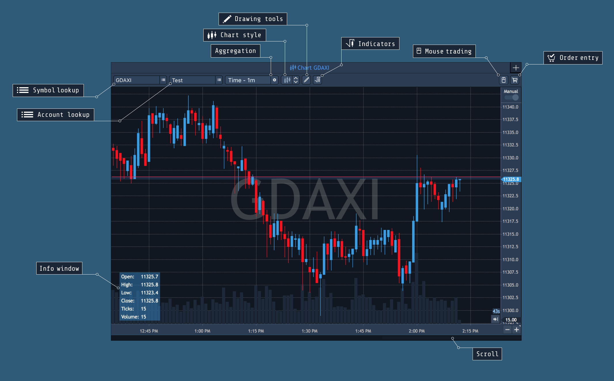
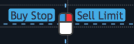
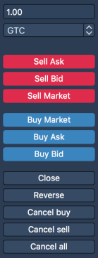

# Chart overview

Chart panel allows to view quotes history and analyze market patterns.

The panel is available through the main menu of the platform. Open the ‘Terminal’ menu and click on the ‘Chart’ item.

### Chart parameters

* Symbol lookup – a field for selection of a symbol to be displayed on the chart;
* Account lookup – a field for selection of an account for visual trading;
* Aggregation – a menu for selection of a desired aggregation type \(Tick, Time, Renko\);
*  Chart style – allows to select a displaying style of symbol price movements. The following styles are available:

  * Line;
  * Bar;
  * Candle;
  * Dots;
  * Dotted line;
  * Histogram;
  * Area.

* Drawings – allow activating drawing toolbar on the chart;
* Indicators – allow to open Indicators lookup window;
* Mouse trading – allows to activate trading from the chart with a mouse;
* Visual trading – opens built-in Order entry panel, which enables visual trading.

Clicking on the 'Mouse trading' button turns it blueand changes the cursor's view to the following:. 
Pressing and holding the key 'Command' leads to the same result. 

When 'Mouse trading' is enabled, pressing the mouse's keys allows to place an appropriate order.

If the cursor is higher than the current price, you can send:

* Buy Stop order – left click of the mouse;
* Sell Limit order – right click of the mouse.

If the cursor is lower than a current price, you can send:

* Buy Limit order – left click of the mouse;
* Sell Stop order – right click of the mouse.

During the Mouse trading, order marker is visible on the chart. If order is buy, then order marker will be blue; and if order is sell, then order marker will be red.

To disable trading from the chart with a mouse, click on the 'Mouse trading' button again, or just stop holding the 'Command' key.

Chart trading – allows to activate the chart’s Order entry panel.

* Scroll – a tool for chart history scrolling;
* Zoom control buttons – allow to zoom out of \(-\), in to \(+\) the chart and to activate manual scaling of the chart by an allocated area.

### 
**Right information button**

Working with right mouse button, user can get the following information:

* Bars – the number of bars between two selected points.
* ∆Time – time past between two selected points.
* ∆Price – price difference between two selected points at each end of the line.
* Ticks – price difference shown in ticks between two selected points.
* Profit – shows how much a trader could earn if the price has gone up/down from point 1 to point 2. In order to get this information, click right mouse button, hold it and lead the mouse across the screen to the needed point.

