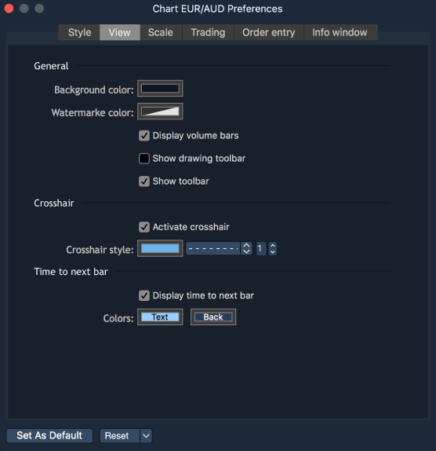

# Chart Preferences

A user can open ‘Chart Preferences’ window through the context menu of the Chart.

The ‘Chart Preferences’ window contains the following sections, stored into the tabs: 

### **Style**


This section allows to adjust the following:

* Style – allows to select a style of symbol price movements. The following styles are available: Line, Bar, Candle, Dots, Dotted line, Histogram, Area;
* Data type – allows to select a data acceptance type. The following types are available: Default by symbol, Bid, Last, Ask. The 'Default by symbol' depends upon server preferences;
* Color schemes for all data types: Body, Border, Wick, Doji. 

### **View**


The following adjustments are available here:

General:

* Background color – allows to select chart's background color;
* Watermark color – allows to select the watermark color;
* Display volume bars – allows to show volume bars on the chart;
* Show drawing mode – allows to activate drawing toolbar on the chart;
* Show toolbar – when checked, the chart's toolbar is active;

Crosshair:

* Activate crosshair – if checked, the cursor lines are active on the chart;
* Crosshair style – allows to set up color, shape and thickness of the cursor lines.

Time to next bar:

* Display time to next bar – allows to show time to the next bar on the chart;
* Colors – allows to choose the font and background colors.

**Scale**


This tab includes the sub-sections allowing particular adjustments of the chart:

Grid:

* Show grid – if checked, the chart's grid, helpful for viewing X and Y axes relation, is visible;
* Grid style – allows to select a grid's color, grid lines' shape and thickness;
* Colors – allows to set up the font's color.

Zoom:

* Scale – allows to choose the type of scaling: Auto or Manual;
* Fit orders/positions – if checked, all orders/positions will be fit into chart scaling;
* Fit settlement prices – if checked, the settlement prices will be fit into chart scaling.


Highlighted prices:

* Show settlement price – allows to show the current settlement price on the chart;
* Settlement price style – allows to choose the style of the 'Settlement price' line;
* Show previous settlement price – allows to show the previous day settlement price on the chart;
* Previous settlement price style – allows to choose the style of the 'Previous settlement price' line.

Time separators:

* Show day – if checked, the day-by-day separators are displayed on the chart;
* Day style – allows to adjust color, shape and thickness of the day-by-day separating lines;
* Show week – if checked, the week-by-week separators are displayed on the chart;
* Week style – allows to adjust color, shape and thickness of the week-by-week separating lines;
* Show month – if checked, the month-by-month separators are displayed on the chart;
* Month style – allows to adjust color, shape and thickness of the day-by-day separating lines;
* Show year – if checked, the year-by-year separators are displayed on the chart;
* Year style – allows to adjust color, shape and thickness of the year-by-year separating lines. 

### **Trading**


  
The following adjustments are available in this section:

* Opened positions – if checked, opened positions will be displayed on the chart;
* Long – allows to adjust the style of long positions on the chart;
* Short – allows to adjust the style of short positions on the chart;
* Working orders – if checked, working orders will be displayed on the chart;
* Buy – allows to adjust the style of working orders with 'Side=Buy' on the chart;
* Sell – allows to adjust the style of working orders with 'Side=Sell' on the chart;
* Bound positions/orders by left side – allows displaying active positions/orders on the left side of the Chart area. 

### **Order entry**


This tab includes the sub-sections allowing particular adjustments of the chart's Order entry:

General:

Show chart order entry – if checked, the chart order entry will be displayed on the chart.

Quick trading – allows to hide/show the following chart order entry elements:

* Show close orders \(SL/TP\);
* Buy/Sell Market;
* Buy Ask/Sell Bid;
* Buy Bid/Sell Ask.

Hot buttons:

If checked, the following hot buttons will be shown in the built-in Order entry:

* Close;
* Reverse;
* Cancel buy;
* Cancel sell;
* Cancel all.

Note: clicking on the hot buttons doesn't evoke confirmation screens, even if confirmations are enabled in the 'Preferences' window.

### **Info window**

* Info window mode – allows to set up the style of displaying the Info window. You can select from the following Info window modes: Separate Window, Attached To Cursor, Hidden.
* Activate short mode – if checked, the Info window fields' names will be displayed in a short mode on the chart:

* Colors – allows to choose the Info window's font and background colors.

Fields – this section allows to select fields for displaying information in the 'Info window'. The following fields are available, mark the needed ones as checked:

* \#Bar;
* Date;
* Time;
* Open;
* High;
* Low;
* Close;
* Change, %;
* Ticks;
* Volume.

### 
**Managing adjustments**

The 'Chart Preferences' window contains the following buttons to manage adjustments:

* – 
  allows to set all current 'Chart Preferences' adjustments as default ones;
* – 
  allows to reset all the 'Chart Preferences' adjustments to 'User Defaults' or to 'Factory Defaults'. 'User Defaults' are the last adjustments, which were stored into the system by clicking on the button 'Set As Default'.

   ****

