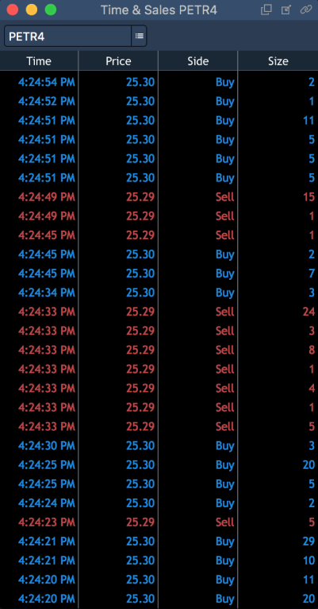

# Time & Sales

Time & Sales panel lists sales operations on the market.

To open the Time & Sales panel. Select ‘Terminal -&gt; Time & Sales’.

The Time & Sales panel chronologically shows all trades for a symbol at the real time mode.

### **Columns**

Information about a chosen symbol starts streaming upon opening the panel.


The context menu of the table's header allows to adjust visibility of the panel's columns.

For each trade, the following data stored into columns is available:

* Time – time of a trade, can be displayed in two modes depending on time format selected in the preferences: HH:mm:ss or HH:mm:ss:ms;
* Price – a price at which a trade is executed;
* Side – shows side of a trade: Buy or Sell;
* Size – a size of a trade;
* Source – a source of market data, where a trade took place;
* Bid – Bid prices;
* Ask – Ask prices;
* Bid x Ask size – a traded Bid x Ask volume;
* Bids/Asks MPID – an exchange market for bid or ask.

This context menu includes the following items as well:

* Restore to factory defaults – allows to restore the table's view to its factory defaults;
* Preferences – allows to open the 'Time & Sales Preferences' menu.

Context menu

To open the 'Time & Sales' panel's context menu, right-click anywhere under its table's header.

This context menu contains the following items:

* Aggregate size – if checked, all trades with the same price, side, size, and MPId are shown in one row as total;
* Clear table – removes data from the 'Time & Sales' table;
* Duplicate panel – opens one more 'Time & Sales' panel, pre-filled with data from a currently opened panel;
* Preferences – opens the 'Time & Sales Preferences' menu.

### Time & Sales Preferences

This Preferences menu contains such sections, as View, Columns, Colors.

**View**

This section allows to adjust the following:

* Grid – allows activating and setting up grid. Vertical, Horizontal, Vetrical & horizontal, None;
* Time format – a time mode displaying on the panel, you can select one of these: HH:mm:ss, HH:mm:ss:ms;
* Size in – a form of volume displaying, you can select one of these:
  * General preferences – taken from general preferences;
  * Lots – will be displayed in lots;
  * Real size – will be displayed in real value.
* Size precision – if checked, you can set up precision of volume displaying;
* Aggregate size – if unchecked, the column 'Bid x Ask size' displays volumes according to a given MPID, and the columns Bid and Ask display the best corresponding prices; if checked, the column Size displays all trades with the same 'Price + Side + MPID' as a cumulative sum, and the column 'Bid x Ask size' displays a cumulative sum of volumes from all liquidity providers proposing the best prices at a current moment;
* Show toolbar – if active, the Symbol lookup is displayed on the panel.

**Columns**

This section allows to select columns to be displayed on the panel and to adjust the following columns' parameters: Column: Alignment, Background and Text colors.

**Colors**

This section allows to adjust the coloring scheme for 'Time & Sales' according to the following parameters:

* Table colors

Allows to select background colors for:

1. Table;
2. Grid.

Allows to select background and text colors for:

1. Columns header row;
2. Row.

* Quote colors - allows to select background and text colors for:
  * Up tick;
  * Down tick;
  * Quote.
* Print colors - allows to select background and text colors for:
  * Above Ask;
  * At Ask;
  * At Bid;
  * Below Bid;
  * Between Spread.

### Managing adjustments 

The 'Time & Sales Preferences' menu contains the following buttons to manage adjustments:

* 
  – allows to set all current 'Time & Sales Preferences' menu adjustments as default ones; 
* 
  – allows to reset all the 'Time & Sales Preferences' menu adjustments to 'User Defaults' or to 'Factory Defaults'. 'User Defaults' are the last adjustments, which were stored into the system by clicking on the button 'Set As Default'. 

