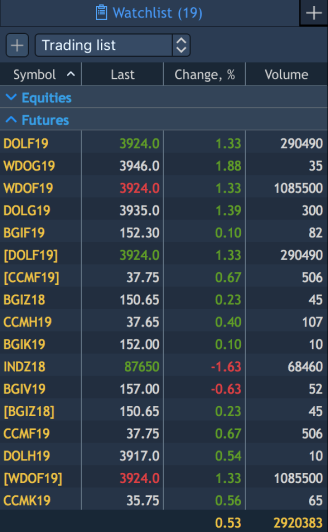
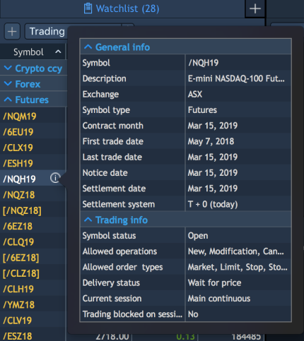

# Watchlist

The 'Watchlist' panel displays real-time market data for each symbol available through a broker.

To open the 'Watchlist' panel, select 'Terminal -&gt; Watchlist':

### 
Columns

The context menu of the Watchlist table's header allows to adjust visibility of its columns. To open this context menu, right-click on the table's header which is located under the panel's toolbar. For each symbol, the following information is available:

* Symbol – selected symbol;
* Last – the last trade price;
* Last size – the last trade volume;
* Last date – the last update date of a quote;
* Last update – a time period between a last quote's update and a current moment;
* Volume – shows cumulative volume traded for today. Volume is null for OTC FX instruments, not null for Exchange traded instruments;
* Exchange – name of the exchange on which symbol is traded;
* Match volume – shows volume traded on the auction session \(pre & post\);
* Bid – the last best bid price;
* Bid size – the volume of the best bid;
* Ask – the last best ask price;
* Ask size – the volume of the best ask;
* Change – the price deviation from a Previous close price;
* Change, % – the price deviation from a Previous close price in a percentage;
* Open – the day's open price;
* High – the day's highest price;
* Low – the day's lowest price;
* Previous close – the previous day's close price;
* Lot size – the size of one lot;
* Expiration date – the date of expiration \(for options\);
* Spread – the change for current price in pips \(Ask-Bid\);
* Description – the symbol description \(company name, type\);
* Symbol type – the symbol type \(market category\);
* Current session – information on the current trading session for the instrument;
* Symbol status – the instrument trading status, available values: Open, Closed. With the symbol status set to Closed, the instrument trading is blocked;
* Ticks – displays quantity of L1 quotes that came from Provider; also can be used for displaying the volumes of FX symbols;
* Settlement price – shows value of the current settlement price;
* Previous settlement price – shows value of the previous day settlement price;
* Preferences – opens Preferences window.

### **Symbols lists creation** 

The Watchlist panel enables a user to create custom sets of symbols lists. In order to add symbols to the Watchlist, click on the button, located at the top left corner of the panel’s toolbar. Select the needed symbols from the 'Symbols lookup' window. By finishing symbols selection, press 'Add'. From the drop-down menu of Symbol list user is able to create new symbol lists. In this list all created instruments lists are displayed. Buttons of list renaming or deleting are located right to each list.

### Symbol lookup

The 'Symbol lookup' window in the 'Watchlist' panel has its own peculiarities.

Except the standard lookup's functions, the 'Symbol lookup' window in Watchlist allows a multi-selection. In case you need to select several symbols, which are located one under another, just slide the mouse cursor up or down to select by highlighting several symbols. In case needed symbols are not located one under another, hold the key 'Command' and click each needed symbol to select it by highlighting. After finishing symbols selection, click on the button 'Add'.

### **Customizing the Watchlist**

​Right clicking within the Watchlist panel evokes its context menu. From this menu a user can:

* edit symbols lists: add new symbols, remove the needed symbol\(s\) or clear all symbols at once;
* switch among existing symbols lists;
* group symbols by: lot size, expiration date, symbol type;
* duplicate the Watchlist panel;
* open search lookup.

### **Watchlist Preferences**

The 'Watchlist Preferences' menu contains such sections, as View, Columns, Colors.

**View**

* Grid – allows activating and setting up grid. The following types of grid are available: Vertical, Horizontal, Vetrical & horizontal, None;
* Allow auto-resorting data – allows auto re-sorting a table after any changes;
* Display totals – allows showing total values for the columns;
* Show toolbar – if active, the toolbar is displayed in the panel.

**Columns**

This section allows to set up visibility of columns in the panel and to adjust the following columns' parameters: Column: Alignment, Background and Text colors.

**Colors**

This section allows to adjust the coloring scheme for Watchlist's table.

You can set up Background and Text colors for the following Watchlist table's elements:

* Table \(background color\);
* Grid \(background color\);
* Columns header row;
* Row;
* Alternative row;
* Selected row;
* Right selected row \(background color\);
* Totals row.

The 'Watchlist Preferences' menu contains the following control buttons for managing adjustments:

* – 
  allows to set all current ‘Watchlist Preferences' menu adjustments as default ones;
* – 
  allows to reset all the ‘Watchlist Preferences' menu adjustments to 'User Defaults' or to 'Factory Defaults'. 'User Defaults' are the last adjustments, which have been stored into the system by clicking on the button 'Set As Default'.

### **Symbol info**

Symbol info panel displays information for a selected symbol. To open the panel, click on the info button
of a certain symbol in the Watchlist. 


All information is divided into 5 groups. Each group can be hidden by one click on a group header. The following buttons appear in a header of a group when it is hidden or opened. 

The following information is available in each group:

1\) General info:

* Symbol – name of a symbol selected in the lookup;
* Description – detailed symbol's information;
* Exchange – an exchange name, where the instrument \(symbol\) is traded;
* Symbol type – type of a symbol traded on the market;
* Settlement system – T+x settlement cycle;
* Underlier – name of the asset, which will be delivered. Available for Options, Futures, Spot, T-Bills;
* Contract month – date of the contract expiration. Available for Options and Futures;
* First trade date – date when the contract can be traded firstly. Available for Options and Futures;
* Last trade date – date when the contract can be traded last time. Available for Options, Futures and Forward;
* Notice date – date when the notification about soonest expiration date must be sent. Available for Futures;
* Settlement date – date when delivery has to take place. Available for Options and Futures;
* Close-out deadline – date when positions will be closed by a specific symbol. Available for Futures and Options;

For symbols with asset class Futures and Options, expiration dates templates are available on the Server. Your administrator can select there the following templates, depending on which the dates will be defined for 'Symbol info panel':

 Contract month;

 Contract month, Last trade date, Settlement date, Notice date, First trade date;

 Contract month, Last trade date, Settlement date, Notice date;

 Contract month, Last trade.

* Delivery method – type of asset delivery. Available for Futures, Bonds, Spot, Forward instruments. Can be only Cash for Bonds;
* Strike price – price level of an underlier by which Option contract must be executed;
* Maturity date – date of the contract expiration;
* Face value – a security's nominal value defined in quoting currency. Available for Bonds, T-Bills;
* Yield – current yield value, this signed value is displayed in percent. Available for T-Bills. Clicking the Refresh link to the right allows to refresh the yield value;
* Coupon rate, % – a nominal interest rate for a bond, which is regulated during a bond's emission. Available for Bonds;
* Coupon cycle – periodicity of a bond yield payment to a position holder. Available for Bonds;
* YTM, % – a current interest rate on a bond yield. Available for Bonds. Clicking the link Refresh allows to refresh the YTM's value.

YTM, % = \( \(Coupon payment + \(Face value - Current price\)/N\) / \(\(Face value + Current price\)/2\) \) \* 100%, where:

Coupon payment=\(Coupon rate/100\) \* Face value;

Current price - Current price of a bond;

N - quantity of years before a bond redemption date.

* Accrued interest – value of accrued interest, which a buyer will pay when buying a Bond, and a seller will get when selling a Bond. Value is indicated for 1 lot. Measured in quotting currency. Available for Bonds. Clicking the link Refresh allows to refresh the Accrued interest's value in its field;
* Previous yield payment – last date of yield payment according to 'Coupon cycle'. Available for Bonds;
* Next yield payment – next date of yield payment according to 'Coupon cycle'. Available for Bonds;
* Asset – name of the asset for the instrument. Available for Equities/CFD, Spot, Forward.

2\) Trading info:

* Symbol status – trading status; available values: Open, Closed, Trading halt. When the symbol status is Closed or Trading halt, the instrument trading is blocked;
* Current session – information on the current trading session period for the instrument;
* Trading blocked on session – shows whether trading is blocked for the current session, available values: Yes, No;
* Quoting currency – information about currency in which quote is calculated;
* Delivery status – status of asset delivery;
* Lot size – amount of base asset for one lot;
* Contract size – amount of the underlying asset for one contract;
* Minimal lot – the smallest part of lot for which trading is available;
* Maximum lot – the largest trade allowed in lots;
* Max. position qty. – shows maximum quantity of positions per selected symbol;
* Lot step – step of lot changes;
* Next holiday – shows date of a next holiday when trade is not allowed;
* Allowed operations – shows operations allowed for a current symbol;
* Allowed order types – shows order types allowed for a current symbol;
* High limit – is an upper limit of an allowable price band above which delayed orders are not accepted;
* Low limit – is a lower limit of an allowable price band below which delayed orders are not accepted;
* Allow short positions – this parameter shows whether opening short positions using the current symbol is allowed;
* Tick size – minimal price change;
* Tick cost – amount of base asset for one tick.

Note: The variable tick cost/size value for the Futures, Futures CFD, Options symbol types can be set depending on price ranges. The variable tick size value for the Equities, Equities CFD and Indices also can be set depending on price ranges.

3\) Margin requirements:

* Margin type – type of margin calculation. Can be different for different assets;
* Margin by account – shows margin requirements based on account coefficients;
* Margin req. – shows margin requirements, which depend on the margin calculation type. When the "None" margin calculation type is selected for the instrument, the "-" is displayed;
* Buy – shows margin requirements for long positions which use different long/short margin and don’t depend on overnight margin;
* Sell – shows margin requirements for short positions which use different long/short margin and don’t depend on overnight margin;
* Day – shows day margin requirements which don’t depend on long/short margin;
* Overnight – shows overnight margin requirements which don’t depend on long/short margin;
* Initial req. – amount of margin which is necessary for trading with one lot;
* Maintenance req. – amount of margin which is necessary for keeping open one lot position;
* Overnight buy – shows coefficients of initial and maintenance margin for long position overnight transfer;
* Overnight sell – shows coefficients of initial and maintenance margin for short position overnight transfer;
* Day buy – amount of margin which is necessary for holding a long position during a trade session;
* Day sell – amount of margin which is necessary for holding a short position during a trade session.

Note: if coefficients of initial and maintenance margin have the same value, for example 2%, then they will be displayed as one value in the Margin requirements section – Margin req. – 2 %.

4\) Fees:

* Fill per lot \(Buy/Sell/Short/Open/Close\) – trader pays fee for each traded lot. Verification of Min. value withdrawal is executed for each fill;
* Order per lot – trader pays fee for each traded lot. Verification of Min. value withdrawal is executed for a whole order;
* Fill volume \(Buy/Sell/Short/Open/Close\), % – fee calculates on base of the volume of each trade;
* Fill volume \(Buy/Sell/Open/Close\) with min p/d, % – commission from the volume, which ensures a day minimum in case of partial filling of an order;
* Per fill – trader pays fee for each fill of an order;
* Per transaction – trader pays fee for each transaction. Transactions: place an order, cancel an order, and modify an order;
* Per phone transaction – trader pays fee for each transaction which was made by a Phone dealer;
* VAT – trader pays VAT from each fee operation;
* Order volume % \(Buy/Sell/Open/Close\) – trader pays fee per each part of order volume that was filled;
* Long swap – shows the swap value applied to overnight long positions of an instrument;
* Short swap – shows the swap value applied to overnight short positions of an instrument.

The fee value for the fee types such as 'Fill per lot', 'Order per lot', 'Per fill', 'Volume, %' and 'Order volume %' can be set depending on quantity ranges.

'Symbol info' panel displays these fee types depending upon comission plan settings on the Server.

        Rebates:

The rebates value can be set for the fee types such as 'Per lot', 'Fill volume, %' depending on quantity ranges.

* Add/Remove liquidity rebate per lot – means that for each lot in a made trade the fixed rebate value will be charged/returned \(in the plan's currency\);
* Add/Remove liquidity rebate per volume, % – means that charged/returned sum will be calculated as a percent from a trade volume.

5\) Indicative market schedule:

Information about settings for all trade sessions:

* Before market;
* Pre-market;
* Main;
* Post-market;
* After market.

In order to make the needed columns or rows with parameters visible in the Symbol info panel, go to Context menu -&gt; Preferences -&gt; Columns -&gt; and simply check them in the list.

### 

