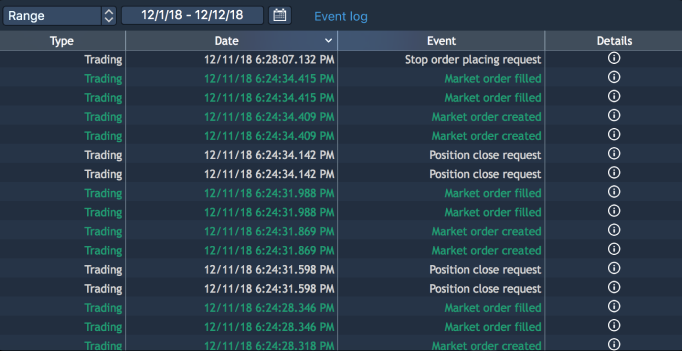
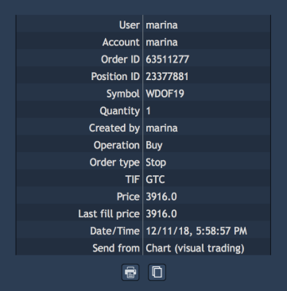

# Event log

Event log panel displays all events that occurred during trading sessions. Click on the button
in the Status bar to open the Event log panel.

### 
Time filter

At the top left corner of the toolbar of the panel there is a combo box ‘Time filter’. It allows to select time period for which a user wants to see logs. The following periods are available:

* Daily; 
* Range – calls date menu 'From ... To' which allows to set up a desired time range. When the 'Range' period is set up, the iconappears near the 'Time filter' combo box. It allows to change a time range for viewing events.

### Columns

Event log displays information via the following columns:

* Type – type of event;
* Date/Time – date and time of an event;
* Event – title of an event;
* Details – click on ‘Details’ icon to open a deal ticket. 

### Context menu

To call the Event log panel's context menu, right-click any row of the panel's table.

The context menu allows the following options:

* Clear – clears the 'Event log' table. This option doesn't delete data, this is just for clearing a current Event log panel view.
* Search – allows to show/hide the Search lookup in the toolbar;
* Group by – allows to group logs by Type or by Event.

