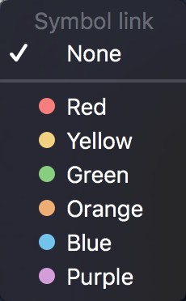

# Arranging panels

### Attaching and detaching panels

There are two main location types for all panels:

* Attached – panel is located in some place of workspace.
* Detached – panel is located separately and can be used independently of any workspace. Each panel has default location. 

Some panels are attached by default, others are detached. Default settings created on base of target usage. To change the location click on the control
which is available in the header of each panel. The following options can be available in the opened menu:

* Attach – allows attaching panel. After clicking panel will attach to default place. Then user can move it to any place of the workspace. After taking header of the panel the following buttons appear:


Drag the panel into the button to preview it's next position.

Attached panels can be arranged into tabbed areas where one or more panels are conveniently fit under/over/beside other panels.

### Linking panels


Linking panels allows to synchronize panels between each other via symbols and/or accounts.

This adjustment is available via the buttons, located on panels' headers: 

* **Symbol link**
  – when panels are linked this way, selecting a symbol in one of the panels synchronizes other panels in a group to display information relevant to that symbol. This means, if you have panels A, B, C, which are linked with a symbol link, changing a symbol in the panel B will automatically change a symbol in the panels A and C to a new selected symbol in the panel B; 
* **Account link**
  – when panels are linked this way, selecting an account in one of the panels synchronizes other panels in a group to display information relevant to that account. This means, if you have panels A, B, C, which are linked with an account link, changing an account in the panel B will automatically change an account in the panels A and C to a new selected account in the panel B.            

Clicking these buttons opens the following menu allowing to identify a link by a color:


Adjusting the same linking color for different panels links these panels to each other by a Symbol and/or an Account link.

