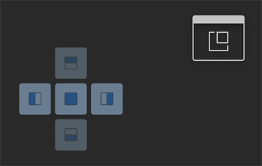
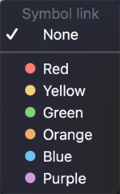
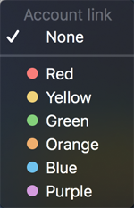
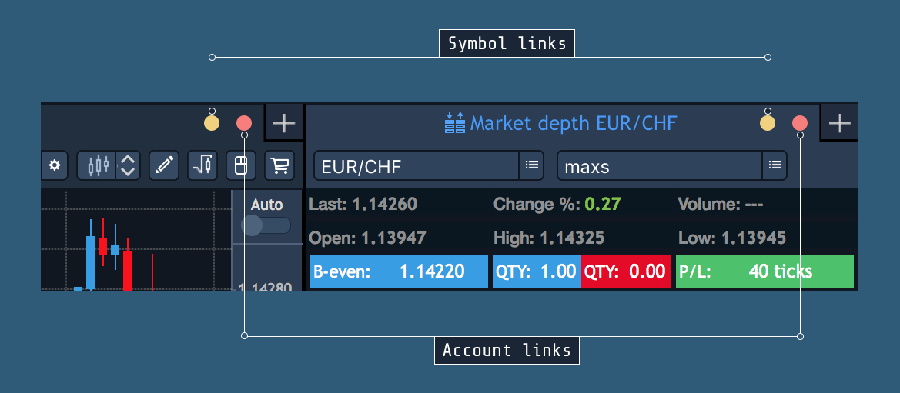

# Arranging panels

A user can adjust panels’ arrangement and it will be automatically saved after logging out and then logging in again.

### Attaching and detaching panels

There are two main location types for all panels:

* Attached – panel is located in some place of workspace.
* Detached – panel is located separately and can be used independently of any workspace. 

Each panel has default location. Some panels are attached by default, others are detached. Default settings are created on base of target usage. 

A user can manage the panels as he needs with the help of the following options:

* Attach/Detach – allows attaching/detaching the panel. User can move it to any place of the workspace. Clicking on the button, 
  which is located in the header of each panel, activates the attachment mode of the chosen panel and opens the arrangement templates allowing to select a panel’s position:


Drag the panel into the certain button of the arrangement template to preview it's next position.

Attached panels can be arranged into tabbed areas where one or more panels are conveniently fit under/over/beside other panels.

* On top– allows seeing the panel over all other currently opened panels. Applicable only for detached panels.
* Duplicate panel – allows duplicating the chosen panel. The option is available from the context menu of the chosen panel.
* Clicking on the button
  allows opening the panel in the fullscreen mode. Available only for Chart.
* Show toolbar – allows showing the toolbar of the chosen panel. Right-click on the header of the panel to to view this option.
* – the standard set of buttons, allowing to close, minimize a window and enable a fullscreen mode respectively.

### Creating tabbed areas

Creating tabbed groups of panels helps save screen space and maximazes efficiency. To make a panel appear as a tab, drag it over another panel \(or tabbed area\).

### Linking panels


Linking panels allows to synchronize panels between each other via symbols and/or accounts.

This adjustment is available via the buttons, located on panels' headers: 

* **Symbol link**
  – when panels are linked this way, selecting a symbol in one of the panels synchronizes other panels in a group to display information relevant to that symbol. This means, if you have panels A, B, C, which are linked with a symbol link, changing a symbol in the panel B will automatically change a symbol in the panels A and C to a new selected symbol in the panel B; 
* **Account link**– when panels are linked this way, selecting an account in one of the panels synchronizes other panels in a group to display information relevant to that account. This means, if you have panels A, B, C, which are linked with an account link, changing an account in the panel B will automatically change an account in the panels A and C to a new selected account in the panel B.            

Clicking on these buttons opens the following menu allowing to identify a link by a color:

Adjusting the same linking color for different panels links these panels to each other by a Symbol and/or an Account link.

