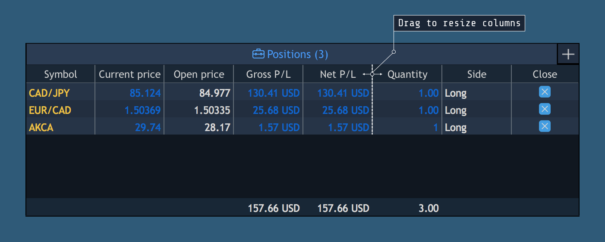
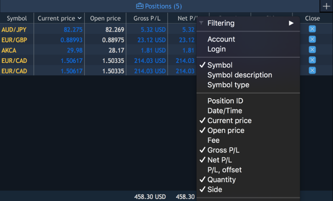
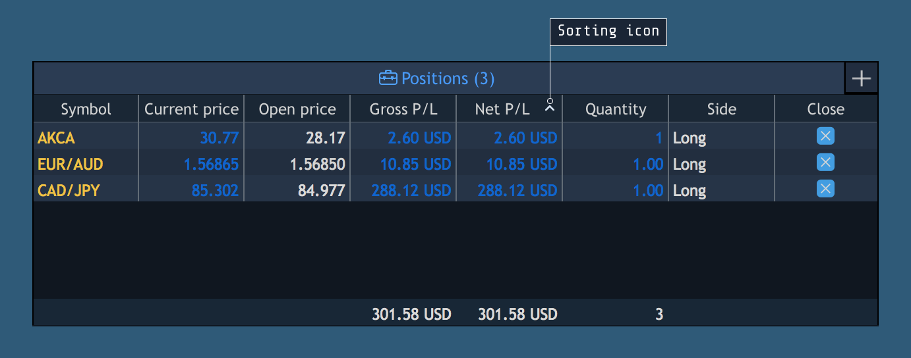

# Managing columns

### **Resizing columns**

To change the width of a column, simply move the mouse over the column border in the header row to see the cursor change to a double-sided arrow. Then click and drag the border to resize the column.


To autosize a column, simply move the mouse over the column border in the header row and double click the mouse when the pointer changes to a double-sided arrow.

### **Displaying columns**

Right-clicking on any column header displays a list of columns that are available in the panel. Only columns that are checked will be visible.


To display a column just place a checkmark by the desired column title. To hide a column, select the undesired column title in the list to remove the checkmark.

### **Reordering columns**

User can rearrange columns in tables by moving them to new locations. Click on a column header and drag the column to the desired location in the table.

### Filtering

Open the context menu of the panel and click on theoption to choose the filter criteria in opened window.

Note: filter criteria can be different for each column.

Filtering of text columns allows to find the selected symbol in 1 click.

### Sorting

Table data can be sorted by any column. Clicking on a column header sorts the data in descending order. To sort in ascending order, click on the header once again. When data is sorted, special icon appears in the header showing the sorting direction.

