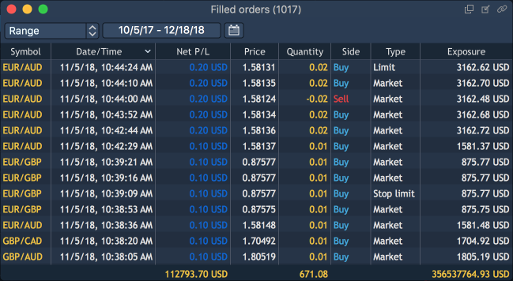

# Filled orders

Filled orders panel displays trading history for a specified period. To open the Filled orders panel select ‘Terminal -&gt; Filled orders’.

### **Time filter**

At the top left corner of the toolbar of the panel there is a combo box ‘Time filter’. It allows to select time period for which a user wants to see filled orders. The following periods are available:

* Daily;
* Range – calls date menu 'From ... To' which allows to set up a desired time range. When the 'Range' period is set up, the icon  appears allowing to change a time range for viewing filled orders.

### **Columns**

There is a table under the panel’s toolbar. The table header's context menu allows to regulate visibility of its columns. To open this context menu, right-click on the table's header.

The following columns are available in the panel:

* Trade ID – unique number of the trade.
* Order ID - unique number that the trading system assigns to each order. If a position is opened based on an order, the position will have the same number.
* Symbol - title of the traded instrument.
* Exposure – quantity recalculated in account currency.
* Type - type of order.
* Symbol type - market category of the symbol \(CFD, spot, stocks, etc.\).
* Account - login name of the account that opened the order.
* Side - type of trade \(BUY or SELL\).
* Quantity - amount of the trade.
* Price - shows price at which the order fills.
* Execution fee - commission connected with the trade.
* Gross P/L - total profit/loss of the trade.
* Net P/L - profit/losses for the symbol including commision.
* Date/Time – date and time when the operation was executed.
* Login - login of the user.
* Bought

- In case of Forex:

if 'Side = Buy', then this column shows the value of 'Price \* Lot size \* Qty.' in base currency;

if 'Side = Sell', then this column shows the value of 'Price \* Lot size \* Qty.' in quoting currency.

- In case of Futures, Futures CFD, Options

with 'Quoting type=Tick cost/Tick size':

if 'Side = Buy', then this column shows the value of 'Qty';

if 'Side = Sell', then this column shows the value of 'Qty \* Tick cost/Tick size \* Price'.

with 'Quoting type=Lot size':

if 'Side = Buy', then this column shows the value of 'Qty';

if 'Side = Sell', then this column shows the value of 'Qty \* Lot size \* Price'.

- In other cases:

if 'Side = Buy', then this column shows the value of 'Qty. \* Lot size' – amount of bought assets \(contracts, equities\);

if 'Side = Sell', then this column shows the value of 'Price \* Lot size \* Qty.' in quoting currency.

* Sold

- In case of Forex:

if 'Side = Sell', then this column shows the value of 'Price \* Lot size \* Qty.' in base currency;

if 'Side = Buy', then this column shows the value of 'Price \* Lot size \* Qty.' in quoting currency.

- In case of Futures, Futures CFD, Options

with 'Quoting type=Tick cost/Tick size':

if 'Side = Buy', then this column shows the value of 'Qty\* Tick cost/Tick size \* Price';

if 'Side = Sell', then this column shows the value of 'Qty'.

with 'Quoting type=Lot size':

if 'Side = Buy', then this column shows the value of 'Qty \* Lot size \* Price';

if 'Side = Sell', then this column shows the value of 'Qty' .

- In other cases:

if 'Side = Buy', then this column shows the value of 'Price \* Lot size \* Qty.' in quoting currency;

if 'Side = Sell', then this column shows the value of 'Qty. \* Lot size' – amount of sold assets \(contracts, equities\).

* Rebates – shows amount of money that was returned/paid for filling this order which added/removed liquidity.
* Expiration date – date of contract expiration.
* Strike price – price of option contract performance.

The same context menu allows to filter data in a table, reset the panel's view to factory defaults and to open the 'Filled orders Preferences' window.

### **Context menu**

The context menu of 'Filled orders' includes the following options:

* Search - allows to show/hide a Search lookup in the panel;
* Show totals - allows to show/hide the row showing the total values for columns;
* Group by - allows to select a column to group the panel's view by:
  * Account;
  * Date/Time;
  * Side;
  * Symbol:
  * Symbol type;
  * Type.
* Duplicate panel - allows to make a copy of a current panel;
* Preferences - opens the 'Filled orders Preferences' menu.

