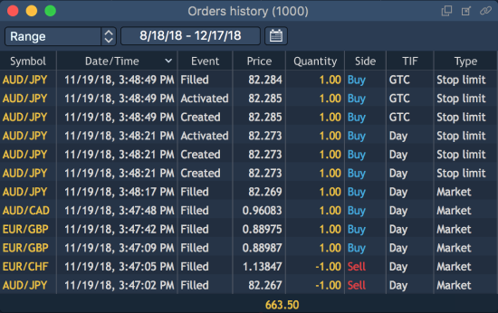

# Orders history

Order history panel allows to view system actions related to opening and closing orders \(SL/TP\). This can be particularly useful for monitoring specific details regarding creation, modification, removal, and execution of orders.

To open Order history panel, select ‘Terminal -&gt; Order history’:

### Columns

There is a table under the panel's toolbar.

Right-clicking on the 'Orders history' table's header calls the context menu with column names. Checking or unchecking these columns allows to show or hide them in the table.

The following columns are available in the panel:

* Account – an account's name of a user who created an order;
* Symbol – a symbol for which an order was created;
* Side – a trade type \(Buy or Sell\);
* Event – an event identifier. The following values are available: Executed, Created, Modified, Rejected;
* Type – an order type;
* Price – an order price which a trade took place at;
* Quantity – a filled amount of an order, in lots or in currency units, depending on what is selected in the Preferences dialog box;
* Order ID – an order's unique identifier. If a position is opened based on an order, this position will have the same number;
* Date/Time – an order's placement date and time;
* TIF – an order's time in force;
* Stop price – stop price for a special stop order;
* Login – a user's login;
* Symbol type – a symbol's market category \(CFD, Spot, Stocks, etc.\);
* Bought

- In case of Forex:

if 'Side = Buy', then this column shows the value of 'Price \* Lot size \* Qty.' in base currency;

if 'Side = Sell', then this column shows the value of 'Price \* Lot size \* Qty.' in quoting currency.

- In case of Futures, Futures CFD, Options

with 'Quoting type=Tick cost/Tick size':

if 'Side = Buy', then this column shows the value of 'Qty';

if 'Side = Sell', then this column shows the value of 'Qty \* Tick cost/Tick size \* Price'.

with 'Quoting type=Lot size':

if 'Side = Buy', then this column shows the value of 'Qty';

if 'Side = Sell', then this column shows the value of 'Qty \* Lot size \* Price'.

- In other cases:

if 'Side = Buy', then this column shows the value of 'Qty. \* Lot size' – amount of bought assets \(contracts, equities\);

if 'Side = Sell', then this column shows the value of 'Price \* Lot size \* Qty.' in quoting currency.

* Sold

- In case of Forex:

if 'Side = Sell', then this column shows the value of 'Price \* Lot size \* Qty.' in base currency;

if 'Side = Buy', then this column shows the value of 'Price \* Lot size \* Qty.' in quoting currency.

- In case of Futures, Futures CFD, Options

with 'Quoting type=Tick cost/Tick size':

if 'Side = Buy', then this column shows the value of 'Qty\* Tick cost/Tick size \* Price';

if 'Side = Sell', then this column shows the value of 'Qty'.

with 'Quoting type=Lot size':

if 'Side = Buy', then this column shows the value of 'Qty \* Lot size \* Price';

if 'Side = Sell', then this column shows the value of 'Qty' .

- In other cases:

if 'Side = Buy', then this column shows the value of 'Price \* Lot size \* Qty.' in quoting currency;

if 'Side = Sell', then this column shows the value of 'Qty. \* Lot size' – amount of sold assets \(contracts, equities\).

* Strike price – price of an option contract performance;
* Expiration date – a contract expiration date.

The same context menu allows to filter data in a table, reset the panel's view to factory defaults and to open the 'Orders history Preferences' window.

**Context menu**

The context menu of 'Orders history' can be evoked by right-clicking anywhere under the 'Orders history' table's header and includes the following options:

* Search – allows to show/hide a Search lookup in the panel;
* Show totals – allows to show/hide the row showing the total values for columns;
* Group by – allows to select a column to group the panel's view by:
  * Account;
  * Bought;
  * Sold;
  * Date/Time;
  * Login;
  * Side;
  * Symbol;
  * Symbol type;
  * Type.
* Duplicate panel – allows to make a copy of a current panel;
* Preferences – opens the window 'Orders history Preferences'.

