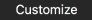
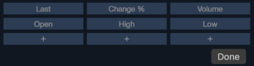
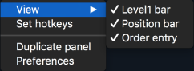

# Market depth

The 'Market depth' panel allows to view and trade Level II quotes.

To open a new 'Market depth' panel, go to 'Terminal -&gt; Market depth'.

### **'Market depth' parameters**

This panel consists of the following sections:

* Level I - only Level I quotes.

 You can customize this section via the context menu -&gt;:

The buttons '+' allow to change the default 'Empty' value of cells to one of the values from drop-down lists which appear with pressing buttons '+'.

Every drop-down list corresponds to its button '+' and contains the following items, except those which are already used to be displayed by previously adjusted cell\(s\):

Bid; Ask; Last; Bid size; Ask size; Last size; Last time; High; Low; Open; Previous close; Change; Change, %; Spread; Settlement price; Previous settlement price; Volume.

* Position bar - short information about opened positions \(average price, quantity, current profit and loss\): 


Position bar has extended functionality for Multiple position mode:

When clicking the Price value, you can select of two options: Average open price or Break-even.

Break-even = \(Long qty.\*Average long – Short qty.\*Average short\) / \(Long qty. – Short qty.\)

When clicking the QTY value, you can select of two options: Net QTY or Gross QTY:

Net QTY = Qty1 + Qty2 + Qty3

Gross QTY = \|Qty1\| + \|Qty2\| + \|Qty3\|

The color of QTY cell depends on a position's side:

a\) If all positions have Side = Long, qty. cell will be colored in blue;

b\) If all positions have Side = Short, qty. cell will be colored in red;

c\) If positions are multidirectional, then qty. cell is not colored;

d\) If there are no positions, qty. cell will not be colored and qty. value will have an empty value \( '---' \).

* 'Order entry' is a compact bar similar to the 'Order entry' panel. It can be displayed in two ways: compact view \(showing only buttons and main boxes\) and extended view \(with explanation labels for buttons and boxes\). An order entry mode can be adjusted in the 'Market depth Preferences -&gt; View'. An 'Order entry' bar allows you to adjust the following: quantity, type and TIF of an order, limit and stop price;
* Detail quote section - this section includes the latest quotes data similar to Watchlist panel. But unlike Level I quotes, it shows a total volume at each price level. On the left side are bid volumes and on the right one – ask volumes.

The detailed quote section is the main part of the Market depth panel, and all other bars can be hidden. To choose panel's elements to be visible, open 'context menu -&gt; View':


In the detailed quote section, offers with equal prices are grouped by the same color. There are five available color groups. Quotes with best prices are placed on the top and regrouped each time when a new quote comes.

The detail quote section is displayed as a table with the columns which can be made visible via the context menu of the table's header:

* Time – time of offer;
* Price – a buy or sell price from the highest Bid and the lowest Ask to lower Bids and higher Asks;
* Size – a volume being offered to purchase at a specified Bid price or to sell at a specified Ask price;
* Source – ECN or exchange, where orders are set. This field is similar to MPID, but it has another representation on the server. Is unavailable when 'Aggregate size' is active in the 'Market depth Preferences';
* MPID \(market participant ID\) – ECN or exchange, where orders are set;
* Total size – the aggregated traded volume;
* VWAP – prices of order executions including slippage effect that will take place depending on order quantity;
* Counter CCY value – a value of Ask/Bid size recalculated in the quoting currency, Price \* Ask/Bid size;
* Counter CCY Total value – a value of total Ask/Bid size recalculated in the quoting currency, Price \* Total Ask/Bid size;
* Reset to factory defaults – allows to reset this section's view to the default view.

### Market depth Preferences

**View**

* Standard preferences – Font, Grid;
* Size in – allows selecting in what form the volume will be shown:
  * General preferences – will be taken from General Preferences -&gt; View:
    * General preferences \(lots\) – in case the checkbox 'Display quantity in lots' in ‘General Preferences... -&gt; View' is enabled;
    * General preferences \(real size\) – in case the checkbox 'Display quantity in lots' in ‘General Preferences... -&gt; View' is disabled;
  * Lots – will be displayed in lots;
  * Real size – will be displayed in real value.
* Size precision – if checked, you can set up precision of the volume displaying;
* Show own working orders – if active, all pending orders \(Limit/Stop\) are shown in the Market depth panel with color, otherwise – orders won’t be displayed. To set the coloring scheme for displaying Limit/Stop orders in Market depth panel, go to 'Context menu - &gt; Preferences - &gt; Colors - &gt; Own working orders';
* Aggregate size - if active, size will be aggregated by the following criteria: Price, Side, MPID. Related to 'Size' and 'Bid / Ask' columns;
* Show toolbar – if active, the Symbol lookup and Account lookup are displayed on the panel;
* Show position bar – if active, the Position bar is displayed on the panel;
* Display level1 – if active, the Level1 is displayed on the panel;
* Make order entry visible – if active, the OE is displayed on the panel;
* Order entry mode – available only when 'Make order entry visible' is active. Allows to select one of two ways to display the OE:
  * Full-size;
  * Compact.
* Mirror view – if checked, Ask section columns of Market depth panel will be displayed backwards;

**Columns**

This section allows to set up visibility of columns in the detail quote section and to adjust the alignment of the columns.

**Colors**

This section allows to adjust the coloring scheme for 'Market depth':

* Table colors - allows to select background colors for Table and Grid;
* Own working orders - allows to select background and text colors for Limit orders and Stop orders;
* Position bar - allows to select background and text colors for:
  * Long position;
  * Short position;
  * Multiple position;
  * Profit;
  * Loss;
* Coloring method - allows a general adjustment of MD colors:
  * Coloring method: None, By price level, Relative to size, Step to max size, By update time, Size histogram;
  * Bid, Ask, Size – Background and Text colors.

**Tab order**

The following settings can be selected:

* Account lookup;
* Instrument lookup;
* Quantity;
* Price;
* Limit price;
* Stop price.

### Managing adjustments

The 'Market depth Preferences' menu contains the following buttons to manage adjustments:

* – 
  allows to set all current 'Market depth Preferences' menu adjustments as default ones;
* – 
  allows to reset all the ‘Market depth Preferences’ menu adjustments to 'User Defaults' or to 'Factory Defaults'. 'User Defaults' are the last adjustments, which were stored into the system by clicking on the button 'Set As Default'.

