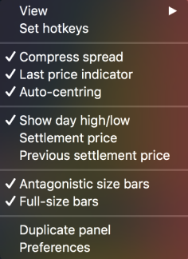

# Matrix

The Matrix panel allows to view open positions, pending orders, market prices, quantity and P/L. Furthermore, a trader can place an order just in 1 click. 

To open the Matrix panel, go to Terminal -&gt; Matrix:


The Symbol lookup is at the top of the Matrix panel.

* Compress spread – allows skipping empty levels between the best bid and best ask;
* Auto-centring button – allows auto-centering the panel relatively to spread;
* Mouse trading button – allows one-click trading with the help of the mouse.

Day high/low – allows showing current high/low levels.


Right-clicking within the Market depth section evokes the Context menu of the panel.

* View – allows to show/hide Position bar and built-in Order entry;
* Set hotkeys – allows to open the ‘General’ tab in the ‘Hotkeys Preferences’ window;  
* Compress spread – allows skipping empty levels between the best Bid and best Ask;
* Last price indicator – allows to show last price indicator;
* Auto-centring – allows auto-centring the panel relatively to spread;
* Show day high/low – allows showing current high/low levels;
* Settlement price – allows displaying settlement price;
* Previous settlement price – allows displaying previous settlement price;
* Antagonistic size bars – allows to determine the direction of volume histograms. If true, the histograms appear from the different boundaries of the column ‘Size’. If false, the histograms appear from the left boundary of the column ‘Size’. Default state: true;
* Full-size cells – allows extending the bars;

* Preferences – allows opening ‘Matrix Preferences’ dialog box.

The bottom position bar shows the current state of the position: open price, open position quantity, current profit and loss.


When clicking on the P/L value, the following options can be selected: Ticks/Points.

QTY cell changes its color depending on the side of the position:

1.    If all positions have Side = Long, qty. cell will be colored in blue;

2.    If all positions have Side = Short, qty. cell will be colored in red;

3.    If positions are multi-directional, then qty. cell is not colored;

4.    If there are no positions, qty. cell will not be colored and qty. value = N/A.

* When trading multi-position symbols, open price of all the positions is calculated as weighted average value;
* The Orders column shows all pending orders and allows their modification. Limit orders are displayed as numbers, and Stop orders - as underlined numbers. Group of orders is displayed with two vertical lines of the pending order left side;
* The Size column shows how many trade operations with Ask/Bid are available at a specific price;
* Clicking on Cancel buy, Cancel sell, or Cancel all will close all buy, sell, or total orders respectively for the currently displayed symbol and account;
* Close position button allows closing the current position by selected symbol and account.

On the right side of the Matrix panel there is a built-in Order entry panel. The order amount can be specified on the top of panel. Also the TIF of the order, SL/TP offset and Trailing stop.

Click on Buy Market or Sell Market to Buy/Sell at market price.

**Mouse trading** – allows trading using mouse \(when the corresponding button is activated on the top of the panel\). Clicking on the Buy column allows placing Buy orders, on the Sell column – Sell orders.

Mouse trading rules:

* When sliding with cursor within any item in the Market depth section the certain cell in the column should be highlighted;
* If there is no order on the current price, it can be exposed by clicking on the empty cell of the column Buy or Sell;
* If there is an order on the current price, then you can open a new one by clicking on it;
* If an order is opened on the current price, then clicking on the cross in the right side of its area will lead to its cancellation;
* If several orders are opened on the current price \(summary volume is shown in the orders area\), then when canceling the order the first exposed order will be cancelled in the first place.

Clicking on the group of orders on one price allows showing the list of pending orders.

