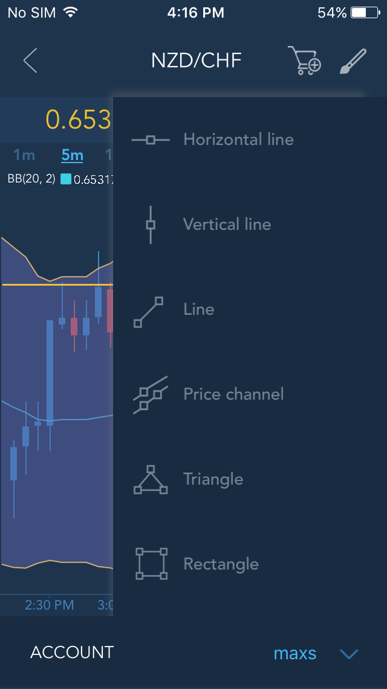
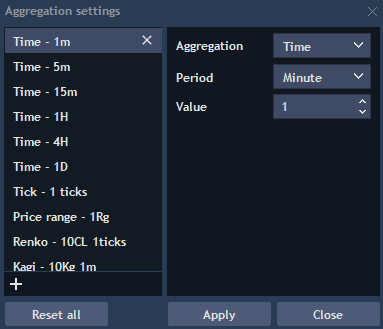

# Aggregation types overview

To choose the type of aggregation for a chart, click on the Time frame button located near the Style button on the Charts toolbar. The following options are available:

* Time – 1 Minute, 5 Minutes, 15 Minutes, Hourly, Daily, Monthly, Yearly and Custom.
* Tick – sets the number of ticks for each bar \(33, 55, 99, 133...\).
* Price range – focuses on the price only, the bars in this chart close when a range completes.
* P&F \(Points and Figures\) – only price changes are recorded. If no price change occurs then the chart is left untouched.
* Renko – price charts with rising and falling diagonal lines of boxes that are either filled or hollow.
* Kagi – a series of vertical lines connected by short horizontal lines. The thickness and direction of the lines is based on the price of the underlying stock or asset.
* Line break - displays a series of vertical boxes that are based on the closing prices.
* Heikin Ashi – chart with this aggregation is very similar to the simple Time chart built in the style of Japanese candles. The only difference is a modified calculation algorithm of the main candle price parameters – Open, High, Low and Close.
* Cluster – displays value of the specific parameter \(Volume, Delta, Trades, etc.\) by each price level. One cluster corresponds to one bar.
* Profile – displays each bar in the form of “market profile”. The base for building the profile is typical time bars or tick bars which instead of general candle are displayed as a column of letters of the Latin alphabet.


User can simply choose predefined aggregation type from the set of saved states, click on it and it'll be immediately applied to the chart or set a new one by clicking on the "Edit" link where user can interactively customize and streamline different types of the chart representation. In the timeframe editor users can adjust each value in each group by adding new items or editing the existing ones. In order to add a new aggregation type, click on "+" button and specify all the necessary parameters for this type:


To edit the existing type, simply click on its button, change the parameters and click "Apply". User can delete aggregation items from the tab by clicking on a chosen item and clicking a button.


Clicking on the Custom aggregation button allows users to choose period, time and other parameters for a custom aggregation type which is now applied to the chart:

Additionally, users can choose the quantity of bars that they want to see on chart. The period of data displaying can be: 1 day, 5 days, 10 days, 20 days, etc.

Aggregation types "Time - 1H" and "Time - 4H" extend period of data displaying \(available history depth\): 6 months, 1 Year; aggregation type "Time - 1D" - 2 Years, 3 Years, 5 Years, 10 Years, 15 Years, 20 Years.

