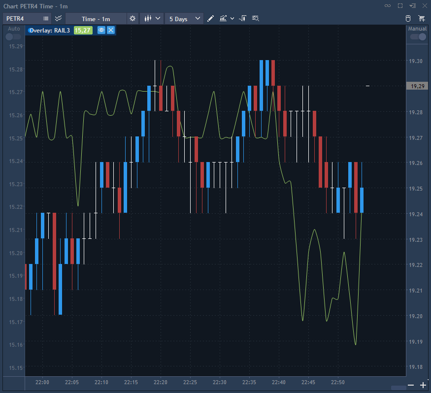
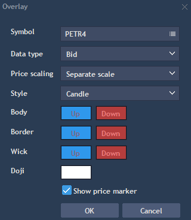

# Chart overlay

User can add any other symbol's chart to the current chart. To provide this, click button
located near the Symbols lookup. Select a new symbol to integrate into the chart.


The menu of the overlaid symbol contains the following buttons:

* Visible - if checked, the price scale of the selected overlaid symbol will be shown on the chart;
* Hide/Show - allows to hide or show overlaid symbol on the chart;
* Remove overlay- allows removing the overlay in one click.


User can select the following overlay settings:

* Symbol - allows selecting symbol for overlay.
* Data type - type of data which will be displayed: Bid, Ask, Last.
* Price scaling - user can select separate or main scale for displaying.
* Style - style of the chart displaying: candle, line, bar, etc.
* Body, Border, Wick, Doji - allows setting the color according to the chart style.
* Show price marker - allows displaying price marker for overlayed symbol.

