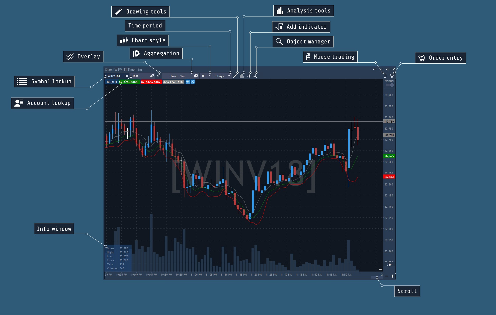

# Chart overview


Chart is the most useful panel for an active trader. Charts enable users to view quotes history, analyze market patterns, and make decisions being well-informed.

This section describes the Chart panel and its functions.

* Symbols lookup – the field for selecting the symbols displayed in the chart.
* Accounts lookup – the field for selecting the accounts for visual trading.
* Overlays – the button for adding one chart of the symbol on the other in order to observe symbol correlations.
* Aggregation – the menu for selecting the desired aggregation type.
* Chart style – allows choosing style of the symbol price movements: candle, line, bar, dots, etc.
* Time period – the button for selecting desired time period, etc.
* Drawing tools – the menu with drawing tools.
* Analysis tools – the menu with tools for analysis: price and bar statistics, volume profile and bars.
* Indicators – the menu with indicators.
* Object manager – shows all indicators and drawings that were applied to the chart with their settings and short information.
* Chart trading – opens Chart built-in Order entry panel, which enables visual trading.
* Mouse trading – allows activating chart trading, this option is available with pressing and holding the key Ctrl as well.
* Info window – displays information about current cursor position.
* Scroll – a tool for scrolling the chart history.

To show/hide elements on Chart, right click anywhere within the chart, select View, and check/uncheck the desired items in this section.

### Navigation


Users can zoom in and out on charts, scroll horizontally and vertically, change the bar width, and manually refresh the chart.

#### **Time zooming**

To zoom in and out in the Chart panel users can use the scroll button on their mouse or simply drag the chart border in the Timeline panel using the scroll:

The scroll bar functions are similar to the scroll bar in a web browser - click, hold, and drag. Use scroll to move the data on the chart, buttons "+" and "-" to zoom in or out, and the arrow-icon to go to the last quote bar.

The chart has a possibility of moving "bar by bar" using a hotkey. A hotkey can be set in general settings -&gt; Hotkeys -&gt; Chart; by default hotkey F12 is specified. After pressing the hotkey, the chart will be moved on one bar to the left. Moving is performed prior to the default offset to the scale.

#### **Price scale zooming**

User can zoom in or out of the chart by price scale \(vertically\). Click on the price axis, drag it up and down to scale the price axis.

#### **Scrolling the chart**

To scroll the chart horizontally, just drag the active section in the Timeline, or click inside the chart and drag it there.

For vertical scrolling the automatic scaling feature must be turned off. To do this, click the Manual zoom button on the chart or the appropriate function in the settings. This will enable vertical scrolling by clicking inside the chart and dragging it up and down.

Three types of the price scale are available: Absolute, Relative and Logarithmic.

* Absolute - displays the price scale in the absolute units.
* Relative - displays the price scale in the relative units, where as a starting point can be used: first point of the screen visibility, point of the day opening, and starting point of the history.
* Logarithmic - logarithmic scale representation, where as a starting point can be used the same points as for relative scale.


If a user prefers Auto scale mode, he may choose fit indicators, fit orders/positions, or fit day High/Low options to be sure that all desired values are visible on a Chart that automatically scales.

#### **Refreshing the chart**

Charts refresh automatically. If, however, a user needs to refresh the chart manually, right click inside of the Chart and select Refresh. This action will reload the chart data and redraw chart.

#### **Right information button**

Working with right mouse button, user can get the following information:

* Bars – the number of bars between two selected points.
* ∆Time – time past between two selected points.
* ∆Price – price difference between two selected points at each end of the line.
* Ticks – price difference shown in ticks between two selected points.
* Profit – shows how much a trader could earn if the price has gone up/down from point 1 to point 2.

In order to get this information, click right mouse button, hold it and lead the mouse across the screen to the needed point.

#### **Additional options**

Right clicking on the timeline shows the panel with additional options:

* Show time periods separators - this option displays the vertical lines on the chart among different days, weeks, months and years.
* Show holes in the history - this option displays bars with no price that appears when the market is closed.
* Show extended sessions - this option displays all quotes received on pre-session, main session and post-session. The timeframes for sessions should be set in the Backoffice for each symbol.


In addition, user can activate "Scrollbar chart preview" option in the chart settings in order to find quickly the necessary place of the chart, such as trend or flat sections.

