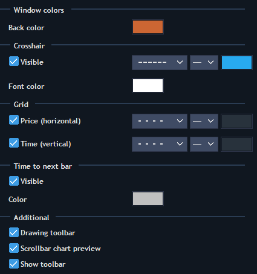
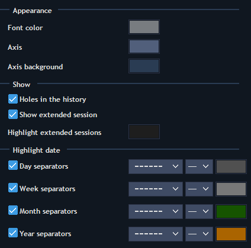
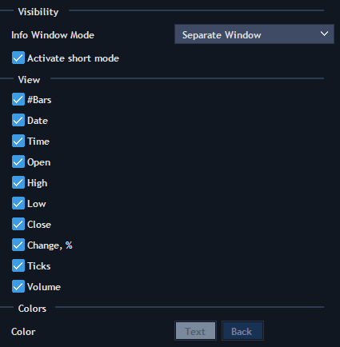

# Chart settings


Chart settings include thirteen sections to set up: 

#### **Data style**

* Style - describes price movements of a symbol. Another way to choose the chart style through context menu: Style-&gt; \[desire style\].
* Data type - the way to accept data. Available types are: Bid, Ask, Bid/Ask average, Last. Based on server settings Last or Bid/Ask type can be disabled.
* Color settings for all styles.

#### View

* Window colors - allows setting up color of the chart background.
* Crosshair - allows activating and setting up cursor lines, as well as font color of price/time labels.
* Grid - allows activating and setting up grid on the chart.
* Time to next bar - allows activating and setting up color of figures that show remaining time to the next bar.
* Additional - allows activating Drawing toolbar, Scrollbar chart preview, Chart toolbar.

#### **Time scale**

* Appearance - allows setting up style of time scale.
* Holes in the history - allows seeing free space on the chart if there is no history at that moment.
* Show extended session - allows seeing bars from extended sessions on chart.
* Highlight extended sessions - all extended sessions that were set on the server for the current symbol will be displayed in selected color.
* Highlight date - allows displaying separator lines for: Days, Weeks, Months, and Years.

#### **Price scale**

* Scale type - allows selecting type of the scale price and start price for the chart: Absolute, Relative and Logarithmic.
  * Absolute - displays the price scale in the absolute units.
  * Relative - displays the price scale in the relative units, where as a starting point can be used: first point of the screen visibility, point of the day opening, and starting point of the history.
  * Logarithmic - logarithmic scale representation, where as a starting point can be used the same points as for relative scale.
* Start price - you can choose from the following options: Begin of the data, Begin of the day, Begin of the screen.
* Zoom - choose between Manual and Automatic Price scale. In manual mode, changes can be made to the vertical price scale. Automatic mode is based on visible prices but it also can fit Indicators, Orders, Drawings and the day's High/Low prices.
* Scale markings - allows setting up custom grid on price scale, minimal distance assigning in ticks and custom spacing between grid's lines.
* Appearance - allows setting up style of price scale.
* Highlight prices:
  * Price indicator - allows setting up active price marking as:
    * Scale marker
    * Scale marker with line
    * None
  * Ask price color
  * Last price color
  * Bid price color
* Spread type - allows setting up the way of spread displaying:
  * None
  * Area
  * Line \(Bid and Ask\)
  * Line with price \(Bid and Ask\)
  * Price

If spread type is None - single price indicator is shown, depending on chart data type \(Bid, Last, Ask etc.\)

* Spread area color - color of spread area \(if it's chosen as spread type\).
* Previous close line - type and color. Available only for Time, Tick, Price range and Heikin Ashi aggregation types.
* Day High/Low lines - type and color. Available only for Time, Tick, Price range and Heikin Ashi aggregation types.
* Settlement price - allows displaying settlement price on the chart and choosing the style of its line.
* Previous settlement price - allows displaying previous settlement price on the chart and choosing the style of its line.

#### **Visual trading**

* Open positions - allows displaying opened positions on chart and setting up style of lines.
* Working orders - allows displaying working orders on the chart and setting up the style of lines.
* Filled orders - allows displaying filled orders on chart.
* Additional - allows displaying active positions/orders on the left side of the Chart area and trading through Order entry.

#### **Chart Order entry**


This section allows choosing buttons and hot buttons which will be displayed in built-in Order entry.

#### **Info window**


This section allows setting up contents of the Info window and style of its displaying. You can select from the following Info Window Modes: Separate Window, Attached To Cursor, Hidden.

Other settings sections \(Volume bars, Price statistics, etc.\) are described in the articles located in the 'Analysis tools' documentation section.

