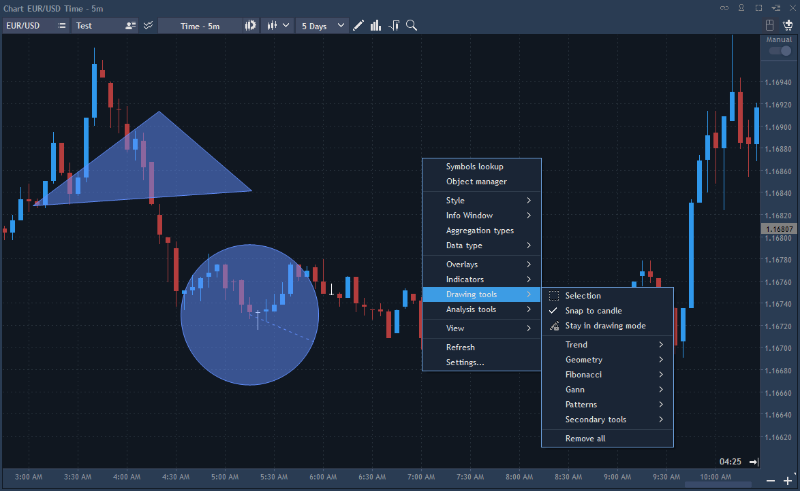
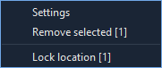
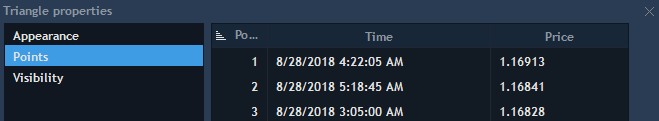
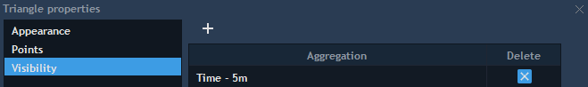

# Drawings


A set of graphical tools is available to assist in price movements analysis. All of these tools are accessible via the Drawing toolbar or through the Context menu of the Chart.

The following list of graphical tools is currently available:

Trend tools:

* Horizontal line – places a horizontal line on the chart that can be extended to the left in order to monitor starting points of levels plotting on the chart history \(option "Left ray" in the settings\);
* Vertical line – places a vertical line on the chart;
* Line – places a line on the chart that may be extended beyond both sides with an option to show the angle of the trend \(set in the settings\);
* Price channel – places levels on a trend line;
* Regression channel – consists of two parallel lines plotted equidistantly above and below a Regression line. User can specify begin and end points of regression line: these will be snapped to the closest bars. The slope of the lines will be automatically adjusted based on linear regression;
* Andrew's pitchfork – places Andrew's channel Polygon;

Geometry tools:

* Triangle – adds a simple triangle on the chart;
* Rectangle – places a simple rectangle on the chart;
* Circle – places a circle on the chart;
* Ellipse – places an ellipse on the chart;
* Polygon – places a polygon figure on the chart;

Fibonacci tools:

* Fibonacci retracement – retracement and price goals;
* Fibonacci expansion – estimating support and resistance levels;
* Fibonacci arc – places arcs with Fibonacci levels;
* Fibonacci ellipses – identifies underlying structure of price movements;
* Fibonacci spiral – places a spiral with Fibonacci levels as steps;
* Fibonacci fans – places Fibonacci angles;
* Fibonacci phi-Channel – places Fibonacci levels on a trend line;
* Fibonacci time goal analysis – places time goals;
* Fibonacci time zone – measures Fibonacci periods.

Gann tools:

* Gann line – places a line drawn at the angle of 45 degrees;
* Gann fan – places a series of diagonal lines;
* Gann grid – places trends at the angle of 45 degrees.

Patterns:

* Gartley butterfly – this drawing allows finding all kinds of Gartley patterns on the price chart;
* Top Bottom pattern – this drawing marks levels of the support/resistance on a price chart which leads to a reversal of an asset/process movement;
* PPZ \(Price pivot zone\) – this drawing marks levels of the support/resistance on the price chart which lead to the strong price reaction for a short period of time.
* ABC pattern – when using this drawing, schematic structure of the waves A, B, C will be built on the chart. ABC pattern is an element of the wave theory by which the wave C is 161° from the value of wave A.

Secondary tools:

* Arrow – adds an arrow on the chart;
* Ruler – measures distance between points;
* Comments – places a small text box for remarks. Double click it to edit a text;
* Price label – places a certain price label on a chart.

Properties:

* Selection – selects more than one drawing on the chart;
* Snap to candle – if checked, while moving drawing tools automatically sticks to the contour of the candle, centerline of the candle and its wicks;
* Stay in drawing mode – if this button is disabled, after drawing some tool, the cursor will be reset to the Arrow view, if enabled – will continue to stay in drawing mode of a selected tool.

Remove all – removes all drawings from the chart.

In order to place a tool:

* Open Context menu and select Drawing tools -&gt; \[desired tool\] or click on an appropriate icon in the Drawing toolbar;
* If a tool requires points to be specified on the chart \(e.g. a line requires two points while Andrew's pitchfork requires three\), you can choose these points using "Snap to candle" option. This defines which price the lines will follow. In Freehand mode, there is no reference to the price.

Note: freehand is the default setting when selecting a tool from the Drawing toolbar and "Snap to candle" is disabled.

#### Context menu

Each drawing tool has its Context menu. Right click on the initial point of the drawing tool in order to evoke its context menu.

* Settings – used for specifying tool’s appearance and settings;
* Remove selected – deletes selected tool;
* Lock location – locks selected drawing.

Drawing's Settings menu contains different sections depending on drawings' types. In general, the following sections are available in the Settings menu: Appearance, Points, Visibility.

However, different sections' combinations are available for different drawings.

* For such drawings, as Line, Vertical line, Horizontal line, Triangle, Rectangle, Polygon, Circle, Ellipse, Andrew's pitchfork, Price channel, Fibonacci spiral, Fibonacci time zone, Gann line, Gann fan, Gann grid, Regression Channel, ABC pattern, PPZ \(Price pivot zone\), Top Bottom Pattern, Gartley butterfly, Ruler, Mark, and Comments, the following sections are available:
* * Appearance – allows to set up drawing's view parameters;
  * Points – allows to indicate coordinates for every point which must be specified for a drawing. Coordinates indication is realized via values of the fields Time and Price:


Visibility – allows to set up a drawing's visibility on the chart depending on its aggregation type \(read more about aggregation types here: [https://guide.traderevolution.com/project/desktop-application-for-windows/analysis-tools/chart/aggregation-types-overview](https://guide.traderevolution.com/project/desktop-application-for-windows/analysis-tools/chart/aggregation-types-overview)\). Every drawing is visible for all aggregation types by default. With defined Visibility settings a drawing becomes visible for selected aggregation types with specified parameters only:


Click on the button
in the column Delete to remove a visibility parameter. Clicking on the buttonallows to set up a visibility parameter depending on a chart's aggregation type via the following dialog screen:

* For such drawings, as Fibonacci retracement, Fibonacci expansion, Fibonacci arc, Fibonacci ellipses, Fibonacci fans, Fibonacci phi-channel, Fibonacci time goal analysis, the following sections are available:

          1. Appearance;

          2. Points;

         3. Visibility;

         4. Fibonacci – allows to add, delete Fibonacci levels, edit their values and to set   up the font, font color and width of a line of a drawing which will be colored after reaching the value which you set:

