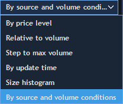
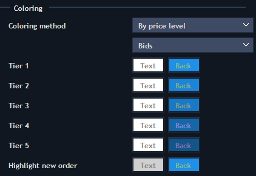
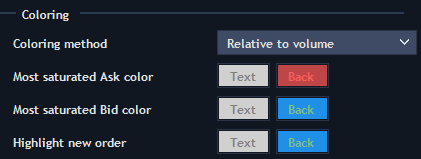
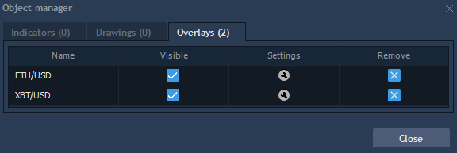

# Object manager

Object manager tool is used to manage drawings, indicators and overlays more effectively and quickly. This panel consists of three tabs which have similar options: Indicators, Drawings and Overlays. In order to open Object manager panel, click on the appropriate button
at the chart toolbar or select "Object manager" option from the context menu.

### **Indicators**

* Name – shows full name of the indicator.
* Window – shows type of the window for displaying: Main or Sub.
* Visible – controls visibility of the chosen indicator on the chart.
* Settings – evokes window with settings of the chosen indicator.
* Remove – allows removing indicator in one click.

### **Drawings**

* Name – shows full name of the drawing.
* Window – shows type of the window for displaying: Main or Sub.
* Show on chart – allows viewing selected drawing on the chart even if it was added long time ago without scrolling the chart.
* Settings – evokes window with settings for the chosen drawing.
* Remove – allows removing drawing in one click.

Note: use hot button "Ctrl + B" for quick evoking the Drawings tab.

### **Overlays**

* Name – shows full name of the overlaid symbol.
* Visible – controls visibility of the chosen overlay on the chart.
* Settings – evokes window with settings for the chosen overlay.
* Remove – allows removing overlay in one click.

