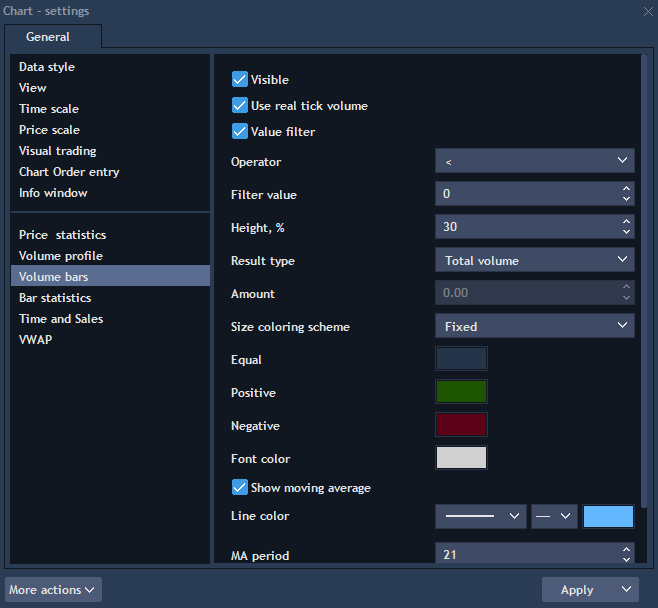

# Volume bars

This functionality allows to organize and analyze vertical volumes on the chart. Volume bars can be opened from the Analysis tools menu by clicking on the button
or through the Context menu -&gt; Analysis tools -&gt; Volume bars.​


Volume bars can be set up in the following way:​

* Visible – controls visibility of the volume bars on the chart; this option is inactive by default, which means the volume bars are not visible on the chart, to make them visible mark the option as active;
* Use real tick volume – this option is inactive by default, which means tick price changes are displayed; if marked as active, then volume by each trade is displayed;
* Value filter – when checked, such elements as Operator and 'Filter value' appear. They allow to set up a constraint for renderers' displaying:
  * Operator – allows to select one of the comparison characters: =, &gt;, &gt;=, &lt;, &lt;=;
  * Filter value – allows to specify value to compare renderers' values with. Renderers' values, which don't correspond to a given condition, will not be displayed on the chart.

E.g., selecting " &gt;=" and specifying the value 30 will result into displaying volume bars having values like 30, 31 \[...\] 45 etc.

* Height, % – allows setting the size for area of the volume bars displaying. For example: Height, % = 30, i.e. 30 %;
* Result type – allows selecting by what type volume bars will be built. Available values:
  * Total volume – shows total volume traded for a specified period of time \(current mode\);
  * Buy volume – shows only buy traded volumes for a specified period of time \(defined by flag-aggressor\);
  * Sell volume – shows only sell traded volumes for a specified period of time \(defined by flag-aggressor\);
  * Delta – shows difference between buy and sell volumes. Delta = Buy volume – Sell volume;
  * Average total size – shows average volume of one trade:

Average total size = Total volume/ Trades count, where: Trades count – total number of trades for a selected period of time;

                Average buy size – shows average volume of one buy trade:

Average buy size = Total buy volume/ Buy Trades count, where: Buy trades count – total number of buy trades for a selected period of time;

                Average sell size – shows average volume of one sell trade:

Average sell size = Total sell volume/ Sell Trades count, where: Sell trades count – total number of sell trades for a selected period of time;

                Custom volume trades, % – this mode summarizes all trades which traded with volume greater than Amount \(set in settings\) and shows percentage of such trades in the total volume:

Custom volume trades, % = Count \(Total volume &gt; Amount\)/ Total trades \* 100%;

                Custom buy volume trades, % – this mode summarizes all buy trades which traded with volume greater than Amount \(set in settings\) and shows percentage of such trades in the total buy volume:

Custom buy volume trades, % = Count \(Buy volume &gt; Amount\)/ Buy trades \* 100%;

                Custom sell volume trades, % – this mode summarizes all sell trades which are traded with volume greater than Amount \(set in settings\) and shows percentage of such trades in the total sell volume:​

​Custom sell volume trades, % = Count \(Sell volume &gt; Amount\)/ Sell trades \* 100%;​

                 Buy&Sell volume –​ shows buy and sell traded volumes for a specified period of time \(defined by flag-aggressor\).​

* Amount – allows setting amount that is necessary for calculation of the Custom buy/sell volume trades parameters \(described above\);
* Size coloring scheme – coloring scheme for displaying. The following schemes are available: Fixed, By bar, By difference, Above/below the moving average;
* Equal/Positive/Negative – allows choosing histogram color for equal/positive/negative values;
* Font color – allows setting style of the labels displaying;
* Show moving average – this option is inactive by default, which means the moving average is not displayed on the chart. To make it visible, mark the option as active. When it is checked, the 'Line color' control allowing to specify moving average line's color, shape and thickness becomes available;
* MA period – allows to specify volume bars' quantity for moving average calculation. This option is used for 'Size coloring scheme=Above/below the moving average' to apply this type of coloring scheme for a specified quantity of volume bars;
* Show value marker on scale – allows showing marker with a current value of volume on the scale.

