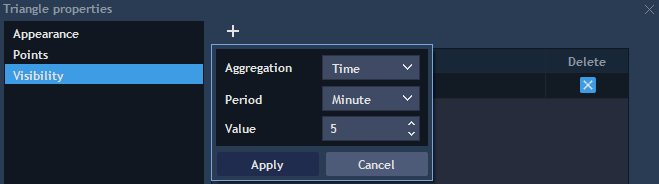

# Time & Sales

Time&Sales panel lists sales operations on the market.

To open the Time&Sales panel select Terminal -&gt; Time&Sales.

The Time&Sales panel chronologically shows all trades for a symbol at real time mode.

The information about chosen symbol starts streaming upon opening the panel.

For each trade, the following data is available:

* Symbol – the relevant symbol.
* Time – the time of the trade, can be displayed in two modes depending on the time format set in the settings: hh:mm:ss or hh:mm:ss:ms.
* Price – the price at which the trade fills.
* Size – the size of the trade.
* Side – shows side of the trade: Buy or Sell.
* Buyer, Seller – shows names of the counterparties.

### **Context menu**

Right clicking within the Time&Sales panel evokes its context menu with following options:

* Clear table – deletes all quotes and trades from the panel.
* Show quotes – if checked, the Time and Sales panel shows trades together with quotes. This option makes sense only for Real time mode.
* Aggregation – if checked, all trades with the same price, side, size, and MPId in one row as total are shown. This is applied to the highly-liquid markets.

If Show quotes = true and Aggregation = true, then column 'Bid \* Ask size' in this mode displays sum of Bids \* Asks by the best price level.

If Show quotes = true and Aggregation = false, then all requests are aggregated on the best price level by the same source and column 'Bid \* Ask size' displays the aggregated value of Bids/Asks with the biggest volume.

* Show toolbar – shows/hides the panel's toolbar with symbol's lookup.
* Search – opens search lookup.
* Export – allows to export table to CSV or Excel format.
* Table alerts – allows to receive notifications about trading events by preset conditions.

### **Time & Sales settings**

* Time format – the time of the trade, can be displayed in two modes depending on the time format set in the settings: hh:mm:ss or hh:mm:ss:ms.
* Show size in – allows selecting in what form the volume will be shown. General defaults – is taken from general settings; Lots – will be displayed in lots; Real size - will be displayed in real value.
* Round precision – if checked, user can set the precision of the volume display.
* Autosize of columns – allows showing T&S table in auto size mode.
* Grid – allows to choose the grid type: Vertical, Horizontal, Vertical & horizontal, None.
* Rows limit – allows to define the limit of rows to be displayed.
* Show only trades with different counterparties – allows showing only trades with different counterparties.

