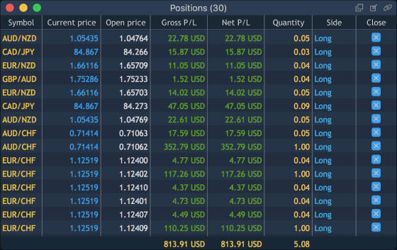
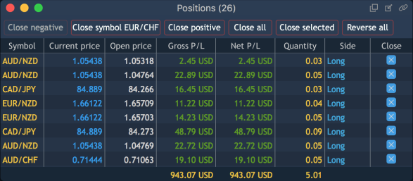

# Positions

Positions panel lists all currently opened positions. When a new position is opened, it appears in this panel immediately.

To open the Positions panel, select 'Terminal -&gt; Positions':

### **Buttons toolbar**

The Positions' toolbar can be opened via ‘Context menu -&gt; View -&gt; Show toolbar’. It contains the following buttons which can be activated via toolbar’s context menu:

* Close all – closes all opened positions;
* Close negative – closes positions with negative P/L;
* Close positive – closes positions with positive P/L;
* Close selected – closes all selected positions. Enabled when there is 1 selected position at least;
* Reverse selected – reverses all selected positions.
* Close long – closes all positions with 'Side = Long';
* Close short – closes all positions with 'Side = Short';
* Close symbol – closes all positions by a selected symbol. This means, to close all positions having a particular symbol, you need to select a position with this particular symbol and click on the button;
* CLX all – closes all opened positions and cancels all orders;
* CLX symbol – closes opened positions and cancels orders by selected symbol and account;
* Reverse all – reverses all positions;
* Reverse symbol – reverses positions by a selected symbol. This means, to reverse all positions having a particular symbol, you need to select a position with this particular symbol and click on the button.

Note: clicking on these buttons doesn't evoke confirmation screens, even if confirmations are enabled in the 'Preferences' window.

### Columns

Under the 'Positions' toolbar there is a table. The context menu of this table's header allows to adjust visibility of its columns. To open this context menu, right-click on the table's header.

Positions panel displays information about all currently opened positions via the following columns:

* Account – a name of a user's account, who opened a position;
* Login – a login of a user, who opened a position;
* Symbol – a symbol's name with which a position is opened;
* Symbol description – relevant information about a symbol;
* Symbol type – a symbol's type;
* Position ID – an ID of an opened position;
* Date/Time – time and date of a position's opening in the following format: m/d/y, h/m/s;
* Current price – a market price obtained from a broker;
* Open price – a price which a position was opened with;
* Fee – a total commission amount taken for a position;
* Gross P/L – profit/loss in account's currency, calculated on base of a price difference:

For Long position: Gross P/L = Qty. \* Lot size \* \(Current price - Open price\);

For Short position: Gross P/L = Qty. \* Lot size \* \(Open price - Current price\);

P/L for Spreadbet instrument type is calculated depending on price change in ticks:

For Long position: Gross P/L = Qty. \* Bet size \* Cross price \* \( \(Current price - Open price\)/Tick size\) \);

For Short position: Gross P/L = Qty. \* Bet size \* Cross price \* \( \(Open price - Current price\)/Tick size\) \).

Cross price is applied in case when account currency doesn't correspond to Betting currency.

* Net P/L - profit/loss for a position excluding fee:

Net P/L = Gross P/L - Fee.

* P/L, offset – profit/loss in points;
* Quantity – amount of a position in lots;
* Side – a position's side depending upon a trade's side, can be Long or Short;
* Expiration date – a date of a contract's expiration;
* Strike price – a price of an option contract's performance;
* Position exposure – an exposure for a position measured in account's currency. Calculated on base of open price:

Position exposure = Price \* Quantity \* Lot size \* Cross price \(quoting CCY &gt; account currency\) – for Forex;

Position exposure = Price \* Quantity \* \(Tick cost/Tick size\) \* Cross price \(quoting CCY &gt; account currency\) – for Futures;

In all cases Cross price \(quoting CCY &gt; account currency\) is a current cross price.

* Position value – a current value of a position. Calculated on base of a current market price:

For Long position: Position value = Position exposure + P/L;

For Short position: Position value = Position exposure – P/L.

* SL price – a Stop loss price set for a position;
* TP price – a Take profit price set for a position;
* SL, value – a Stop loss sum in account's currency which trader risks by each symbol in case 'Stop loss' triggers. Also, SL sum by all positions is displayed in Totals on the bottom of the panel, in order you could know how much it is possible to lose;
* SL limit price – Limit price set for SL order;
* Swaps – amounts collected/paid out by a broker when a position is rolled over to a new value date.
* Close – allows to close a position.

The same context menu allows to filter data in a table, reset the panel's view to factory defaults and to open the 'Positions Preferences' window.

### Context menu

To open the Position panel's context menu, right-click on any clean space under its table's header.

The Positions' context menu includes the following options:

* Modify position – opens a position modification window, which allows to modify a selected position;
* Close – gives access to the following options:
  * Close position \[\#\#\#\] – closes a selected position;
  * Close by \[...\] for \[...\] – closes all positions in the panel by a symbol of a selected position for an account of a selected position;
  * Close all long;
  * Close all short;
  * Close all negative;
  * Close all positive;
  * Close all positions.
* CLX – gives access to the following options:
  * CLX by \[...\] for \[...\] – closes all positions and cancels all orders in the panel by a symbol of a selected position for an account of a selected position;
  * CLX all – closes all opened positions and cancels all orders.
* Reverse – gives access to the following options:
  * Reverse position \[\#\#\#\] – reverses a selected position;
  * Reverse by \[...\] for \[...\] – reverses positions by selected symbol and account;
  * Reverse all positions – reverses all positions.
* View – allows to show/hide the row showing the total values for columns and to show toolbar of the panel;
* Search – allows to show/hide a search lookup;
* Set hotkeys – allows to open the ‘Positions’ tab in ‘Hotkeys Preferences’;
* Group by – allows to select a column to group the panel's view by:
  * Account;
  * Login;
  * Expiration date;
  * Symbol type;
  * Side;
  * Symbol.
* Duplicate panel – allows to make a copy of a current panel;
* Preferences – opens the 'Positions Preferences' window.

