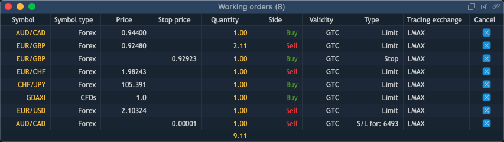

# Working orders

The Working orders panel lists all created orders which are visible for a user.

To open a new Working orders panel, select Terminal -&gt; Working orders.

Right-click on the table's column name in order to open the menu of available columns:

* Symbol – name of the instrument to be traded;
* Side – type of the trade to be performed \(Buy or Sell\);
* Date/Time – date and time on which the order was placed;
* Type – the order type;
* Quantity – the order amount measured in lots or in currency units, depending on what is selected in the Preferences dialog box;
* Price – price, at which the order is to be executed;
* Stop price – stop price for special stop order;
* Current price – market price obtainable from broker;
* Validity – allows specifying order validity by selecting among the following time frames: Day, GTC, IOC, GTD, FOK;
* Quantity filled – executed quantity of the order when only part of the order was executed;
* Quantity remaining – difference between quantity and executed quantity when only part of the order was executed;
* Order ID – unique number that the trading system assigns to each order. If a position is opened based on an order, the position will have the same number;
* Account – login name of the account that placed the order;
* SL price – stop loss price set for the order;
* TP price – take profit price set for the order;
* Bound to \(OCO\) – ID of the order which another order is bound to; if the former is executed, system will cancel the latter;
* Symbol type – market category of the instrument \(CFD, spot, stocks, etc.\);
* Login – user login;
* Symbol description – comments to the instrument;
* Exchange – indicates whether the instrument has a stock exchange or off-exchange type;
* Status – status of the current order. It can have the following values: Created, Part filled, Off market, Cancelling, Modified;
* SL offset – shows the stop loss order offset in ticks, fractional ticks or points \(depending on the current configuration of the Trading defaults section of the General preferences\);
* TP offset – shows the take profit order offset in ticks, fractional ticks or points \(depending on the current configuration of the Trading defaults section of the General preferences\);
* SL limit price – Limit price set for SL order;
* SL limit offset – Limit offset for SL order;
* Product type – shows the current trading mode and margin check method of the instrument;
* Strike price – price of option contract performance;
* Expiration date – date of contract expiration;
* Cancel – allows to cancel an order.


Note: Users can select which columns to display in the Working orders panel in the panel context menu \(Preferences -&gt; Columns\).


This context menu also contains the following options:

* Filtering – allows filtering the data in the panel’s table;
* Reset to factory defaults – allows to reset the adjustments to the factory defaults;
* Preferences – opens the ‘Working orders Preferences’ dialog box.

### 
**Buttons toolbar**

The most important functions related to Working orders can be viewed as buttons in the toolbar of the panel. To select the buttons to be displayed, simply right click on the toolbar of the panel and choose the needed buttons from the menu.

* Cancel all – cancels all orders.
* Cancel Buy – cancels all buy orders.
* Cancel Sell – cancels all sell orders.
* Cancel Stops – cancels all stop orders. 
* Cancel Limits – cancels all limit orders.
* Cancel Days – cancels all day orders \(Validity=Day\).
* Cancel GTCs – cancels all GTC orders \(Validity=GTC\).
* Cancel selected – cancels all selected orders.
* Cancel symbol – cancels all orders by selected symbol.
* Modify order – allows modification of the selected order.
* Change to Market – changes order type to market for selected orders.

Note: clicking on these buttons doesn't evoke confirmation screens, even if confirmations are enabled in the 'Preferences' window.

### **Context menu**

The following actions can be performed via the Context menu:

* Modify order – allows modification of the selected order. Note: If Stop limit order is activated, the Stop price field will be disabled in Modify screen. Thus, only Limit price can be modified. The same is true for closing Stop loss limit orders.
* Quick SL/TP – adding SL/TP orders to the selected order.
* Change to Market – changes order type to market for selected orders.
* View – allows to show total values and to show toolbar.
* Search – allows to show/hide a search lookup in the panel.
* Cancel – allows cancelling all selected orders, all orders by selected symbol, all orders by selected account, all orders.
*  Set hotkeys – allows to open the ‘Working orders’ tab in ‘Hotkeys Preferences’;
* Group by – allows to group orders by:

  -       Account;

  -       Date/Time;

  -       Login;

  -       Quantity filled;

  -       Quantity remaining;

  -       Side;

  -       Status;

  -       Symbol;

  -       Symbol type;

  -       Type;

  -       Validity.

* ​Duplicate panel – allows to duplicate a panel;
* Preferences – allows to open 'Working orders Preferences' dialog box.

### 
**Working orders Preferences**

The 'Working orders Preferences' menu contains such sections, as View, Columns, Colors.

**View**

* Grid – allows activating and setting up grid. The following types of grid are available: Vertical, Horizontal, Vetrical & horizontal, None;
* Allow auto-resorting data – allows auto-resorting a table after any changes;
* Display totals – allows showing total values for the columns;
* Show toolbar – if active, the toolbar is displayed in the panel.

**Columns**

This section allows to set up visibility of columns in the panel and to adjust the following columns' parameters: Alignment, Colors.

**Colors**

This section allows to adjust the coloring scheme for 'Working orders' table.

You can set up Background and Text colors for the following elements of 'Working orders':

* Table \(background color\);
* Grid \(background color\);
* Columns header row;
* Row;
* Alternative row;
* Selected row;
* Right selected row \(background color\);
* Totals row.

The 'Working orders Preferences' menu contains the following control buttons for managing adjustments:

* 
  – allows to set all current 'Working orders Preferences' menu adjustments as default ones;
* 
  – allows to reset all the Working orders Preferences' menu adjustments to 'User Defaults' or to 'Factory Defaults'. 'User Defaults' are the last adjustments, which were stored into the system by clicking on the button 'Set As Default'.

