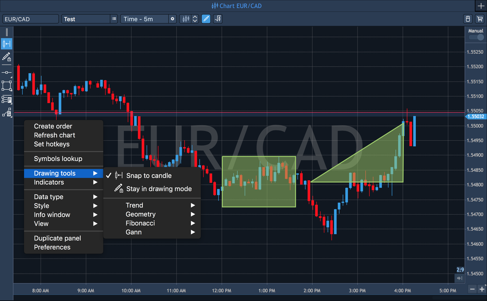
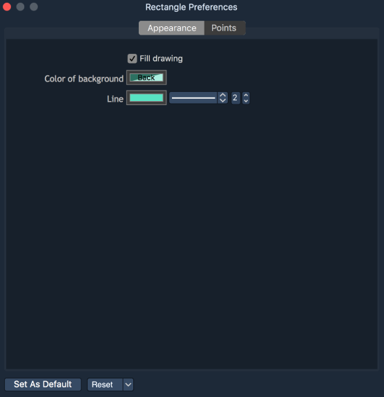
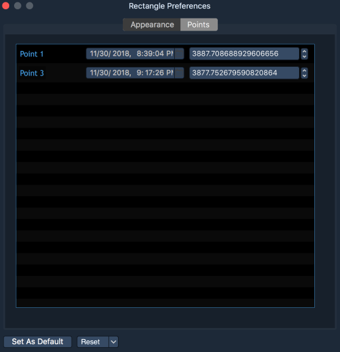
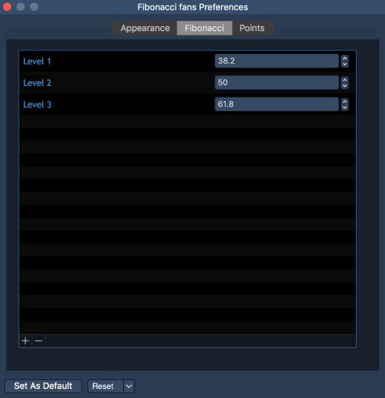

# Drawings

A set of graphical tools is available to assist in price movements analysis. All of these tools are accessible via the Drawing toolbar or through the Context menu of the Chart.

The following list of graphical tools is currently available:

Trend tools:

* Horizontal line – places a horizontal line on the chart that can be extended to the left in order to monitor starting points of levels plotting on the chart history \(option 'Extend left' in the 'Preferences'\);
* Vertical line – places a vertical line on the chart;
* Line – places a line on the chart that may be extended beyond both sides with an option to show the angle of the trend \(set in the 'Preferences'\);
* Price channel – places levels on a trend line;
* Andrew's pitchfork – places Andrew's channel Polygon;

Geometry tools:

* Triangle – places a simple triangle on the chart;
* Rectangle – places a simple rectangle on the chart;
* Polygon – places a polygon figure on the chart;

Fibonacci tools:

* Fibonacci retracement – retracement and price goals;
* Fibonacci expansion – estimating support and resistance levels;
* Fibonacci fans – places Fibonacci angles;
* Fibonacci phi-channel – places Fibonacci levels on a trend line;
* Fibonacci time goal – places time goals;

Gann tools:

* Gann line – places a line drawn at the angle of 45 degrees;
* Gann fan – places a series of diagonal lines;
* Gann grid – places trends at the angle of 45 degrees.

Properties:

* Snap to candle – if checked, while price movement, drawing tools automatically sticks to the contour of the candle, centerline of the candle and its wicks;
* Stay in drawing mode – if this button is disabled, after making a drawing, the cursor will be reset to the arrow view, if enabled – will continue to stay in drawing mode of a selected tool.

In order to place a tool:

* Open Context menu and select Drawing tools -&gt; \[desired tool\] or click on an appropriate icon in the Drawing toolbar.
*  If a tool requires points to be specified on the chart \(e.g. a line requires two points while Andrew's pitchfork requires three\), you can choose these points using 'Snap to candle' option. This defines which price the lines will follow. In Freehand mode, there is no reference to the price.


Freehand is the default setting when selecting a tool from the Drawing toolbar and 'Snap to candle' is disabled.


### 
Context menu

Each drawing tool has its Context menu. Right-click on the initial point of the drawing tool in order to evoke its context menu. 

* Preferences – allows to specify tool’s appearance and preferences;
* Remove – deletes selected tool.

Drawing's 'Preferences' window contains different sections depending on drawing's type. In general, the following sections are available in the 'Preferences' menu: 

* Appearance – allows to set up view parameters of a drawing;

* Points – allow to indicate coordinates for every point which must be specified for a drawing. Coordinates indication is realized via values of the fields Time and Price.


For such drawings, as Fibonacci retracement, Fibonacci expansion, Fibonacci fans, Fibonacci phi-channel, Fibonacci time goal, the additional section is available in Preferences menu:

* Fibonacci – allows to add, delete Fibonacci levels and edit their values.

