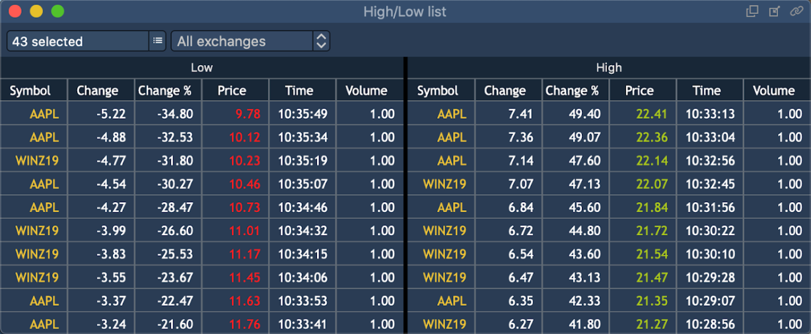
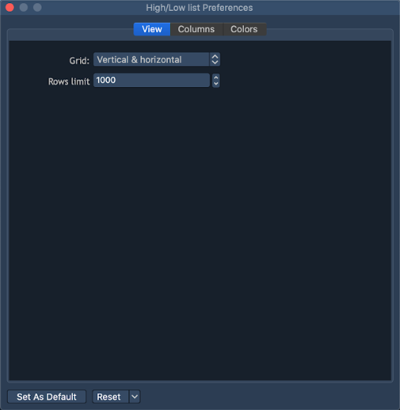
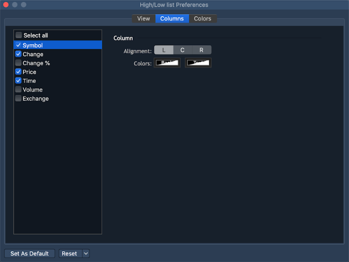
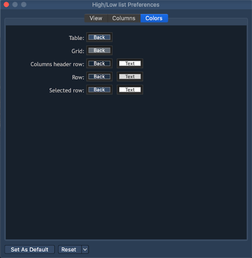

# High/Low list

This panel displays the Low and High lists containing the Instruments, which quote prices reach or exceed the current maximum \(day bar "High" price\) or minimum \(day bar "Low" price\) price values. The panel lists are populated with the Instruments, which quotes only exceed the maximum/minimum values or also reach the the maximum/minimum, depending on the algorithm configuration on the server.

The panel has the following view:

In the panel, the following common controls are available:

* Instruments drop-down list - drop-down list with checkboxes containing all the Instruments available to the User, for selecting the Instruments to be used for populating the panel lists. Multiple selection is available;
* Exchanges drop-down list - drop-down list with checkboxes containing all the Exchanges available to the User, the Instruments subscribed to which are used for populating the panel lists. Multiple selection is available;

For each list in the panel, the displayed columns can be configured independently in the Preferences menu on the right mouse click on the needed list. In the lists, the following columns can be displayed:

* Symbol - the Instrument name;
* Change - the absolute value of the Instrument price change;
* Change % - the percentage value of the Instrument price change;
* Price - the Instrument quote price, which caused the touching/breakdown of the current High/Low price \(preference the new "High/Low" day bar price\);
* Time - the time of the Instrument quote price, which caused the touching/breakdown of the current High/Low price;
* Volume - the total Instrument volume at the quoted price, which resulted in the touching/breakdown of the current High/Low price;
* Exchange - the name of the Exchange, to which the Instrument is subscribed.

### **High/Low list Preferences**

The Preferences window can be opened via the context menu of the panel. The 'High/Low list Preferences' menu contains such sections as View, Columns, Colors.

**View**

* Grid – allows activating and setting up grid. The following types of grid are available: Vertical, Horizontal, Vertical & horizontal, None;
* Rows limit – allows to define the limit of rows to be displayed.

**Columns**

This section allows to set up visibility of columns in the panel and to adjust the following columns' parameters: Alignment, Colors.

**Colors**

This section allows to adjust the coloring scheme for the table panel.

You can set up Background and Text colors for the following elements of the High/Low list:

* Table \(background color\);
* Grid \(background color\);
* Columns header row;
* Row;
* Selected row.

  
  
  

