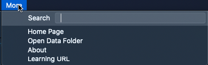

# More

In this panel, users can view the the terminal version info and use additional features:

* Search – allows performing a text search across the terminal menu content;
* Home page – allows opening the terminal home page;
* Open Data Folder – allows opening the terminal data folder;
* About – allows viewing the terminal version info;
* External link – when configured in the Back Office, allows opening an external link content in a dedicated detachable panel named after the link text.

