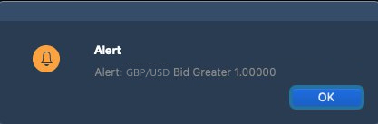
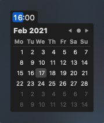

# Alerts

To open the Alerts panel, click the  button which is located at the header of the TraderEvolution terminal to the left from the Account details widget. In order to create an alert, click the  button at the bottom of the panel.

A user can find Bid, Ask, Last, Change%, and Volume data by the instrument selected in the symbol lookup of the panel.

The following settings are available when creating an alert:

* Symbol – standard lookup for instrument selection;
* Action – allows to select the action that will take place when the alert is triggered, the available values are:
  * Place order + Notify – alert is performed according to notification type and order placing occurs;
  * Notify – user is notified without placing an order;
* Order parameters – appears only if Action is set to ‘Place order + Notify’. At this point, there is an ‘Order entry’ button by clicking on which a full form for placing an order will be opened;
* Notification type – combobox for selecting the type of notification, multiselect is available:
  * Email – an alert containing the text from the ‘Alert message’ field will be sent to the user by email;
  * Push notification – an alert containing the text from the ‘Alert message’ field will be sent to the user via push notification;
  * Pop-up – an alert containing the text from the ‘Alert message’ field will be sent to the user in pop-up message;
  * Sound – a musical alert will be played to the user in the client.
* Alert type – allows to set an alert type. Available options are: Ask, Bid, Last, Change%, Volume;
* Condition – allows to set an alert condition. Available values are: &gt;,&lt;,&gt;=,&lt;=;
* Value – allows to set a value of Alert type for reaching the condition;
* Importance – allows to define the alert importance. The following options are available: High, Medium, Low. After the alert execution, the user gets a notification with the corresponding color of the indicator which depends on importance of the alert:

* Expiration – date/time picker that allows specifying the period of the alert lifetime. The expiration date and time are set in the corresponding calendar control:

The default expiration value is today + 30 days. 

* After execute – allows to select alert behavior after execution. Available options are ‘Stop’ - alert is not active but stored in the list of alerts, and ‘Remove’ - alert is removed after execution;
* Alert message – input field for entering the alert message text. The text in the message box is generated automatically in accordance with the alert parameters, but the user can customize the notification text if needed;
* Create/Cancel buttons – pick the appropriate action after setting the alert parameters. The ‘Create’ button is colored in accordance with the alert importance.

### Alert management

The user can browse through created alerts and work with them in the Alerts tab – both with executed and not executed ones. The maximum number of alerts which can be added to the panel is 100. The Alerts tab looks as follows:

The tab itself contains the table with alerts which consists of the following columns:

* Symbol – name of the instrument for which the alert was created;
* Condition – displays the condition upon reaching which the alert must be executed;
* Controls – set of controls for each alert, namely:
  * Play – this button is visible for executed alerts only, clicking this button will restart the alert with existing settings;
  * Stop – this button is visible for non-executed alerts only, clicking this button will stop the alert;
  * Edit – allows to open the editing screen, this screen is similar to the Create alert;
  * Remove – this button allows to remove the existing alert.

### Alerts on chart

The chart displays all active alerts for the instrument selected in the symbol lookup. If the alert is executed, it will not be shown on the chart, but its presence in the panel is controlled by the ‘After execute’ parameter. The chart displays all alerts for an instrument, for Ask, Bid, Last types.

In order to create a new alert on the chart, click thebutton that appears next to the price scale when the user hovers over a certain price level:

All active alerts created for the same instrument are visible on the chart. After execution, the alert is removed from the chart. The buttons for editing  and removing  an alert become visible when the user clicks the alert icon. The color of the alert icon depends on the importance of the alert.

Clicking the Edit control will open the Editing screen. Editing the alert from the chart is also possible using the Drag&Drop function. When using this function, the alert is modified without additional confirmation, just drag the alert to the required position.

