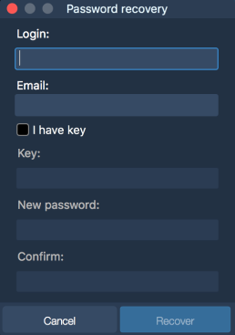

# Installation and updates

In order to download the application, use the App Store on your Mac. The login screen of the application looks as the following:

To open the application with your account, enter your Login and Password.

Check the 'Save password' if you want the app to store your login credentials.

### **Changing password**

Passwords can be changed anytime by using the following methods:

1. Before login to the application for Mac:

If a user forgot his password and needs to log in, simply click on the 'Forgot password' button on the main login screen.

To recover the password:

* enter Login ID in the Login field;
* enter email in the Email field;
* click 'Recover' to receive an email with a recovery key. Then enter this key to the field.

2. After login to the application for Mac: 

To open the ‘Change password’ / ’Change trading password’ window, select it in the Account menu:

Change password - allows changing the password which is entered to login into the terminal.


Change trading password - allows changing the password which is entered before making any trading operation.

To change the password:

* enter current password in the Current password field;
* enter new password in the New password field;
* re-enter new password in the Confirm new password field;
* click 'Save' to apply the new password.

### **Errors arising when changing the password**

When changing the password the user may have some problems, and the following error messages will be displayed:

1.    Incorrect current password or login - the message appears if the old password is incorrect or the user does not already exist in the system.

2.    Incorrect new password: you cannot use the same password - the message appears if the user enters a new password, which coincides with the old password.

3.    New password contains prohibited symbols - the message appears if new password contains prohibited symbols \(for example, & etc.\).

4.    Password cannot be the same as login - this message is displayed if the new password matches the login.

5.    Please enter new password - this message is displayed when new password has not been sent to the user or the new password field is empty.

6.    Incorrect new password: password should contain 1 number and 1 uppercase letter - this message is displayed if the new password does not meet the required level of password protection \(Strong Password required, low level of protection\).

7.    Incorrect new password: password should contain at least 8 chars and numbers - this message is displayed if the new password does not meet the required level of password protection \(Strong Password required, low level of protection\).

8.    Incorrect new password: password should contain at least 8 symbols including chars, numbers and special symbols - this message is displayed if the new password does not meet the required level of password protection \(Strong Password required, low level of protection\).

Click 'Log in' to open the application.

In order to update the application, use the App Store on your Mac.

 _\* Minimal system requirements for application for Mac:_

_macOS version 10.11._

