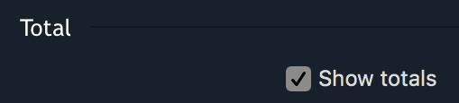
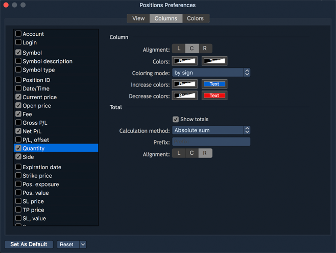

# Panel preferences

The menu Preferences can be opened through the Context menu, right click anywhere and select Preferences. See an example of the settings dialog window below:

### 
**View**

* Grid – allows showing grid between columns and rows \(you can select the following options: Vertical, Horizontal, Vertical & horizontal, None\);
* Allow auto-resorting data – allows auto re-sorting a table after any changes; 
* Display totals – allows showing total amount for columns. Be attentive to mark the "Show total" option 
  as checked as well for selected columns in the Columns tab;
* Show toolbar – allows showing panel toolbar.

### 
**Columns** 

 The ****'Columns' tab ****allows changing columns settings.


**Displaying and hiding columns**

The Columns box on the left lists the columns available in the panel. To display or hide a column, check or uncheck an appropriate box and click apply.

**Reordering columns**

To reorder columns, click on a desired column and drag it to the desired location while holding the left mouse button.

**Configuring each column**

To configure settings for a specific column: select the column type in the columns box. The column settings area on the right displays all available settings for a selected column, arranged into categories.

**Column**

The Column category lists the following settings:

* Alignment – allows to choose the alignment of data inside of a column: Left, Center, Right;
* Colors – allows changing font color and background color in a column;
* Coloring mode – allows choosing the coloring mode \(by difference, by sign or none\);
* Increase colors – allows drawing the price values which were increased while trading;
* Decrease colors – allows drawing the price values which were decreased while trading.


**Total**

Show total – if checked, the total value is shown.

Calculation method – allows to choose the calculation method of Total value \(Sum, Average, Count, Absolute sum\).

### **Colors**

The Colors tab allows configuring the color scheme for tables:

* Text colors – the cell text color \(text color\);
* Background colors – the cell background color.

### 
**Managing adjustments**

Use the following options to manage the adjustments:

* 
  – allows to set all current 'Preferences' menu adjustments as default ones;
* 
  – allows to reset all the 'Preferences' menu adjustments to 'User Defaults' or to 'Factory Defaults'. 'User Defaults' are the last adjustments, which were stored into the system by clicking on the button 'Set As Default'.

