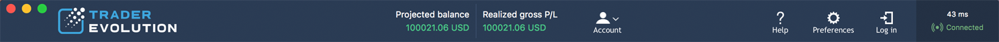

# Top menu and Status bar

### Top menu

*  Account: access to account information, Reports, Change password, Change trading password.
* Help: access to TraderEvolution Guide. 
* Preferences: access to general preferences of the platform. Read more about this section here: [https://guide.traderevolution.com/project/desktop-application-for-mac/logging-in/traderevolution-preferences](https://guide.traderevolution.com/project/desktop-application-for-mac/logging-in/traderevolution-preferences)
*  Log in: evokes login screen.
* Connection status: shows the status of connection to the server. 
* Ping information: shows the response time of the server \(ms\) to which the application is connected.

### **Status bar**


The Status bar is located at the bottom of the application. It displays \(from left to right\):

* Event log – shows a log of all events that occurred during work sessions.
* Lock trading – disables making all trading operations.
* Time – the current time**.**

 Clicking the date and time section will open the window for selecting the Terminal time zone:

This window contains the time zones available for the user, the first in the list is the user's local time zone, the second is the time zone of the server. The last on the list is the ‘Customize’ item, to get to this point, scroll down the list of time zones. Select the ‘Customize’ item in order to open the ‘Select time zones’ window where the user can redefine the default list of time zones:

Check the required time zones in order to include them in the default list and click ‘OK’. It is also possible to return the list to its default state by clicking the ‘Reset to default’ button.

Please note that after changing the time zone, the time display will immediately change in the following panels:

* Event log – time in the ‘Date’ column for Daily and Range query;
* Symbol info – instrument trading session time;
* Watchlist/Market depth – time in the ‘Last date’ column;
* Chart – time displayed at the bottom of the chart, also, when the time zone is changed, the display of trades on the chart will be automatically redrawn in accordance with the selected time zone;
* Time & Sales – time in the ‘Time’ column;
* Position/Working orders – time in the ‘Date/Time’ column;
* Filled orders/Orders history – time in the ‘Date’ column for Daily and Range query;
* High/Low list – time in the ‘Time’ column.  

