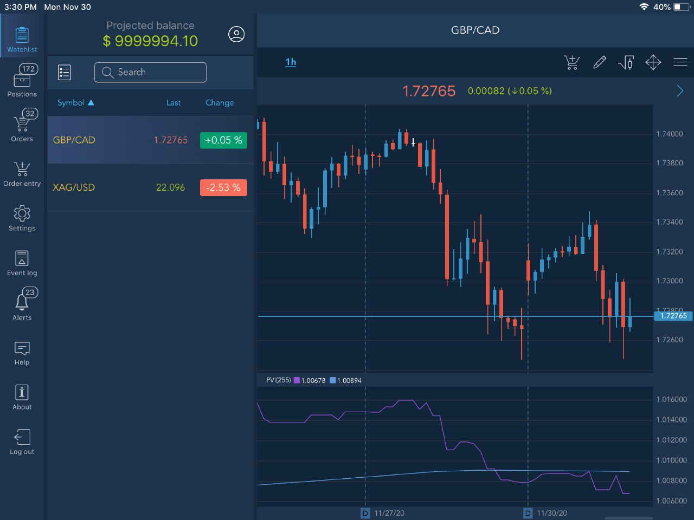

# PVI \(Positive volume index\)

The Positive Volume Index was introduced by Norman Fosback and is often used in conjunction with the Negative Volume Index to identify bull and bear markets. It focuses on days where the volume increased from the previous day. The premise behind the PVI is that the “not-so-smart” money is most active on the higher volume days and is more emotionally reactive to movements in the market caused by higher volume. One should note that while this assumption may tend to be true overall, it is not always necessarily a fact, which can undermine the usefulness of the indicator.

The interpretation of the PVI is based on the assumption that on days with increasing trade volumes, the large-scale, crowd-following "uninformed" investors are in the market. On days with decreasing trade volumes, on the other hand, the "smart money" is quietly taking positions. In this way, the PVI is able to show the activity of the "not-so-smart-money". 

The PVI is good at suggesting a bull market when it is above its one-year Moving Average, and still good in identifying a bear market when it is below its one-year Moving Average.

The Positive Volume Index is not currently applicable for intraday charts due to the nature of the data. 

The Positive Volume Index is typically compared to a 255-period moving average of its value.

* When the index increases above this value, less informed traders \(the crowd\) have typically been buying, indicating the prices may continue to increase;
* When the index increases below this value, uninformed traders have typically been selling, indicating a possible decrease.

### Calculation

If today's volume is greater than yesterday's volume then:

PVI = Yesterday's PVI + \(\(\(Close - Yesterday's Close\) / Yesterday's Close\) + Yesterday's PVI\)

If today's volume is less than or equal to yesterday's volume then:

PVI = Yesterday's PVI

Because rising prices are usually associated with rising volume, the PVI usually trends upward.

### Main parameters

* Data type: Close, Open, High, Low, Median, Typical, and Weighted;
* Period of SMA, 255 by default;
* Start index, 1 is the default value.

Below is the appearance of the indicator with a 255-period Simple Moving Average added to the chart:

