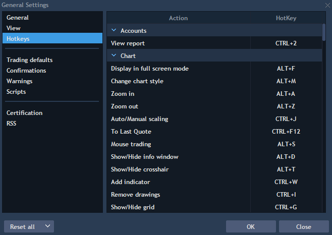

# Hotkeys


Hotkey is a key or a combination of keys providing quick access to a particular function. The same functionality can be activated using the mouse by selecting the functionality in a menu, but using the equivalent hotkey is much faster. The description below is given within the bounds of each panel.

### 
Accounts

View report – allows viewing a report of account activity. The certain account in the panel should be chosen to make the hotkey work.

### Chart

Display in full screen mode – allows displaying the chart in the full screen mode.

Change chart style – allows changing style of the symbol price movements: candle, line, bar, dots, etc.

Zoom in – allows zooming in the chart.

Zoom out – allows zooming out the chart.

Auto/Manual scaling – allows choosing Auto or Manual modes of scaling.

To Last Quote – moves the chart to the last quote.

Mouse trading – activates trading using mouse.

Show/Hide info window – shows or hides info window.

Show/Hide crosshair – shows or hides the crosshair.

Add indicator – opens the screen for adding an indicator.

Remove drawings – allows to remove drawings from the chart.

Show/Hide grid – shows and hides the grid on the chart.

Show volume – shows the volume profile on the chart.

Set period \(Tick, 1 m, 5 m, 15 m, 30 m, 1 H, 4 H, 1 D, 1 W, 1 Month, 1 Y\) – allows specifying the timeframe.

Object manager Indicators – allows evoking the window with settings of indicators.

Object manager Drawings – allows evoking window with settings of drawings.

Object manager Overlays – allows evoking window with settings of overlays.

Draw Line – allows drawing a line on a chart.

Draw Vertical line – allows drawing a vertical line on a chart.

Draw Horizontal line – allows drawing a horizontal line on a chart.

Draw Comments – allows drawing comments on a chart.

Draw Fibonacci retracement – allows drawing Fibonacci retracement on a chart.

Draw Fibonacci expansion – allows drawing Fibonacci expansion on a chart.

Draw Fibonacci arc – allows drawing Fibonacci arc on a chart.

Draw Fibonacci time goal analysis – allows drawing Fibonacci time goal analysis on a chart.

Draw Fibonacci fans – allows drawing Fibonacci fans on a chart.

Draw Fibonacci spiral – allows drawing Fibonacci spiral on a chart.

Draw Fibonacci time zone – allows drawing Fibonacci time zone on a chart.

Draw Fibonacci phi-channel – allows drawing Fibonacci phi-channel on a chart.

Draw Triangle – allows drawing a triangle on a chart.

Draw Polygon – allows drawing a polygon on a chart.

Draw Rectangle – allows drawing a rectangle on a chart.

Bar by bar moving – allows moving bar by bar.

Cancel last order on selected instrument – allows cancelling the last order on the selected instrument.

Cancel all active orders on selected instrument – allows cancelling all active orders on the selected instrument.

Cancel Buy order\(s\) closest to the last price – allows cancelling Buy order\(s\) closest to the last price.

Cancel Sell order\(s\) closest to the last price – allows cancelling Sell order\(s\) closest to the last price.

Set qty. equal to opened position's qty. – allows setting quantity equal to opened position’s quantity.

### General

Connections – opens the screen ‘Connections’.  
  
Show settings – opens the screen with settings.  
  
Show hotkeys – opens the screen with settings of hotkeys.  
  
New Chart panel – allows opening a new Chart panel.

New OE panel – allows opening a new Order entry panel.

New Working orders panel – allows opening a new Working orders panel.

New Positions panel – allows opening a new Positions panel.

Search in panels – evokes search window inside of the chosen panel. Click on the chosen panel to allow the hotkey work.

### Grid Group

Grid fullsize panel – allows gridding the fullsize panel.

### Market depth

Cancel last order on selected instrument – allows cancelling the last order on the selected instrument.

Cancel all active orders on selected instrument – allows cancelling all active orders on the selected instrument.

Place Sell order with amount equal to existed position – allows placing order with side ‘Sell’ with amount equal to the existed position without regard to the quantity which is set. Other parameters \(Order type, TIF, Price\) are taken from the panel.

Place Buy order with amount equal to existed position – allows placing order with side ‘Buy’ with amount equal to the existed position without regard to the quantity which is set. Other parameters \(Order type, TIF, Price\) are taken from the panel.

Buy market with amount equal to existed position – allows to open a position with parameters equal to the existed position with Buy side.

Sell market with amount equal to existed position – allows to open a position with parameters equal to the existed position with Sell side.

Cancel Buy order\(s\) closest to the last price – in case of existence of two orders of different price, the order which is closer to the last price is cancelled. In case of existence of two or more orders of the same price, all orders are cancelled because they are equidistant from the last price.

Cancel Sell order\(s\) closest to the last price – in case of existence of two orders of different price, the order which is closer to the last price is cancelled. In case of existence of two or more orders of the same price, all orders are cancelled because they are equidistant from the last price.

Place Buy order – allows placing Buy order according to the parameters of the order which are set at the panel.

Place Sell order – allows placing Sell order according to the parameters of the order which are set at the panel.

Prepare LMT Order – allows activating the field for entering the value of LMT order.

Place Buy order with working qty. 1, 2, 3 – allows placing Buy order with working quantity specified in first/second/third field of working quantities in Market Depth/Hotkey trading settings without regard to the quantity which is set. Other parameters \(Order type, TIF, Price\) are taken from the panel. The setting ‘Display quantity in lots’ – if true, the quantity which is set at the panel is applied. If false, the quantity ‘working qty.’ \* ‘lot size’ will be applied depending on the chosen instrument.

Place Sell order with working qty. 1, 2, 3 – allows placing Sell order with working quantity specified in first/second/third field of working quantities in Market Depth/Hotkey trading settings without regard to the quantity which is set. Other parameters \(Order type, TIF, Price\) are taken from the panel. The setting ‘Display quantity in lots’ – if true, the quantity which is set at the panel is applied. If false, the quantity ‘working qty.’ \* ‘lot size’ will be applied depending on the chosen instrument.

Modifier: Stop order when mouse click – allows stopping an order after mouse click.

Set qty. equal to opened position's qty. – allows setting quantity equal to opened position’s quantity. Other actions are not available.

Sell Ask – allows selling Ask according to your preset parameters.

Buy Bid – allows buying Bid according to your preset parameters.

### Matrix

Cancel all active orders on selected instrument – allows cancelling all active orders on the selected instrument.

Cancel last order on selected instrument – allows cancelling last order on the selected instrument.

Cancel Buy order\(s\) closest to the last price – in case of existence of two orders of different price, the order which is closer to the last price is cancelled. In case of existence of two or more orders of the same price, all orders are cancelled because they are equidistant from the last price.

Cancel Sell order\(s\) closest to the last price – in case of existence of two orders of different price, the order which is closer to the last price is cancelled. In case of existence of two or more orders of the same price, all orders are cancelled because they are equidistant from the last price.

Modifier: Stop order when mouse click – allows stopping the order when mouse click.

Modifier: Group actions with orders – allows grouping actions with orders.

Autocenter – allows autocentering Bid/Ask while scrolling the panel.

Set autocenter type to ask – allows setting autocenter type to ask.

Set autocenter type to bid – allows setting autocenter type to bid.

Set qty. equal to opened position's qty. – allows setting quantity equal to opened position’s quantity.

### Order entry

Open Buy OE – opens Order entry with default state ‘Buy’.

Open Sell OE – opens Order entry with default state ‘Sell’.

Place order – allows placing an order with the parameters which are chosen in the panel.

### Panels

Help – allows opening the article in Knowledge Base about the panel which is in the focus.

Show panel settings – opens the screen of panel settings.

### Positions

Close position – allows closing a chosen position.

Modify position – allows modifying a chosen position.

View position history – allows viewing position history.

### Super DOM

Cancel last order on selected instrument – allows cancelling the last order on the selected instrument.

Cancel all active orders on selected instrument – allows cancelling all active orders on the selected instrument.

Cancel Buy order\(s\) closest to the last price – allows cancelling Buy order\(s\) closest to the last price.

Cancel Sell order\(s\) closest to the last price – allows cancelling Sell order\(s\) closest to the last price.

Mouse trading – activates trading using mouse.  
  
Set qty. equal to opened position's qty – allows setting quantity equal to opened position’s quantity.

Autocenter – allows autocentering Bid/Ask while scrolling the panel.  
  
Modifier: Stop order when mouse click – allows modifying the order into Stop order while pressing the hotkey and clicking on the order.  

### Trading

Close all positions screen – opens the screen for closing all positions.

Close all positions immediately – allows closing all positions immediately.

Cancel all orders screen – opens the screen for cancelling all orders.

Cancel all orders immediately – allows cancelling all orders immediately.

Cancel all orders and close all positions immediately – allows cancelling all orders and close all positions immediately.

Open Reports – allows opening Reports.

### Watchlist

Remove symbol – allows removing a symbol.

### Working orders

Modify order – allows modifying an order.

Cancel order – allows cancelling an order.

Change to Market – allows changing to Market.

View order history – allows viewing order history.

To change the value of a hotkey, click on its current value.

Find information about Scalper hotkeys here: [https://guide.traderevolution.com/project/desktop-application-for-windows/trading-panels/scalper](https://guide.traderevolution.com/project/desktop-application-for-windows/trading-panels/scalper)_._

