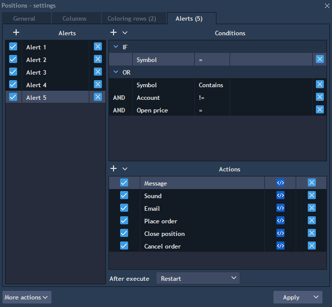
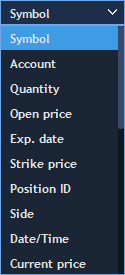
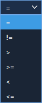
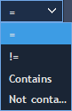

# Table alerts

Table alerts are available in the Settings -&gt; Alerts. Also alerts tab can be opened through context menu -&gt; Table alerts.


Click on the button
to add new alert. Its title can be changed directly from the title cell. Use the checkbox
to activate or deactivate an alert. Alert can also be removed with button.


Select one alert and use the button
to add new conditions. For each condition user must select Column type, type of comparison and value to compare:


Then in the bottom of the panel select actions which will happen if chosen conditions are true. Click on the button
to setup conditions of each selected action.

·         Message – allows writing a message, which a user will get if the conditions are true. The message will appear as a deal ticket.

·         Sound – allows playing a sound file, which a user can choose through the file path. The file should be saved in ‘wav’ format.

·         Email – allows sending a message to the email. Write a text, subject of the letter and the address of the email to which the letter has to be sent.  

·         Place order – if the conditions are true, the order will be placed. Open order entry to choose the parameters of the order you want to be placed.

·         Close position – allows closing positions if the conditions are true. Choose ID of the positions, which you want to be closed.

·         Cancel order – allows canceling orders if the conditions are true. Choose ID of the orders, which you want to be canceled.

