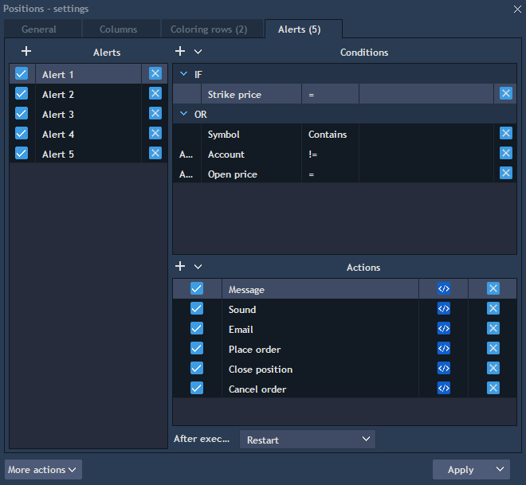
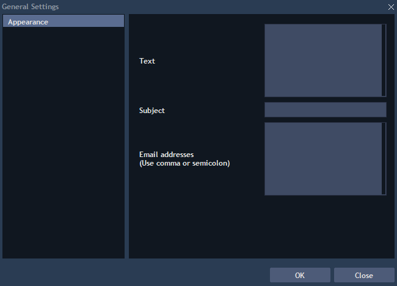

# Table alerts

Table alerts are available in the Settings -&gt; Alerts. Also alerts tab can be opened through context menu -&gt; Table alerts.


Click on the button
to add new alert. Its title can be changed directly from the title cell. Use the checkbox
to activate or deactivate an alert. Alert can also be removed with button.


Select one alert and use the button
to add new conditions. For each condition user must select Column type, type of comparison and value to compare:


Then in the bottom of the panel select actions which will happen if chosen conditions are true. Click on the button
to setup conditions of each selected action.

For example the following window will be opened for Email settings:

