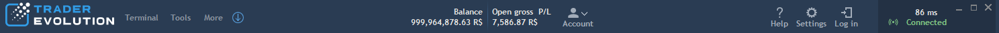
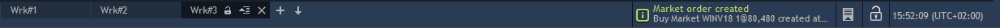

# Top menu, Info bar, Status bar

### **Top** **menu**

* Terminal: access to various panels which allow to trade, analyze trading activity, and monitor market conditions.
* Tools: Strategy manager, Synthetic instruments, Aggressor Balance Beta, Trading ideas, News, RSS, Economic calendar.
* More: access to TraderEvolution Global website, log file, private log file, data folder, About current version screen.
* Account: access to account information, Account statistics, Withdrawal, Reports, Change password, Change trading password.
* Help: access to TraderEvolution Guide.
* Settings: access to general settings of the terminal. Read more about this section here: Desktop application for Windows -&gt; General settings.
* Log in: evokes login screen.
* Connection status: shows the status of connection to the server.
* Ping information: shows the response time of the server \(ms\) to which the client is connected.

### **Info bar**

Info bar can be enabled or hidden via the tab General in General settings.

It looks as the following:


You can customize it via its context menu. To open the Info bar's context menu, right-click anywhere on the 'Info bar':.

* Tape rolling – when checked, the 'Info bar' moves horizontally along the application's window width;
* Customize – opens the 'Customize info bar' menu:


This menu allows to select a set of elements to be displayed in the 'Info bar'.

The checkbox 'Tape rolling' allows to enable/disable the Info bar's horizontal movement along the application's window width. 

The control
opens a list of elements' groups for particular elements selection. The groups 'Account details', 'Symbols' and 'Clocks' are available here:

* Account details – opens the 'Customize account details' menu:


This menu contains an account lookup for users having more than one account.

The following sub-groups of elements displaying account details are available here: General, Margin, Account activity, Today results, Risk management, Info.

To select element\(s\) from the sub-group\(s\), check needed element\(s\) and press the button 'OK'. Press the button 'Close' to cancel the selection and to quit the 'Customize account details' menu.

* Symbols – 
  opens the symbol lookup. You can select symbol\(s\) to be displayed on the 'Info bar' here. In the 'Info bar' near the selected symbol you can see the Last price \(the last trade price\) and Change, % \(the price deviation from a Previous close price in a percentage\);
*  Clocks – shows a list of clocks:


Check needed clock\(s\) to be displayed in the 'Info bar'.

All selected elements via the 'Customize info bar' menu are displayed in the 'Info bar'. They are also arranged in this menu in the form of hierarchical tree. To remove an element from the 'Info bar', select it with highlighting in the 'Customize info bar' hierarchical tree, right-click it and select 'Delete' or click on the button.

To remove more than one element, hold the key 'Ctrl', select as much elements as you need, right-click anywhere on the highlighted area and select 'Delete'.  
  
The following buttons allow to manage the 'Customize info bar' hierarchical tree's view:

* – click to collapse each tree's entity;
* – click to expand each tree's entity.


The button 'OK' allows to apply the 'Customize info bar' menu's arrangement to the 'Info bar'.

The button 'Cancel' allows to quit this menu without applying the arrangement to the 'Info bar'.

### **Status bar**

The status bar, located at the bottom of the screen, makes it possible to "stream" information such as news and many others. The status bar can be customized to show only information that user needs.

The status bar displays \(from left to right\):

* Workspace\(s\) – shows a particular configuration of panels, toolbars, charts and/or table layouts that makes up trading environment.
* Trading notifications – notifications about changes in the terminal and server. Appears when deal ticket comes, then notification disappears.
* Event log – shows a log of all events that occurred during work sessions.
* Lock trading – disables making all trading operations. After pressing the button, the notification in the center of the screen and the warning signs appear and it shows that trading is locked.

 Date/Time – the current time or date; or both date and time.

