# How to...

#### **1. How to reset my password?**

Reset your password following the recommendations from the ‘Changing password’ section: 

[https://guide.traderevolution.com/project/desktop-application-for-windows/getting-started/installation-and-updates](https://guide.traderevolution.com/project/desktop-application-for-windows/getting-started/installation-and-updates)

#### **2. How to find the ID of the order / position?**

1. Open the panel Positions/ Working orders;
2. Right click on the column names in the chosen panel;
3. Choose Position ID/ Order ID in the correspondent panels.

#### **3. How to execute a partial close?**

* Select the position to be closed from the Positions panel. Right-click and select ‘Close position’;
* User can also do a double left click on the position for the same operation. The ‘Close position’ dialog window will appear. Select ‘Quantity to close’ to execute a partial close of the position;

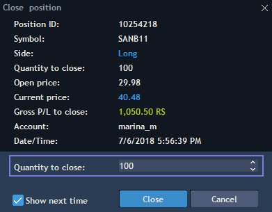

* Or place an order with the opposite side by the chosen instrument.

#### **4. How does the OCO order work?**

OCO order combines Stop order with Limit order. You can set prices for both of these orders and place 2 orders at the same time:

* You can place it selecting OCO order type in Order entry panel;

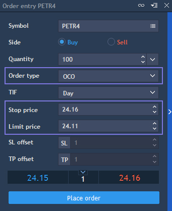

* Visual trading is another way to place OCO order directly on a chart.

#### **5. How does trailing stop work?**

* To place Trailing stop order, choose ‘Trailing stop’ from the drop-down menu of ‘Order type’ in the Order entry panel;

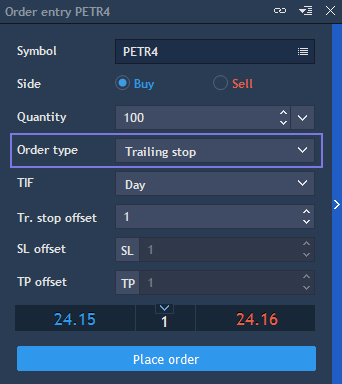

* To place Closing Trailing stop order instead of Stop loss, open Order entry panel. Put your mouse cursor on the SL icon without clicking on it and then choose TSL. You can place Closing Trailing stop directly from the chart, using Visual trading functionality and modifying an order or a position in the same way.

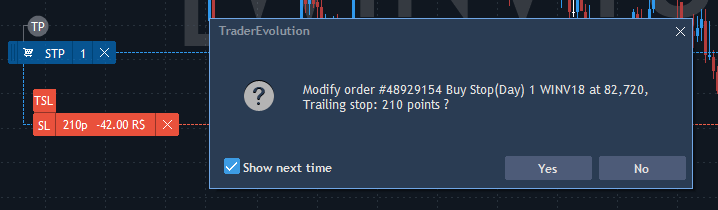

#### **6. How to add a price alert?**

1. Choose ‘Table alerts’ from the context menu of the chosen panel;
2. Set conditions by which you will receive an alert and actions which will be executed while receiving an alert.

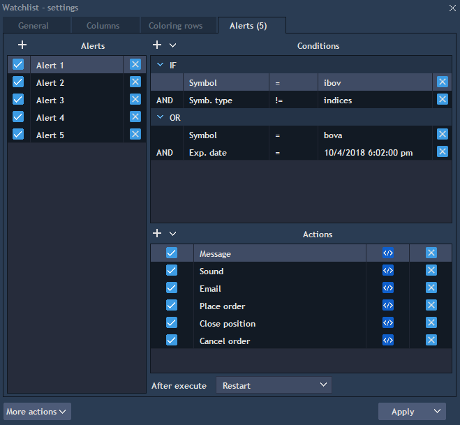

#### **7. How to disaggregate the Market depth?**

1. Open Market depth settings;
2. In the tab ‘View’, choose the option ‘By order’ from the drop-down menu of the control ‘View by’ and apply changes.  

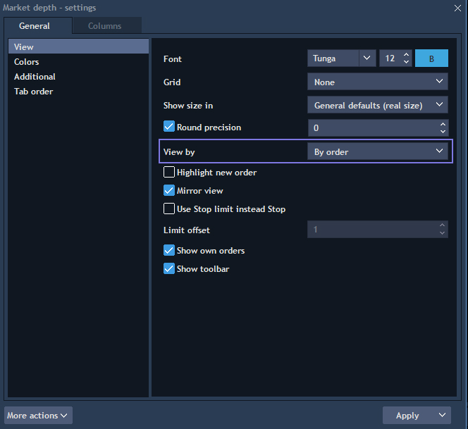

#### **8. How to import indicators?**

Click on the ‘Import’ button at the bottom of Indicators lookup.

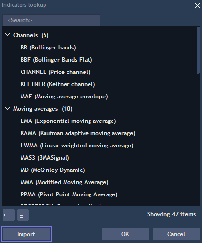

#### **9. How to show filled orders on the chart?**

1. Select the tab ‘Visual trading’ in the Chart settings;
2. Check filled orders to make it visible on a chart.

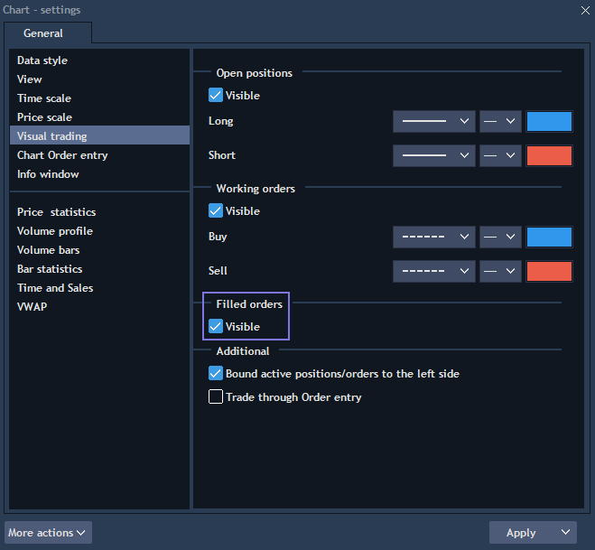

#### **10. How to enable VWAP?**

* Click on the button ‘Analysis tools’ button to open the list of analysis tools and choose VWAP;
* VWAP can be enabled in such panels as Chart, Market depth, Scalper, Matrix, Order entry;
* Read more about VWAP here: 

[https://guide.traderevolution.com/project/desktop-application-for-windows/analysis-tools/chart/volume-analysis/vwap](https://guide.traderevolution.com/project/desktop-application-for-windows/analysis-tools/chart/volume-analysis/vwap)

#### **11. Where is the volume at price?**

You have several ways how to view the volume by price:

* Market depth panel allows to see the volume for each price;
* Info Window in the Chart panel contains the volume value;
* Select ‘Volume bars’ from the list of Analysis tools to see it directly on a chart.

#### **12. How to track the auction price at opening?**

* Right click on the column names of the Watchlist panel to select ‘Indicative auction price’ from the menu;
* The column with such a name will appear in the Watchlist.

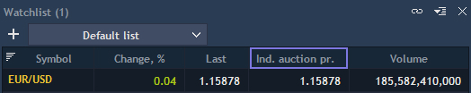

#### **13. How to open two charts at the same time?**

You have 2 options how to do this:

* Open grid panel: [https://guide.traderevolution.com/project/desktop-application-for-windows/analysis-tools/grid](https://guide.traderevolution.com/project/desktop-application-for-windows/analysis-tools/grid)
* Open 2 charts: [https://guide.traderevolution.com/project/desktop-application-for-windows/getting-started/arranging-panels](https://guide.traderevolution.com/project/desktop-application-for-windows/getting-started/arranging-panels)

#### **14. How to color brokerages in Market depth?**

1. Open Market depth settings;
2. Choose the tab ‘Colors’;
3. From the drop-down menu of the ‘Coloring method’, select the option ‘By source and volume conditions’.

#### **15. How to add a previous close line on the chart?**

1. Open the context menu of the chart panel;
2. Select ‘View’ -&gt; ‘Previous close’.

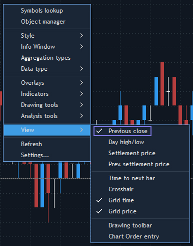

#### **16. How to put a chart inside of Scalper?**

1. Open the Scalper settings from the context menu of the panel;
2. Open the tab ‘Time & Sales chart’;
3. Choose ‘Trades & Quotes’ from the drop-down list of the Mode;
4. Apply changes.

#### **17. How to enable DDE Link?**

1. Open the context menu of the chosen panel;
2. Select the option ‘Export’ and choose ‘Excel’ from the drop-down menu;
3. Enable the ‘Synchronize’ checkbox;
4. Click on the button ‘Export’.

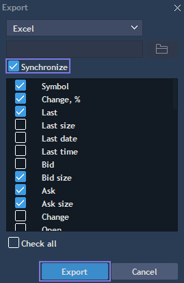

#### **18. How to view aggressor balance?**

* Open Aggressor Balance Beta panel in the terminal;
* You will have an opportunity to see the aggressor balance in form of data table, diagram and chart.

#### **19. How to show time to next bar?**

1. Right click on the Chart panel;
2. Select ‘View’ tab;
3. Choose the section ‘Time to next bar’;
4. Check ‘Visible’.

#### **20. How to close opposite positions mutually?**

* Any number of opposite positions by the same symbol and account can be closed at once;
* Select the positions to close in the Positions panel. To select multiple entries, hold down Ctrl key and click each entry. To select a range of entries, hold down the Shift key and click on the first and last entries in the range;
* With all positions selected, right-click and select Mutual close. The Mutual close dialog window will appear;
* Click OK to confirm the close, and the request will be sent to the server.

#### **21. How to modify a pending order?**

1. Right-click on a pending order in the Working orders panel and select ‘Modify order’;
2. Use the editable boxes to change quantity, order price, time in force, and the OCO order. To specify a new order price, use the Price field; the Current price field shows the market price. To update the Open price, click on the button ;
3. Click ‘Modify’ when done.

