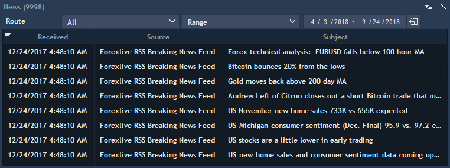
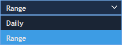

# News

News panel lists the latest news available from the broker and other news sources which user is subscribed to. To open new News panel, select Tools -&gt; News.


User can choose the News feed from the Routes list which was created on the server using this control.


Broker can create news routes, such as: News provider or exact news-wire from the same provider. This feature gives users more possibilities of customization and in some ways decreases the traffic flow through selection of the exact subject or news provider, and not all the news flow in general.

The following columns are available for the panel:

* Received – date and time when news were received.
* Source – source of news.
* Subject – topic of news.
* Content – the whole text of news.
* Category – type of news.
* Symbol – exact instrument on which news have influence.
* Priority – urgency of news.
* Link – direct link to news source.

Note: if any columns are not supported by News provider that fields will be free.

User can select time period for which he wants to see logs. Choose from the following time filters:


To read the story - open context menu and select View news story or simply double-click on the story. A built-in browser window will be opened, containing the full text of the story. It is also possible to remove selected news story or clear the whole table through context menu.

