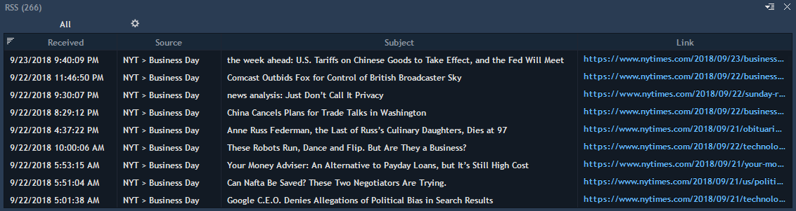
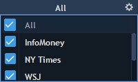
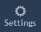
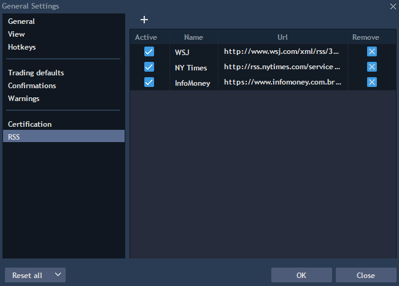

# RSS

RSS panel lists the latest news available from different RSS feeds added by user through RSS manager.

To open a new RSS panel, select Tools -&gt; RSS.


The following columns are available for the panel:

* Received – date and time when the news was received.
* RSS feed – original name of the RSS feed.
* Source – source of the news.
* Subject – topic/header of the news.
* Content – the whole text of the news article.
* Category – the news type/category.
* Link – direct link to the news article.

Note: if any columns are not supported by RSS feed that fields will be empty.

In order to view the news content, open context menu and select “View news story” or simply double-click on the news row, or just click the link in the corresponding column, after that selected news will be opened in the browser.

### **RSS feeds selection**

User can choose RSS feeds for receiving the news from the list of available.


Simply check/uncheck the needed feeds from the list or select all. After selection the user will receive fresh news only from the chosen RSS feeds, but previous news from other feeds won’t be removed from the panel.

### **Adding/Editing the RSS feed** 

To add a new RSS feed, click on General settings-&gt; RSS. RSS settings allow adding a new feed or editing the existing one.


To edit the existing feed, just make corrections in the feed name/Url, or enable/disable the feed and click "OK".

To add a new feed, click on "+" button and fill all feed parameters. All active RSS feeds will be displayed in the drop-down feeds list of RSS panel.

