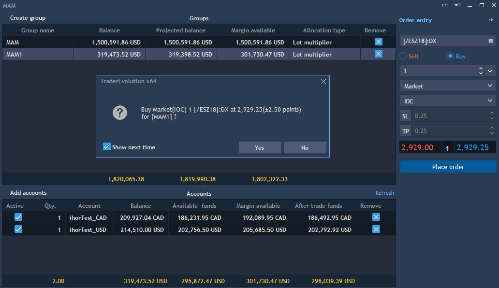
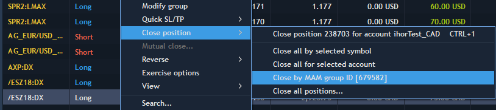

# Trading in MAM

The MAM panel includes a built-in Order entry panel for one-click trading. This Order entry panel automatically selects all active accounts in the MAM group and applies the allocation type to each trade. As seen at the screenshot below, placing an order within the MAM panel will give a confirmation message that confirms the order will be applied to all active MAM accounts based on allocation type.

### 
**Modifying and closing group positions**

Each position in the Desktop terminal has a Group ID. Group IDs are assigned to positions based on the method that the positions were opened by. When a MAM manager opens a position for all active accounts in the MAM group, those positions are assigned one single Group ID.

To view, modify, and close positions based on MAM group, simply navigate to the Positions panel, right click, and select Group By -&gt; MAM group ID. This will show all positions by their Group ID.

To modify positions by MAM group ID, right click within the one position of the group and select Modify group. This will open the Modify position window and changes will be made for the whole group.

Likewise, to close positions by Group ID, right click within the one position of the group and select Close position -&gt; Close by MAM group ID.


**Note: Trading using MAM group from any panel except MAM for MAM group is prohibited. Portfolio trading is forbidden from the MAM panel as well.**

