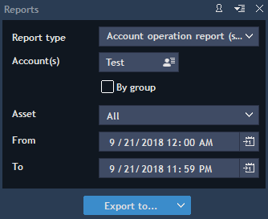

# Reports

To view any reports of account activities, select Account -&gt; Reports.



Users can export reports to CSV or Excel.

Users may choose to generate reports by user or by user group. For a user it is needed to specify one account or all accounts. When ‘Asset’ is checked, you can make reports for one specified symbol only. By default, reports include all symbols.

The list of reports available for trader is the following:

**Account operation report \(settled and unsettled\)**

Shows the detailed information on settled and unsettled account operations. Shows all account operations made by selected users/user groups/accounts for the chosen period of time. This report displays information as follows: Account, Account\(s\), Created at, Valuation date, Account operation ID, Order ID, Position ID, Trade ID, Operation type, Value, Currency, Comments.

**Account performance report**

Shows the following parameters for an account and a specific period of time: Account, Gross P/L, Net P/L, Trade volume, Fee, Spread, Swap, Balance, Currency.

**Account statement report**

Shows a detailed account statement for selected account\(s\). This report displays information as follows: Account, Account\(s\), Group, Balance, Blocked balance, Open gross P/L, Projected balance, Available funds, Margin used, Margin available, Margin warning, Maintenance margin, Risk level, Withdrawal available, Current margin %, Realized P/L, Stock, Stock value, Currency, Unsettled cash, Stock orders req, Option value, Stocks liquidity, option\_premium\_req.

**Active orders report**

Shows pending orders of the selected users, which are/were active within the specified period. The report displays parameters as follows: Account\(s\), Account, Group, Order ID, Created at, Bound order ID, Symbol, Operation type, Order type, Price, Stop price, Quantity, Filled amount, remaining\_amount, Fee, TIF, Updated time, Route, Auto trade, Terminal type, tradingmode.

**Balance report \(settled\)**

Shows a list of balance-affecting operations performed on the selected user accounts within the specified period, with the user and system balances after each operation. The report displays parameters as follows: Account\(s\), Account, Group, Created at, Valuation date, Account operation ID, Operation, Order ID, Debit, Credit, Balance, Currency, Comment.

**Balance summary report**

Shows detailed balance information on selected users, including settled and unsettled stock operations. By default, this report shows information as follows: Account\(s\), Account, Group, Balance before, Trading in, Trading out, Deposit, Withdrawal, Fee out, Swap in, Swaps out, Interest, Dividends, Other account operations, Total, Balance after, Currency.

**Executed orders report**

Shows information about all executed orders within a specified period. The report displays parameters as follows: Account\(s\), Account, Group, Order ID, Created at, Bound order ID, Position ID, Symbol, Operation type, Order type, Price, Stop price, Actual price, Execute, Quantity, Execution fee, TIF, Updated time, Auto trade, Terminal type, tradingmode.

**Open positions report**

Shows data about all the positions opened at the current moment. The report displays information as follows: Position ID, Account, Account\(s\), Group, Symbol, Symbol group, Quantity, Open price, Buy/Sell type, Open time, Current price, SL, TP, Profit, Swaps, Fee, Currency, Route, Margin, Auto trade, Terminal type, tradingmode.

**Order history report**

Shows all orders and their change history. The report displays parameters as follows: Account name, Symbol group, Symbol, Side, Event, Side, Event, Order ID, Type, Price, Stop price, Quantity, Route, Actual time, TIF, Trader, Auto trade, Terminal type, expyear, expmonth, expday, derivativetype, strikeprice, ordertime, tradingmode.

**Order book report**

Shows all orders and their current state - created or filled. The report displays information as follows: Account, Symbol, Side, Event, Order ID, Type, Price, Stop price, Quantity, order\_book\_disclosed\_qty, Route, Date, TIF, Modified, Login, Symbol type, expyear, expmonth, expdate, derivativetype, strikeprice, order\_book\_bought, order\_book\_sold, ordertime, tradingmode, External order id.

**Position history report**

Show the list of all positions \(both, open and closed\). For Options, the Instrument field has a specific format, for example: EUR/USD \(Call 10/2018 @1,34\). This means EUR/USD call options with a strike price of 1.34 and expired in October 2018. The report displays information as follows: Time, Account\(s\), Account, Sender, Symbol, Position ID, Order ID, Trade ID, External ID, Open time, Open price, Operation, Type, Position status, Trade amount, Position amount, Price, External price, Cross price, SL, TP, Route, Swaps, Execution fee, Total fee, Profit.

**Removed orders report**

Show the list of removed \(canceled\) orders in the system. The report displays parameters as follows: Account\(s\), Account, Group, Order ID, Created at, Bound order ID, Symbol, Operation type, Order type, Price, Stop price, Quantity, TIF, Removed, Auto trade, Terminal type, tradingmode.

**Trades report**

Shows trades operations: short or long. The report displays information as follows: Account, Sender, Symbol, Order ID, Trade ID, External ID, Route, Operation, Time, Price, Quantity, Cross price, Profit, Execution fee, External price, Trade volume, Exposure, Exchange, Type, Valuation date, Auto trade, Terminal type, rebates, expyear, expmonth, expday.

