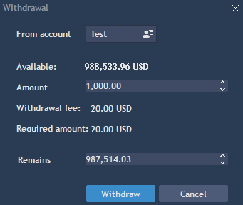

# Account operations

### **Withdrawal**

To withdraw from an account choose Account -&gt;Withdrawal. Withdrawing effectively blocks funds from being used in the platform.


Select account name and Withdrawal or Remaining amount. The confirmation message about blocking withdrawal amount will appear.

If a broker \[administrator\] withdraws money from a user account, the user receives a message about this. It's always best to confirm account withdrawals with a broker before proceeding.

Note: Withdrawal operations required broker approval. When a request is made, the broker can confirm or reject the transfer. While the request is pending, funds will be set aside as "Blocked balance."

### **Transfer**

Transfer is available only for users who have multiple accounts.

For transferring funds between accounts, choose Account -&gt; Transfer.


Select Source account \(From account\) and Target account \(To account\). Select transfer amount in the field ‘Amount’. Press Transfer for the transaction.

* Transfer fee - shows commission of the transfer.
* Required amount - shows amount user selected for the transfer.
* Transfer rate - shows rate of the transfer.
* Result transfer - shows amount which will be transfered to the target account.

 Note: Transferring  funds requires broker approval. When a request is made, the broker can confirm or reject the transfer. While the request is pending, funds will be set aside as "Blocked balance."

