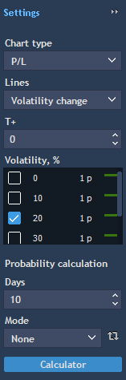
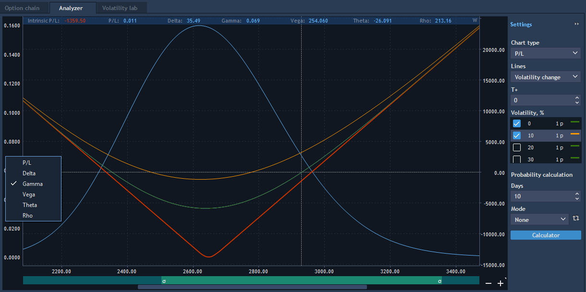

# Analyzer

Analyzer tab is used for graphic analysis before starting to trade options.

Analyzer tab has the general view as follows:


The main purpose of this tab is to describe graphically the portfolio of positions \(Test on paper tab\), and also to model changing of impact factors on portfolio.


While setting the corresponding changes of time and volatility user can model changing of portfolio cost which consists of options and underlier.

* Chart type – allows setting the type of displayed information on the chart. The following types are available here: P/L, Delta, Gamma, Vega and Theta.
* 'T +' – allows modeling changes in the numbers of days remaining until expiration of option or futures contract.
* Volatility, % – allows modeling volatility change in %; volatility modeling occurs simultaneously on all positions included in the portfolio. Range of changing: -99%..∞,%. Option "1 px" controls the width of volatility lines on the analyzer chart.
* Lines – this setting establishes the interconnection between 'T +' and Volatility, % parameters:
  * Time change – if selected, user can add lines which simulate the change by time and apply to them the change by volatility.
  * Volatility change – if selected, user can add lines which simulate the change by volatility and apply to them the change by time.

Probability calculation:

* Probability calculation mode – this setting allows choosing the calculation type of probability at a certain price movement of the underlier, the following values are available here:  
  * None – calculation of probabilities is missing.
  * Single – allows calculating the probability of the underlier price change till the specified level set by the user in the form of a vertical line;
  * OR – allows calculating the conditional probability of occurrence of any event P1 or P2 designated by the user on the chart in the form of vertical lines;
  * AND – allows calculating the conditional probability of execution of the events P1 and P2 designated by the user on the chart in the form of vertical lines.
* Days – allows specifying the number of days by which the modelling of changes in prices will be held \(Min value=1, Step =1, Value by default = 10\);
* Button "Refresh probability" – allows performing probability recalculation by click.

**Overlays**

Option analyzer chart has a possibility to display additional data \("greeks"\) in the form of **overlays**.

Analyzer chart has two axes: main \(right\) and auxiliary \(left\). Not only auxiliary data series \("greeks"\), but the same data as on the main axis can be displayed on the left axis. If both axes contain the same data, for example, PL, then only one data series will be displayed on both axes; there is no overlay in such case. Auxiliary axis supports Auto/Manual chart mode.

Right click by the auxiliary axis and choose data series to display as overlay on the auxiliary axis. Available data series: PL, Delta, Gamma, Vega, Theta.

Only one data series can be selected. "What if" scenario is not applied to the data series located on the auxiliary axes. Double click in the chart area or by X axis in order to enable Auto scale mode for both axes simultaneously.

**Probability calculation algorithm**

**Single mode**

Using vertical selector the user specifies the distance from selected point by X coordinate to current Last price. After that, the side and the distance are defined:

If X &gt; Current Last price, then UpDown=1

If X &lt; Current Last price, then UpDown=0

* If Simulation model = By absolute price, then R = X – Current Last price;
* If Simulation model = By relative price, then R = X/ Current Last price;
* If Simulation model = By logarithmic price, then R = Ln\(X/ Current Last price\).

After clicking on the "Refresh probability" button, all available 1 D history by the underlier will be loaded.

Point С \(Close price\) is selected randomly from the array of loaded history. Point C' is calculated from this point by the Y coordinate by the following rules:

* If Simulation model = By absolute price, then С' = C + R
* If Simulation model = By relative price, then С' = C \* R
* If Simulation model = By logarithmic price, then С' = C \* e^R

Probability scenario = One touch, this type calculates probability by touch to the level.

Probability scenario = Out of range, this type calculates "out of range" probability.

Repeat the whole procedure Simulation examples times.

Probability = Positive results/Simulation examples \* 100


**OR mode**

This mode is similar to Single mode, but instead of one selector for editing, there are two available selectors. When specifying the range for analysis, the following rule should be applied:

X1&gt; Current last price &gt; X2 or X2 &gt; Current last price &gt; X1

X1 != Current last price and X2 != Current last price

It is necessary to calculate points C’ and C’’ by the rules described in the Single mode.

**AND mode**

This mode allows calculating the conditional probability of the event. i.e. at first event 1 should be executed, and then event 2; event 2 cannot be executed, if event 1 is not executed.

Probability scenario setting is related only to the event 2, event 1 is always checked by the One touch scenario.

Determination of the distance:

If Simulation model = By absolute price, then

R1 = X1 - Current Last price

R2 = X2 - X1

If Simulation model = By relative price, then

R1 = X1/Current Last price

R2 = X2/X1

If Simulation model = By logarithmic price, then

R1 = Ln\(X1/Current Last price\)

R2 = Ln\(X2/X1\)

Point С \(Close price\) is selected randomly from the array of loaded history. Points C' and C’’ are calculated from this point by the Y coordinate by the following rules:

* If Simulation model = By absolute price, then С' = C + R1 and C’’ = C’ + R2
* If Simulation model = By relative price, then С' = C \* R1 and С’’ = C’ \* R2
* If Simulation model = By logarithmic price, then С' = C \* e^R1 and С’’ = C’ \* e^R2

Probability calculation is performed similar to the Singe mode, but two events should be executed consecutively.

