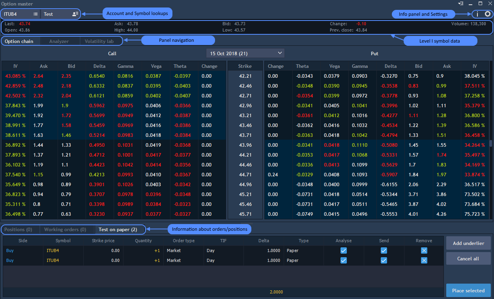

# Overview

The Option master panel shows detailed information about options, allows to analyze it and then to trade with selected option contracts.

To open a new Option master panel go to Terminal - &gt; Option master.

