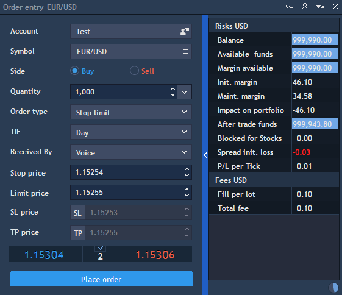

# Order entry

Order entry panel is where market or pending orders can be placed. To open the Order entry panel select Terminal -&gt; Order entry.


This panel contains the following settings:

* Account - the account used for an order creation;
* Symbol - the symbol available for the trade;
* Side - allows to activate Buy or Sell side;
* Quantity – an amount of lots in which an order is placed. The buttonnear this field  allows to select among default values for Quantity from the drop-down list. The item Edit calls the Types manager panel, allowing to edit the default values;
* Order type - defines the type of the order: Market, Limit, Stop, Stop limit, Trailing stop, OCO:

1. Market order is an order to buy or sell a security at the best available price immediately;
2. Limit order is placed to buy or sell a security at specified price or better;
3. Stop order is placed to buy or sell a security when its price surpasses a particular point, thus ensuring a greater probability of achieving a predetermined entry or exit price, limiting the investor's loss or locking in his or her profit;
4. Stop limit order will be executed at a specified price \(or better\) after given stop price has been reached. Once the stop price is reached, the stop-limit order becomes a limit order to buy \(or sell\) at the limit price or better;
5. OCO \(One-Cancels-the-Other\) is an order stipulating that if one part of the order is executed, then the other part is automatically canceled;
6. "Sell" trailing stop order sets the stop price at a fixed amount below the market price on the trailing offset. As the market price rises, the stop price rises by the trail amount, but if the stock price falls, the stop loss price doesn't change, and a market order is submitted when the stop price is hit. "Buy" trailing stop orders are the mirror image of sell trailing stop orders;

* TIF - Time-in-force option which allows traders to be more specific about time parameters in which an order is activated. This is especially important for active traders. It can be Day, GTC, IOC, FOK, GTD:

1. A Day order, as the name implies, is valid for the current trading day;
2. GTC \(Good till cancelled\) orders, on the other hand, will remain alive until they are cancelled or the contract expires;
3. IOC \(Immediate or cancel \) requires the whole or part of the order to be executed immediately after it has been brought to the market;
4. FOK \(Fill or kill\) requires to execute the entire transaction immediately and completely or not to execute it at all;
5. GTD \(Good till date\) order will be cancelled on specified date if not executed or until the contract expires;

* Received by - drop-down menu that determines the way the user issued a command on the order processing. The following values are available for selection in the list:

1. Voice - the command for processing the order was issued via a phone call;
2. Symphony - the command for processing the order was issued via the Symphony platform;
3. Email - the command for processing the order was issued in an email;
4. Bloomberg - the command for processing the order was issued via the Bloomberg Messenger;
5. Result of option expiry - the command for processing the order originated from an option expiration;
6. Option Exercise - the command for processing the order originated from an option exercise;
7. Reuters messenger - the command for processing the order was issued via the Reuters messenger;
8. OE - admin performs operations on the order.

Note: if the user performs actions on the position or modifies the order from one of the menus, in which this parameter is available the "Received by" value is automatically switched to "OE".

* Stop price \(for the "Stop order" type\) - allows entering the order stop price;
* Limit price \(available together with Stop price for the "Stop order" and "OCO" order types; also available for the "Limit order" type\) - allows entering the order limit price;
* Tr. stop offset - \(for the "Trailing stop" type\) - allows entering the order trailing stop price.


You can set up set the Stop loss and Take profit directly from the Order entry panel if needed. Also, it is possible to manage risks by setting trailing stop. Put your mouse on the SL button without clicking on it and then choose TSL to change Stop Loss order into Trailing Stop.

Order entry panel has two additional sections which display important information: VWAP and Margin. VWAP section - allows displaying VWAP prices section \(Bid, Spread, Ask\) in the Order entry panel. It shows prices of order executions including slippage effect that will take place depending on order quantity user set.

* Margin section - allows displaying Margin section in the Order entry panel.

The **Margin** section is divided on two parts: Risks and Fees.

Risks details section shows all values in account currency:

* Balance - an account's balance;
* Available funds – amount of funds for placing new orders;
* Margin available – available margin for trading;
* Initial margin – minimum account balance required to open the position;
* Maintenance margin – minimum account balance required to keep this position open;
* Impact on portfolio – shows impact of the order fill on available funds considering all other positions/orders;
* After trade funds – shows value of available funds remaining after filling the order:

After trade funds = Available funds + Impact on portfolio - Fee;

* Blocked for stocks – amount of funds debited from the balance in the case of trading with symbols with Stocks pre-paid margin type;
* Spread initial loss – shows initial loss on the spread:

Spread initial loss = \(Ask - Bid\) \* Tick cost \* Qty.

* P/L per Tick - displays data for Symbols:


P/L per Tick = Tick cost \* Qty - if a Symbol type is one of these: Futures, Options, Spreadbet;

P/L per Tick = Tick size \* Lot size \* Qty \* Cross-price **-** if a Symbol type is NOT one of these: Futures, Options, Spreadbet, Index;

P/L per Tick - no information for Index.

**Fees** part shows commission for a trade:

Total fee – shows the commission total on the trade. It is displayed depending upon commission plan settings on the Server. 

Information of the Margin section can be updated by clicking on the button
at the right corner at the bottom of the Margin section, or by default it is updated every 30 seconds.

