# Scalper

Scalping is type of the intraday trading strategies in the stock, currency, futures markets, etc. It implies the making of profits on small price changes. Typically, the trade is performed with a short period of time, from a fraction of a second to several minutes.

The necessary conditions for the implementation of such strategy type are the high liquidity of the traded instrument, moderate volatility, low spread, low broker and exchange fees, the ability to monitor constantly the current quotes.

There are three main methods of scalping:

1. Market depth \(classic\) scalping is to determine the imbalance between the volume of demand and supply that could lead to directional quotes movement, even insignificant.
2. Pulse scalping lies in the constant assessment of external markets and instruments which can cause impulsive directional movement of the traded instrument.
3. Hybrid scalping combines features of the first two methods and is used in the terminal.


Scalping has many advantages, such as:

* The highest potential profitability among other types of trading. Scalper can make from a few percent to several tens of percent on capital per day.
* The opportunity to start with a small start-up capital. And with the right approach you can quickly increase this small capital.
* The market activity for the scalper trades can be found almost any time of the trading session. No need to wait for a long time for the necessary signal or wait until a certain trend will be formed.
* User can trade immediately after opening the panel. Since the most liquid and volatile instruments always have activity and trades on such instruments can be made almost every second.
* The result of the trade has already been known for a couple of tens of seconds, etc.

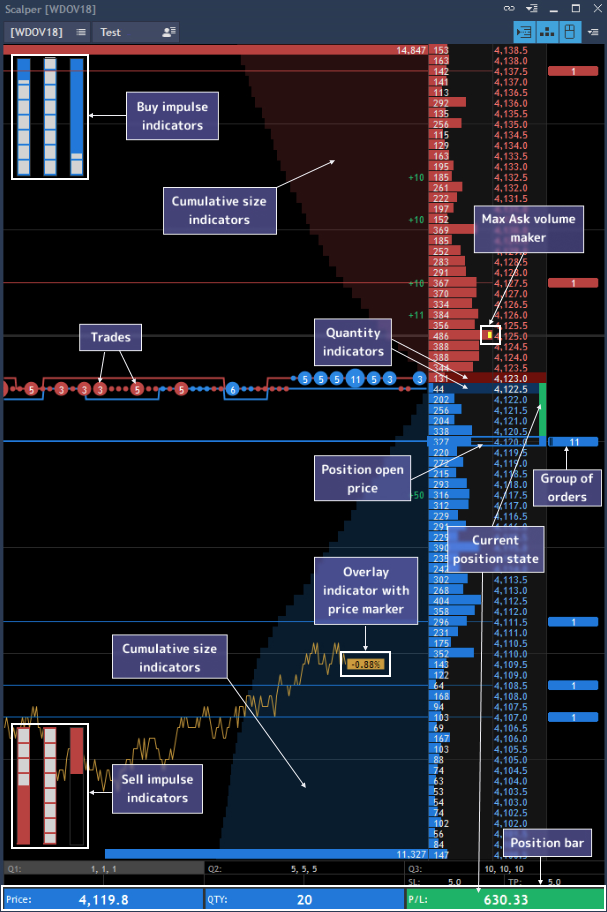


The Scalper panel allows traders to view and to trade Level II quotes, to use overlay and impulse indicators for analysis and to view Time & Sales chart – all in one panel.

**Note:** trading with instruments which have "one position" trading type is only allowed in the Scalper panel.

To open a new Scalper panel go to Terminal - &gt; Scalper.

The top panel of the Scalper consists of the Symbol and Account lookups, trading buttons and Menu button.

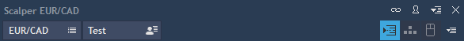

* Auto center button – allows auto centering the Market depth section relatively to spread.
* Hot keys trading button – allows trading with the help of the Hotkeys from the keyboard and Market depth section which is an integral part of the Scalper panel.
* Mouse trading button - allows trading with the help of the mouse and Market depth section. Both trading types \(Hot keys and Mouse\) are available simultaneously.
* Context menu button – allows to evoke the Context menu of the panel, also it is available through right click tapping within the Scalper panel:

- Show impulse indicator – allows to enable/disable the market sentiment indicators \(not more than three\).

- Show cumulative indicator – allows enabling an indicator of the growing volume.

- Show size changes – if enable, then volume change at a given price will be dynamically displayed in the charts area next to each price level.

- Settings – allows opening settings tab.

The bottom status bar consists of the three sections:

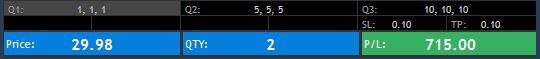

1. Working quantity indicator – shows the current value of the working quantity that displays the number of active combination and the values themselves \(working quantity – increase quantity – decrease quantity\). All three available combinations are displayed on the status bar, and active combination is highlighted.
2. SL/TP indicator – shows SL/TP values that are currently set in the settings. Also the separate indicator shows what type of adding SL/TP mode is now active \(auto or manual\).
3. Market position indicator – shows a current state of a position: open price, opened position quantity, current profit/loss. P/L value is displayed in currency or in ticks/points depending on what option you choose clicking on it.

Selection between 'P/L by currency' and 'P/L by points' is available when 'Show offset in = Points' in the section 'Trading defaults' of the 'General settings'.

The color of QTY cell depends on the side of the position:

* If all positions have Side = Long, qty. cell will be colored in blue;
* If there are no positions, qty. cell will not be colored and qty. value = N/A.
* If positions are multidirectional, then qty. cell is not colored;
* If all positions have Side = Short, qty. cell will be colored in red;

User has a possibility to change a size of Time and sales chart section using left mouse button \(drag&drop\), to provide this just disable Mouse trading and resize chart section to desired width.

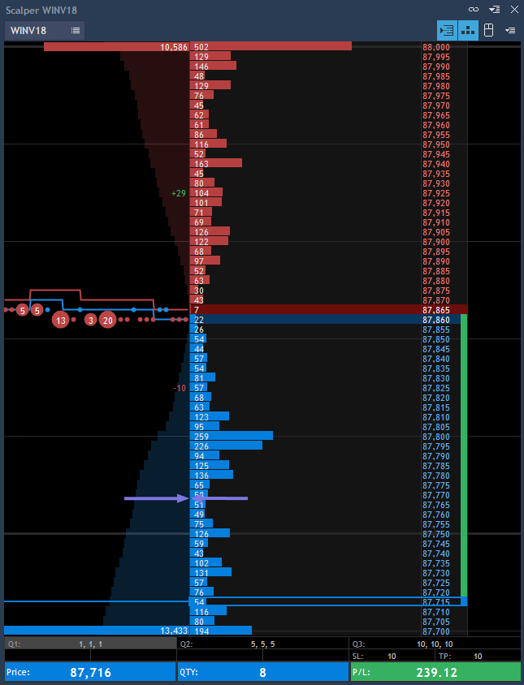

**Market depth section**

Two types of the trading are possible here:

* Mouse trading – allows trading using mouse \(when the corresponding button is activated on the top panel\). Mouse trading rules:

When sliding with cursor within any item in the Market depth section the whole row should be highlighted \(volume value/price\).

If there is no order on current price, it can be exposed by clicking on any area of a given row.

If there is an order on current price, then user can open a new one by clicking on price and volume area.

If an order is open on current price, then clicking \(with any button\) on it \(in orders area\) will lead to its closure.

If several orders are open on current price \(summary volume is shown in the orders area\), then when canceling the order the first exposed order will be cancelled in the first place.

* Hot keys trading – allows trading using Hotkeys on the keyboard \(when the corresponding button is activated on the top panel\). Both types of trading can be available simultaneously when both buttons are active.

1. The open position is displayed on the Market depth and pending orders are on the right side of price scale opposite to each installation price. Limit orders are displayed as numbers, and Stop orders - as underlined numbers. The volume of pending orders is shown depending on side the fill color of the order cell is changed. Group of oders is displayed with two vertical lines of the pending order left side.
2. The position movement on the Market depth section is displayed graphically and with color. The position of the open price should be fixed.
3. "Quantity indicators" is located on the left side of price scale – the column indicates the amount of orders for each specific price. Rows in the column are colored from left to right, depending on the number of orders. The marker is placed in the cell with the largest volume \(Bid and Ask\) in visible area.
4. Cumulative indicator is displayed near "Quantity indicators" column on the background of the Time and Sales chart section. Cumulative indicator graphically shows the cumulative sums of Bids and Asks sizes. Indicator is drawn from right to left line by line starting from the first price in the Market depth. Only the order volume is displayed for the first price, for the second price – the volumes corresponding to the first and second price are summed \(1+2\), for the third price – orders volume for the third price is added to the previous sum \(1+2+3\) and etc. The indicator is displayed as a Background, i.e. never overcast tick chart, trades and overlays.
5. Overlay indicators – are any other symbols, the movement or side of which may be preceded by the movement of the traded asset, and the whole process of leading one another called "correlation". They are shown as line charts which are outputted in the panel without reference to Market depth section \(not more than 3\).
6. Impulse indicators – are any other symbols which can cause impulsive directional movement of the traded instrument \(not more than 3\). Impulse indicator is presented in the form of two vertical columns opposite each other at the bottom and top of the panel Scalper. Upper column shows the total amount of purchases over a certain time interval, the lower - total sales for the specified time interval.

### 
**Scalper settings**

Scalper settings have six sections to setup.

**General**


Line types, colors and steps for the horizontal grid that are used in the charting area can be set here. General color of the panel background is also set here.

* Autocenter – activates autocentering function.
* Autocenter type – allows choosing autocenter type: by Ask, Bid or Bid \(+ Ask\)/ 2.

Show toolbar – allows showing toolbar.

**Trading**

* Cancellation priority – allows setting the priority for canceling orders in group \(FIFO, LIFO\).
* Replacing priority – allows setting the priority for replacing orders in group \(FIFO, LIFO\).
* Expected position limit – displays quantity in lots which the open position cannot exceed. Note: theoretically, this limit can be exceeded when trading with hot keys.
* Cancel orders after close position – if checked, all pending orders are cancelled after closing the position.
* Cancel orders before open position - if checked, while placing a new order it will be checked for the possibility to open position on it, and if the conditions are executed \(Stop, Limit\), then all other existing orders will be deleted, and after that a new position will be opened.
* Automatically add SL/TP after open position - if checked, after opening or editing the position the orders will be added automatically. If unchecked, the orders can be added using Hotkeys.
* Default SL/TP/Trailing stop, offset – allows setting the default offset values when placing different types of orders.
* Working qty. 1, 2, 3 – three different combinations are available where user can set different options for work. Switching between options will be done using Hotkeys:

Working qty. – allows setting quantity of opening the position.

Increase qty. – allows setting quantity of increasing the position.

Decrease qty. – allows setting quantity of decreasing the position.

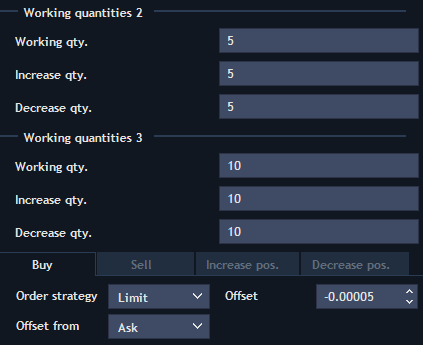

**Orders execution scheme:**

Each order executing type \(buy, sell, increase, decrease\) has a possibility to choose the execution scheme by order strategy:

Order strategy:

* Limit \(buy, sell, increase, decrease\) – offset from the best price.

Offset field is set in pips from the price selected in the 'Offset from' list: Ask, Bid, Last.

For ‘Buy orders’ the offset is counted from Ask price by default. Positive offset means that the order will be placed with better price than current Ask and therefore it will become the first in Market depth. Negative offset means that the order will be placed with worse price than current Ask and therefore it can start to fill immediately after placing.

For ‘Sell orders’ the offset is counted from Bid price by default. Positive offset means that the order will be placed with better price than current Bid and therefore it will become the first in Market depth. Negative offset means that the order will be placed with worse price than current Bid and therefore it can start to fill immediately after placing.

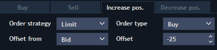


For Limit order strategy \(increase/decrease\), user can choose the order type \(Buy or Sell\) that allows to set up correct offsets for Buy/Sell orders. Note, when selecting the Order type, "Offset from" and "Offset" settings should be saved separately for Buy and Sell orders.

* Market \(buy, sell, increase, decrease\) – always by market. All orders will be placed at the market price.

Slippage field – the maximal slippage value is set while placing a new market order.

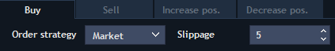

Put over volume \(buy, sell, increase, decrease\) – allows setting order volume in the “Volume” field which should be skipped till placing user’s own order, i.e. some number of orders is skipped forward with the condition that the sum of their volume does not exceed the one specified in the field.

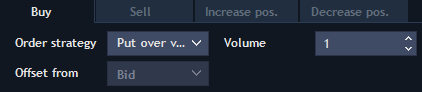


**Time & Sales chart**

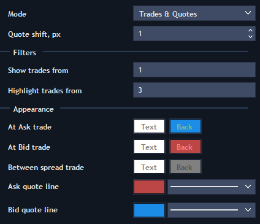

* Mode – here can be two modes:

Trades – only past trades are shown on the chart;

Trades and Quotes – tick chart and past trades are shown on the chart. If selected, the Quote shift field is available to setup in pixels.

* Show trades from – shows the quantity starting from which the trades will be shown on the chart \(shown as small balls\).
* Highlight trades from - shows the quantity starting from which the trades will be highlighted on the chart \(shown as big balls with numbers\).
* Appearance – in this section user can set the colors for tick chart, trades \(“balls”\) and trades by prices inside the spread.

**Market depth**

1. Base settings:

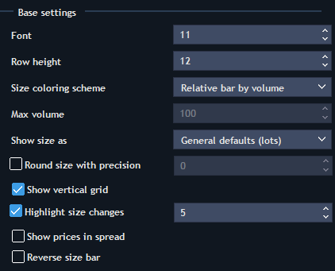

* Standard settings – Font, Row height.
* Size coloring scheme – allows selecting the coloring scheme of volume indicators:

Relative bar by volume – under this scheme the cell with maximum volume is colored entirely, the others are colored as a percentage from its volume.

Relative bar by custom volume – if selected, the Max volume field is activated where user can set the volume value as a percentage of which the coloring of each cell is calculated.

Relative by volume – all cells are colored entirely, the color saturation depends on volume. Cell with maximum volume will be colored in the most saturated color.

Relative by custom volume – all cells are colored entirely, the color saturation depends on value which is set in the Max volume field.

* Show size as – allows selecting in what form the volume will be shown. General defaults – is taken from general settings; Lots – will be displayed in lots; Real size - will be displayed in real value.
* Round size with precision – if checked, user can set the precision of the volume display.
* Show vertical grid – if checked, the separator is shown between column Volume and column Price.
* Highlight size changes – if checked, the last change is shown near the column Volume. User can set the minimum value in the active field which will be shown.
* Show prices in spread – if checked, price values are shown in the spread; if unchecked – dashes.
* Reverse size bar – if checked, size of quantity indicators will be filled from right to left; if unchecked – from left to right.

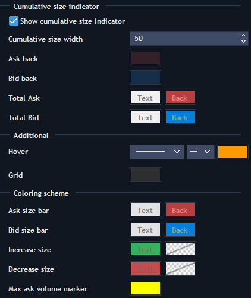

2. Cumulative size indicator:

* Show cumulative size indicator – allows enabling the cumulative indicator. User can set the cumulative size width in the active field to display in the panel.
* Color settings for the Ask and Bid parts \(text, background\) are also set here.

3. Additional settings:

* Hover – color and line types settings when sliding the cursor through each price level.
* Grid – color of the vertical grid in the Market depth section.

4. Coloring scheme:

* Color settings for filling the volumes by Ask and Bid;
* Color settings for volume change indicators by each price;
* Color settings for max volume markers.

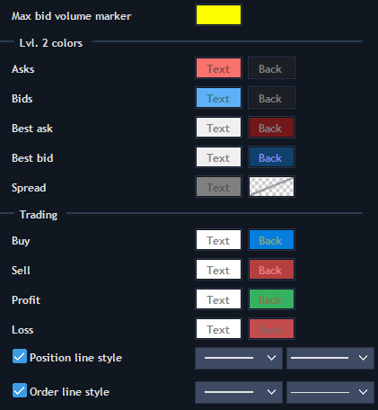

5. Lvl. 2 colors:

* Color settings for the prices column;
* Color settings for Best ask and Best bid rows.

1.      Trading:

Color and line types settings for established orders and positions.

* Buy/Sell color settings – change colors in the Position bar \(Price and QTY\), when positions are Long/Short.
* Profit/Loss color settings – change colors in the Position bar \(Price and QTY\), when P/L is positive/negative.

**Impulse indicator**

* Indicator 1, 2, 3 visible – allows to activate and to select not more than three symbols that will be displayed in the panel and to set the Bar max volume value for each of them.
* Appearance:

Mode – allows selecting mode to display: By ticks – shows the number of trades; By volume – shows the trades volume.

Time interval \(sec\) – allows indicating the time interval for which the indicator will be calculated.

Bar height, % - allows setting the size of one column in percent from panel height. For current example, showing above, the upper column will occupy 15% by height and will be located at the top of the screen, and lower column 15% - at the bottom of the scope \(30 % in summary by height\).

* Colors – allows selecting the fill color for Buy and Sell columns.

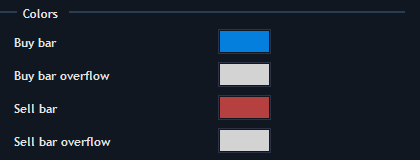

**Overlay indicator**

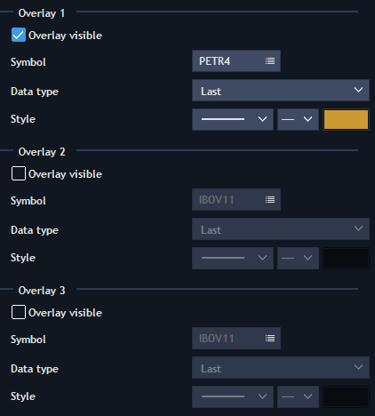

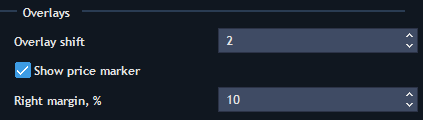

* Overlay 1, 2, 3 – allows enabling overlay indicators \(not more than three\) and selecting the symbol for which the chart will be built, and also data type for charting and line style.
* Overlay shift – allows indicating distance in pixels on which the next point of the overlay chart will be built.
* Show price marker – allows showing near the chart the marker with price change in percent from the beginning of the day \(the opening of trade\).
* Right margin, % - allows setting the distance from Market depth section at which the overlay chart will be built.

### **Scalper hotkeys**

The list of hotkeys to set for the Scalper panel is available in the General settings - &gt; Hotkeys - &gt; Scalper.

Scalper hotkeys have the following functions:

* Long position open/Close short – allows opening the long position or closing the short one.
* Short position open/Close long - allows opening the short position or closing the long one.
* Increase position – allows increasing the current position volume.
* Decrease position – allows decreasing the current position volume.
* Working qty. 1, 2, 3 – allows activating the first/second/third group of working quantities.
* Reverse position – allows changing the position side at constant volume.
* Cancel orders and close positions – allows closing the position and cancelling all orders.
* Cancel all orders – allows cancelling all orders.
* Close position – allows closing the current position.
* Autocenter – allows moving spread to the center of Market depth.
* Add SL/TP to position – allows placing SL/TP order manually.
* Add Trailing stop to position - allows placing Trailing stop order manually.
* Add Sell limit to Ask – allows placing Sell limit order by current Ask price.
* Add Buy limit to Bid - allows placing Buy limit order by current Bid price.
* Modifier: Stop order when mouse click – modifier by tapping on which user can place the Stop order \(Limit order without modifier is placed by default\).
* Modifier: All operations by Market - modifier by tapping on which all executed operations will be made at Market price.
* Modifier: Group actions with orders – modifier that allows executing operation directly with a group of objects, specifically with all orders that were exposed at one price.
* Modifier: Create OCO link - modifier that allows exposing the order links. Principle of operation: Clamp the modifier - &gt; Select the first price - &gt; without releasing the left mouse button, drag the cursor to the second price.
* Modifier: All operations with position quantity – modifier that allows executing all operations with current position volume.
* Modifier: Add by mouse SL/TP – modifier that allows adding the arbitrary SL/TP orders using mouse.

