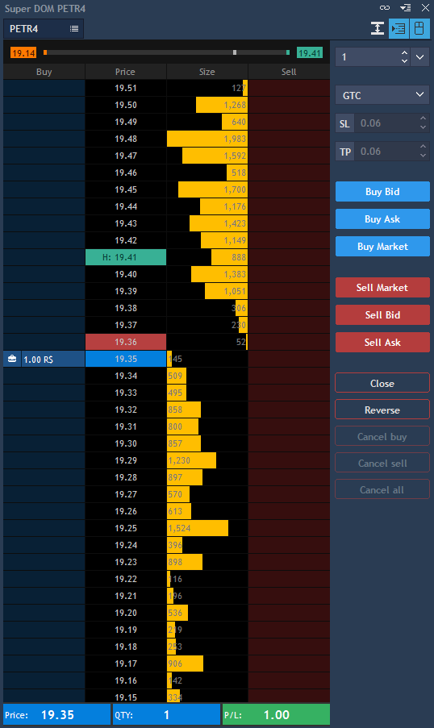
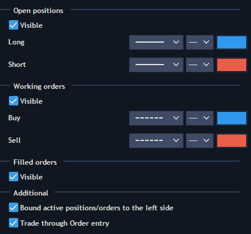
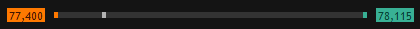
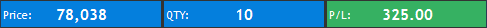
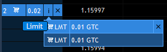
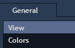
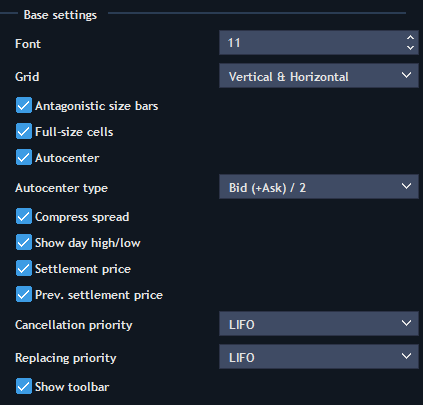
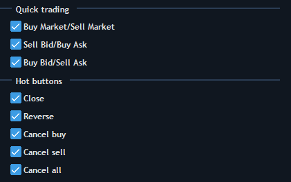
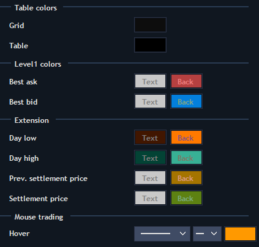
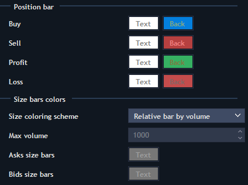

# Super DOM

The Super DOM panel's active field looks fairly similar to the Market depth ladder, but orders can be placed simply by clicking on the cells in Buy/Sell columns.

To open the Super DOM panel, go to Terminal -&gt; Super DOM:


The Symbol lookup is at the top of the Super DOM panel.

* Compress spread – allows skipping empty levels between the best bid and best ask;
* Autocenter button – allows auto centering the panel relatively to spread;
* Mouse trading button – allows one-click trading with the help of the mouse.

Day high/low – allows showing current high/low levels.


Right click tapping within the Market depth section, evokes the Context menu of the panel.

* Compress spread – allows skipping empty levels between the best Bid and best Ask;
* Autocenter – allows auto centering the panel relatively to spread;
* Day high/low – allows showing current high/low levels;
* Settlement price – allows displaying settlement price on the chart.
* Previous settlement price – allows displaying previous settlement price on the chart.
* Antagonistic size bars – allows to determine the direction of volume histograms. If true, the histograms appear from the different boundaries of the column ‘Size’. If false, the histograms appear from the left boundary of the column ‘Size’. Default state: true;
* Full-size cells – allows extending the bars;

* Settings – allows opening a settings tab.


The bottom position bar shows the current state of the position: open price, opened position quantity, current profit and loss.

When clicking on the P/L value, the following options can be selected: Ticks/Fractional ticks for Forex/Points.

Furthermore, Ticks/Fractional ticks for Forex/Points can be selected in 'Show offset in' in the section 'Trading defaults' of the 'General settings'.

Position bar has extended functionality for Multiple position mode:

When clicking the Price value, one of two options can be selected: Average open price or Break-even.

Break-even = \(Long qty.\*Average long – Short qty.\*Average short\)/\(Long qty. – Short qty.\)

When clicking on QTY value, one of two options can be selected: Net QTY or Gross QTY.

1. Net QTY = Qty1 + Qty2 + Qty3
2. Gross QTY = \|Qty1\| + \|Qty2\| + \|Qty3\|

The color of QTY cell depends on the side of the position:

1. If all positions have Side = Long, qty. cell will be colored in blue;
2. If all positions have Side = Short, qty. cell will be colored in red;
3. If positions are multidirectional, then qty. cell is not colored;
4. If there are no positions, qty. cell will not be colored and qty. value = N/A.

* When trading multi-position symbols, open price of all the positions is calculated as weighted average value;
* The Orders column shows all pending orders and allows their modification. Limit orders are displayed as numbers, and Stop orders - as underlined numbers. Group of orders is displayed with two vertical lines of the pending order left side;
* The Size column shows how many trade operations with Ask/Bid are available at a specific price;
* Clicking on Cancel buy, Cancel sell, or Cancel all will close all buy, sell, or total orders respectively for the currently displayed symbol and account;
* Close position button allows closing the current position by selected symbol and account.

On the right side of the Matrix panel there is a built-in Order entry panel. The order amount can be specified on the top of panel. Also the TIF of the order, SL/TP offset and Trailing stop.

Click on Buy Market or Sell Market to Buy/Sell at market price.

**Mouse trading** – allows trading using mouse \(when the corresponding button is activated on the top of the panel\). Clicking on the Buy column allows placing Buy orders, on the Sell column – Sell orders. You can switch the order type from Limit to Stop using the hotkey "Shift" \(can be changed in General settings - &gt; Hotkeys - &gt; Matrix\).

Mouse trading rules:

* When sliding with cursor within any item in the Market depth section the certain cell in the column should be highlighted;
* If there is no order on the current price, it can be exposed by clicking on the empty cell of the column Buy or Sell;
* If there is an order on the current price, then you can open a new one by clicking on it;
* If an order is opened on the current price, then clicking on the cross in the right side of its area will lead to its cancellation;
* If several orders are opened on the current price \(summary volume is shown in the orders area\), then when canceling the order the first exposed order will be cancelled in the first place.

Clicking on the group of orders on one price allows showing the list of pending orders.


**Super DOM settings**

Super DOM settings have 2 tabs, each of them consists of several parts:


**View**

Base settings:

* Font – allows to choose the size of the font;
* Grid – allows activating and setting up grid. The folllowing options are available: Vertical, Horizontal, Vertical & horizontal, None.
* Antagonistic size bars – allows to determine the direction of volume histograms. If true, the histograms are built from the different boundaries of the column ‘Size’. If false, the histograms are built from the left boundary of the column ‘Size’. Default state: true;
* Full-size cells – allows extending the bars;
* Autocenter – activates auto centering function;
* Autocenter type – allows choosing autocenter type: by Ask, Bid or Bid \(+ Ask\)/ 2;
* Compress spread – allows skipping empty levels between the best Bid and best Ask;
* Show day high/low – allows showing high/low levels for one day;
* Settlement price – allows displaying settlement price on the chart and choosing the style of its line.
* Previous settlement price – allows displaying previous settlement price on the chart and choosing the style of its line.
* Cancellation priority – allows setting the priority for canceling orders in group \(FIFO, LIFO, Max volume\);
* Replacing priority – allows setting replacing priority \(FIFO, LIFO, Max volume\);
* Show toolbar – allows showing the toolbar.


Check/uncheck the needed hot buttons in order to display them in the Quick OE section of the Super DOM panel:

* Buy Market/Sell Market;
* Sell Bid/Buy Ask;
* Buy Bid/Sell Ask;
* Close;
* Reverse;
* Cancel buy;
* Cancel sell;
* Cancel all.

**Colors**

Table colors:

Grid – color of the vertical grid in the Market depth section;

Table – color of the table filling.

Level1 colors:

Color settings for Best ask and Best bid rows.

Extension:

Color settings for maximal and minimal price markers, settlement price, previous settlement price.

Mouse trading:

Hover – color and line types settings when sliding the cursor through each price level.


Position bar:

Buy/Sell color settings – change colors in the Position bar \(Price and QTY\), when positions are Long/Short;

Profit/Loss color settings – change colors in the Position bar \(Price and QTY\), when P/L is positive/negative.

Size bars colors:                

Size coloring scheme – allows selecting the coloring scheme of volume indicators. The following options are available: Relative bar by volume, Relative bar by max volume.

Max volume – allows choosing the maximal volume. The field is active when ‘Size coloring scheme’ is ‘Relative bar by max volume’.

Asks/Bids size bars – color settings for filling the volumes by Ask and Bid.

### 
**Super DOM hotkeys**

The list of hotkeys to set for the Super DOM panel is available in the General settings - &gt; Hotkeys - &gt; Super DOM.

The Super DOM hotkeys have the following functions:

*  Cancel last order on selected instrument – allows cancelling the last order on the selected instrument**.**
* Cancel all active orders on selected instrument – allows cancelling all active orders on the selected instrument.
* Cancel Buy order\(s\) closest to the last price – allows cancelling Buy order\(s\) closest to the last price.
* Cancel Sell order\(s\) closest to the last price – allows cancelling Sell order\(s\) closest to the last price.
* Mouse trading – activates trading using mouse.
* Set qty. equal to opened position's qty – allows setting quantity equal to opened position’s quantity.
* Autocenter – allows autocentering Bid/Ask while scrolling the panel.
* Modifier: Stop order when mouse click – allows modifying the order into Stop order while pressing the hotkey and clicking on the order.

