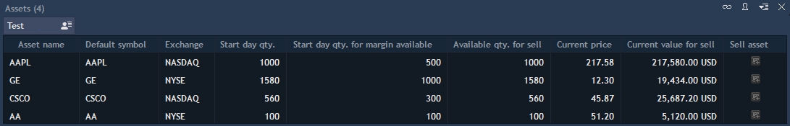
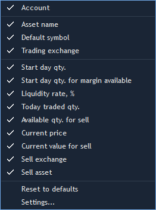
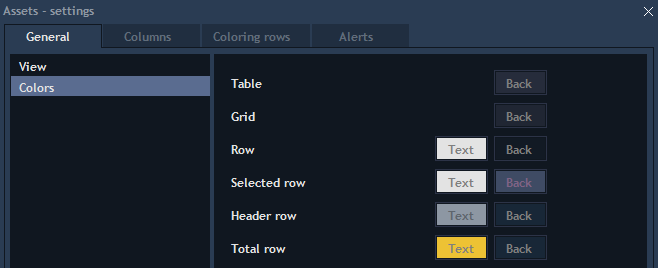

# Assets

Assets panel contains information about all assets by the chosen account\(-s\). If different accounts have the same asset, then it is displayed in different rows in the table.


There are the following columns in the table:

* Asset name – name of the asset, which is set on a server.
* Default symbol – allows showing the instrument name from the setting ‘Pricing instrument’.
* Exchange – allows showing the exchange which is set on a server for the Default symbol.
* Account – name of the account, which contains the asset.
* Start day qty. – asset quantity at the user’s account at the beginning of a day. While logging in it is sent from a server.
* Start day Qty. for Margin available – while logging in, the user gets information from the correspondent field on a server.
* Liquidity rate% – the price of each asset at the user's account can be used for the opening of a position by other instruments. This price should be counted in Margin available in that interest proportion which is defined in this setting. Default value is 0. Maximal value is 100.
* Today traded qty. – the quantity of the asset which was traded by all instruments for which this asset was pre-selected, but only for Product type=Delivery. The quantity of all Buy trades is counted with ‘+’, the quantity of all Sell trades is counted with ‘-‘.
* Available qty. for sell – quantity of the asset, which is available for sell.

If Today traded qty.&gt;=0, then Available for sell = Start day qty.

Otherwise, Available for sell = Start day qty. - \|Today traded qty.\|

* Current price – current Last price on the instrument Default symbol.
* Current value for sell – allows showing the price of the asset, which is available for the sell by Current price.

Current value for sell = Available for sell \*Current price \* CrossPrice

* Sell asset – allows to launch Order entry in order to sell asset.
* Sell exchange – allows showing a combo box with all exchanges where the asset is traded. Also you can sell asset on the chosen exchange via the context menu of the certain asset.

Right-click on the asset evokes the following context menu:


You can choose the columns, which have to be displayed by right-click on one of the columns.


The settings of the Assets panel consist of 2 tabs in the column ‘General’: View and Colors.

**View**


Grid – allows showing grid between columns and rows. The following options are available: Vertical, Horizontal, Vertical & horizontal, None.

Autosize of columns – automatically sizes columns so that their total width would be equal to the width of a panel. If disabled, each column will be sized by maximum length.

Auto re-sorting – allows auto re-sorting a table after any changes.

Show totals – allows showing total amount for columns. Be attentive to mark the "Show total" option as checked as well for selected columns in the Columns tab.

**Colors**


Table, Grid, Row, Selected row, Header row, Total row – allows configuring the color scheme for table.

