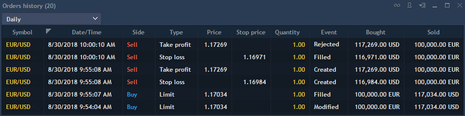

# Orders history


Orders history panel allows to view system actions related to opening and closing orders (SL/TP). This can be particularly useful for monitoring specific details regarding creation, modification, rejection and execution of orders.

To open Orders history panel, select Terminal -> Orders history:

The following columns are available in the panel:

* Account – an account's name of a user who created an order;
* Symbol – a symbol for which an order was created;
* Side – a trade type (Buy or Sell);
* Event – an event identifier. The following values are available: Executed, Created, Modified, Rejected;
* Type – an order type;
* Price – an order price at which a trade took place;
* Quantity – a filled amount of an order, in lots or in currency units, depending on what is selected in the settings dialog box;
* Time – time of an order placement;
* Order ID – an order's unique identifier. If a position is opened based on an order, this position will have the same number;
* Date – an order's placement date;
* Validity – allows specifying order validity by selecting among the following time frames: Day, GTC, IOC, GTD, FOK;
* Stop price – stop price for a special stop order;
* Login – a user's login;
* Symbol type – a symbol's market category (CFD, Spot, Stocks, etc.);
* Bought

\- In case of Forex:

if 'Side = Buy', then this column shows the value of 'Price \* Lot size \* Qty.' in base currency;

if 'Side = Sell', then this column shows the value of 'Price \* Lot size \* Qty.' in quoting currency.

\- In case of Futures, Futures CFD, Options

with 'Quoting type=Tick cost/Tick size':

if 'Side = Buy', then this column shows the value of 'Qty';

if 'Side = Sell', then this column shows the value of 'Qty \* Tick cost/Tick size \* Price'.

with 'Quoting type=Lot size':

if 'Side = Buy', then this column shows the value of 'Qty';

if 'Side = Sell', then this column shows the value of 'Qty \* Lot size \* Price'.

\- In other cases:

if 'Side = Buy', then this column shows the value of 'Qty. \* Lot size' – amount of bought assets (contracts, equities);

if 'Side = Sell', then this column shows the value of 'Price \* Lot size \* Qty.' in quoting currency.

* Sold

\- In case of Forex:

if 'Side = Sell', then this column shows the value of 'Price \* Lot size \* Qty.' in base currency;

if 'Side = Buy', then this column shows the value of 'Price \* Lot size \* Qty.' in quoting currency.

\- In case of Futures, Futures CFD, Options

with 'Quoting type=Tick cost/Tick size':

if 'Side = Buy', then this column shows the value of 'Qty\* Tick cost/Tick size \* Price';

if 'Side = Sell', then this column shows the value of 'Qty'.

with 'Quoting type=Lot size':

if 'Side = Buy', then this column shows the value of 'Qty \* Lot size \* Price';

if 'Side = Sell', then this column shows the value of 'Qty' .

\- In other cases:

if 'Side = Buy', then this column shows the value of 'Price \* Lot size \* Qty.' in quoting currency;

if 'Side = Sell', then this column shows the value of 'Qty. \* Lot size' – amount of sold assets (contracts, equities).

* Strike price – price of an option contract performance;
* Expiry date – a contract expiration date;
* Trading exchange – displays a trading exchange where the order was placed;
* Product type – displays the product type;
* Description – contains a short description of the instrument by which the event was executed.

