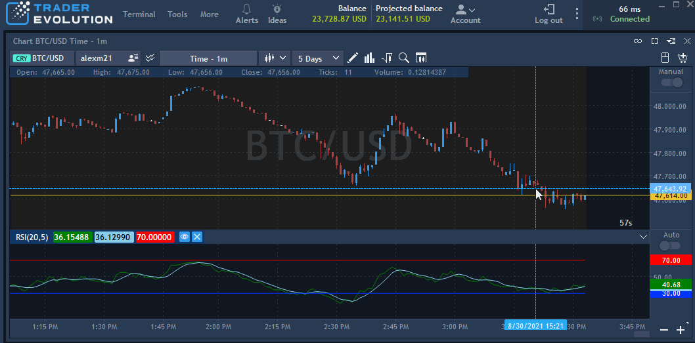

# Chart templates

A template is a set of settings, drawings, indicators, overlays, volume analysis tools, zoom level, chart settings and chart type saved in 1 file for further usage. One template can be applied in different workspaces.


Currently selected symbol is not saved in the template.


Click on thebutton located in the toolbar of a chart to create a template.

Then click on the «+» button and type a template name in the opened window. Created templates appear at the menu of templates. In order to apply a template, check the certain name in the list of created templates.

By hovering a certain template name, a user can see 3 additional buttons for managing the template:

* Re-save– allows to re-save a template with all settings from the chart.
* Rename– allows to rename a template. By clicking on this button, a window for renaming the template appears. A user can type a preferred template name.
* Remove– allows to remove a template. By clicking this button, a confirmation window appears, click ‘Yes’ in order to remove a template.

