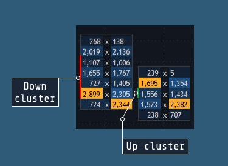

# Cluster chart

Cluster chart allows trader to identify places with large volumes, assess visually the speed of their occurrence and the relative value. Cluster chart also allows making trading decisions based on absolute cluster values.

Cluster chart fits for analysis on any timeframe for any style of the trading: scalping, intraday trading, medium or long-term position trading.


Cluster aggregation type can be set up using timeframe selector:

### **Cluster timeframe parameters**

* Build from – allows selecting the time period for plotting the chart, available periods here are: tick, second, minute, hour, day, week, month, year.
* Value – allows setting value for selected period from “Build from” field.
* Data type – this setting allows choosing from what value we can build the cluster, the following options are available:
  * Volume – each cluster row will contain volume traded by each price level;
  * Buy volume – buy volume by each price level;
  * Sell volume – sell volume by each price level;
  * Delta – each cluster row will contain delta \(Buy volume – Sell volume\) by specified price level;
  * Volume, % – each cluster row will contain volume value expressed as a percentage relative to the maximum value of the volume in the cluster;
  * Delta, % – each cluster row will contain delta value expressed as a percentage relative to the maximum value of the delta in the cluster;
  * Max tick volume – each cluster row will show maximum tick volume by each price level. For example, ticks with volumes 1,2,10,3 come on the price X; if Max tick volume is chosen, then value = 10 should be displayed on the price X in the cluster, i.e. volume is not accumulated, but max tick value is taken.
  * Delta/Volume,% – each cluster row will show the percentage of the delta in the volume;
  * Trades – each cluster row contains the number of trades which took place on a certain price level;
  * Custom pair – in the case, when this setting is chosen, each cluster row will contain two parameters simultaneously, divided by sign “x”. For example, Volume & Trades. Fields “Parameter \#1” and “Parameter \#2” are only available for Custom pair mode. In this mode, user can specify random pair of parameters by choosing the corresponding data in the combo boxes.
  *  Volume imbalance – allows to automatically determine imbalance between Buy volume which is at one price level, and Sell volume which is at a higher price level. 

### Cluster chart settings

* Value filter – if checked, it is necessary to plot only those clusters, total data \(volume, delta, etc.\) of which meets the condition specified in the fields ‘Operator’ and ‘Filter value’.
* Highlight maximum – allows allocating the maximum value in the cluster. If several values are maximal at the same time, they will be both highlighted.
* Cluster color – allows allocating upward and downward clusters.
* Doji

* Font color – allows to set up the font color of the numbers which are displayed inside of the clusters.
* Color scheme – allows setting the coloring style of background inside the cluster. Four color schemes are available:
  * None – cluster filling is absent;
  * By volume – color scheme oriented on the volume value, i.e. each cluster row has one-color filling, but different brightness depending on the volume value by each row. Row with the maximal volume value will have the most saturated filling, and vice versa – row with the minimal volume value will have the dimmest filling.
  * By trades – this color scheme is the same as ‘By volume’ scheme with the only difference that the number of trades by each price level serves as a brightness \(saturation\) indicator of the filling.
  * By delta – is identical to the previous methods of filling, with the only difference being that two colors for the positive and negative delta are used for the filling.
* Price step, Custom step – allows setting the price step by Y-axis.
* Strong Sell volume, Strong Buy volume, Neutral volume – color pickers \(color schemes are oriented on the volume type\).

Note: relative and algorithmic price scales are not applied to this aggregation type.

