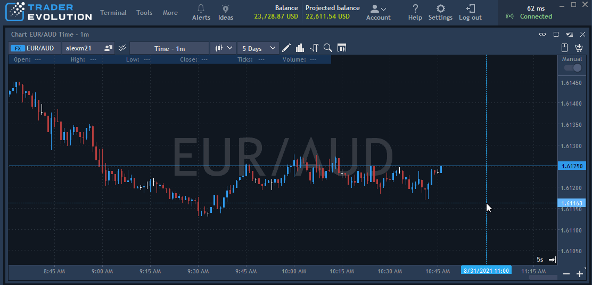

# Level ll data on chart

This functionality allows to actualize the possibility to represent the structure of changing of Level II on 1 Tick Chart. The functionality becomes available after activation of checkbox 'Order Flow surface':


The checkbox synchronizes with the same checkbox in the chart settings.

The functionality is available only for aggregation 1 Tick.

In checkbox 'Order Flow surface', the default state is false, the checkbox is available only if 'Value' = 1, otherwise the checkbox is disabled.

Other place for activating functionality is the menu Setting -&gt; Data style \(only for 1 tick aggregation\).

If 'Order Flow surface' is active, the rest of settings becomes available.

* Aggregation mode – combobox allows to indicate a method that determines how the maximum value of volume is calculated:

Auto - in this mode, the system independently calculates the maximum volume from the incoming level 2 data. This value is used while drawing a histogram. Auto mode is set by default.

Custom - in this mode, the user indicates the maximum value by himself.

* Value – numeric for custom maximal value. Numerics becomes available only when Aggregation mode = custom.
* Number of levels – numeric, by default = 5, min = 1, max = without limit, Step = 1. This numeric allows to indicate how many levels of Level II have to be shown on a chart.
* Font, Font color – allows to choose font style.
* Show volume markers – the default state of the checkbox is false, when this checkbox is activated, controls 'Font', 'Color', 'Area' are activated. This setting enables to display the volume markers on the Y axis. These markers show the current volume value at each level of Market depth. 


The field is depicted in proportion to the maximum value.

Sell limit orders are depicted from the initial level down.

Buy limit orders are depicted from the initial level up.

**Histogram building**

Histogram building occurs in real time from the moment when the checkbox 'Order Flow surface' is activated. The redrawing of the histogram occurs after the emergence of a new quote, i.e. at the moment of its drawing. Building of a histogram does not depend on the Data type of a chart. Zooming of a chart does not change the functionality. The histogram which is built should have a lower Z-Index than the chart itself.

In the settings there is a combobox 'Coloring scheme' with two states - 'Histogram' and 'Gradient'.


 The example of Gradient coloring scheme is shown on the first screenshot.​

* Limit orders - сolorpickers, default values for Buy limit - blue, for Sell limit - red.
* New limit order - the coloring occurs when the volume changes one time at this level, for example, if at the level of 2000 there is a volume of 200 lots and if at some time at this level the volume changes to 202 - at this moment coloring New limit order should occur. Default values for New buy limit - another shade of blue, New sell limit - another shade of red.


The example of Histogram coloring scheme is shown below:​

